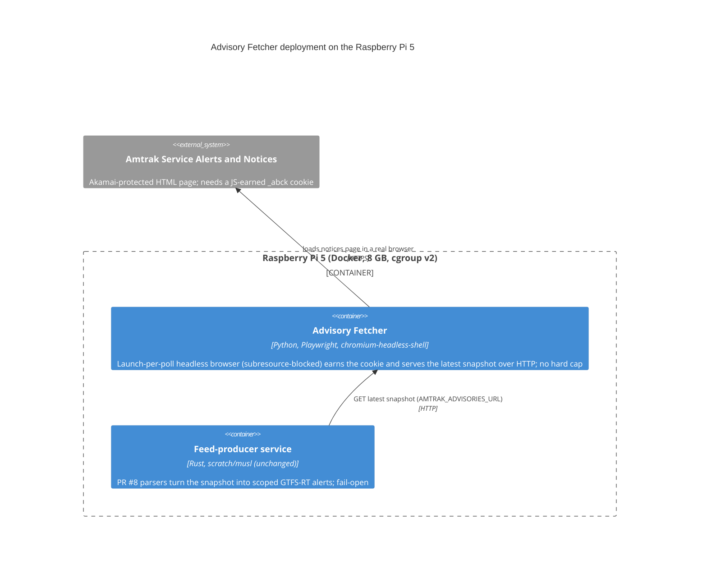
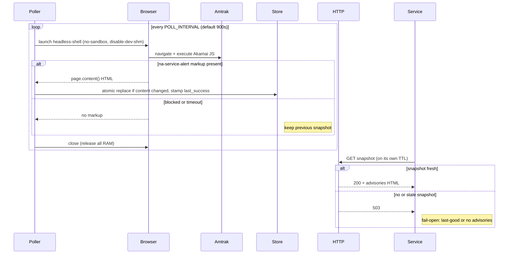

# Design: Advisory Fetcher (Playwright sidecar)

<!-- spec-nav:start -->
**Spec navigation:** [State](00_state.md) · [Discovery](01_discovery.md) · [Requirements](02_requirements.md) · [Design](03_design.md) · [Tasks](04_tasks.md) · [Execution](05_execution.md)
<!-- spec-nav:end -->

## Overview

The advisory-fetcher is a **standalone container** that runs a real browser to defeat Amtrak's
Akamai bot gate, and serves the resulting advisories HTML over HTTP to the already-built,
fail-open feed-producer service (PR #8). It is **spike-first**: a gating measurement proves the
Akamai bypass before the production component is finalized. Every design choice favors the lightest
viable option (Requirement 8): a **launch-per-poll** headless browser (nothing resident but a tiny
HTTP server), the lean **`chromium-headless-shell`** build, **subresource-blocking** (skip
images/fonts/media/CSS during the fetch), no snapshot rewrite when content is unchanged, and
infrequent polling. There is **no hard memory cap** (operator decision); efficiency comes from these
measures, not an enforced limit.

The feed-producer service is **not modified**. It already GETs `AMTRAK_ADVISORIES_URL`, requires a
`200`, reads the body as HTML, and parses the `na-service-alert__*` markup with a TTL cache
(default 900s), failing open on any error (`src/sources/advisories.rs` `fetch_html`, on the
`service-advisories` branch / PR #8 — not present on this branch). This design simply points that
URL at the fetcher's endpoint.

## Chosen direction and settled decisions

This realizes discovery's **Approach A** (Playwright sidecar), spike-gated, with Approach B
(managed API) as the fallback on spike failure and Approach C (browser in the service image)
remaining rejected. The requirements' open decisions are now settled by the confirmed contract and
the efficiency directive:

| Open decision | Resolution | Why |
|---|---|---|
| Transport (was file:// vs HTTP) | **HTTP endpoint** | The service fetches with `reqwest::Client.get(url)`, which does not support `file://`. HTTP is the only contract that works unchanged. |
| Snapshot format | **Raw HTML** | Maximizes reuse of the tested PR #8 parsers; the fetcher stays "dumb" (no duplicated parsing). |
| Fetcher runtime | **Python + Playwright** | Concise (~one small module), official Playwright support, HTTP served by the stdlib — no extra runtime deps beyond Playwright. |
| Browser build | **`chromium-headless-shell`** | Automatically selected in headless mode with no `channel`; the lean build. Installed with `playwright install --only-shell chromium` to keep the image small. |
| Memory efficiency | **launch-per-poll, single browser, subresource-blocking** | No resident browser between polls; one browser at a time; images/fonts/media/CSS skipped during the fetch. No hard cap (operator decision). |
| Deployment | **docker-compose, two containers, shared Docker network** | Fetcher `restart: unless-stopped` (auto-restart on crash). |

## Current Technology Evidence

Consulted via Context7 (`/microsoft/playwright`, latest line v1.61.0) on 2026-08-18:

- **Headless build selection** — `getExecutableName` returns `chromium-headless-shell` when
  `headless` is true and no `channel` is set; setting `channel: "chromium"` forces the *full*
  browser. So the efficient shell is the default as long as we do not override the channel.
  (`packages/playwright-core/src/server/chromium/chromium.ts`.)
- **Slim install** — `playwright install --only-shell chromium` installs only the headless shell,
  skipping the full Chromium binary, for a smaller image
  (`packages/playwright-core/src/server/registry/index.ts`).
- **ARM64 support** — official Playwright Docker images support Arm64 (and Debian 12+); the image
  is self-contained, so the Pi's Debian 13 host version is irrelevant (release notes v1.37+).
  On Arm64 Linux, Playwright continues to use Chromium (not Chrome-for-Testing) as of v1.57.
- **Full rendered DOM** — `page.content()` serializes the complete post-JS DOM
  (`document.documentElement.outerHTML`), i.e. the `na-service-alert__*` markup Akamai injects
  after its sensor JS runs (`packages/playwright-core/src/server/frames.ts`).
- **Default low-memory args** — Playwright already adds `--no-sandbox` (when
  `chromiumSandbox !== true`), `--mute-audio`, `--hide-scrollbars`. We add `--disable-dev-shm-usage`
  and `--disable-gpu`; the container also runs with `--ipc=host` or an enlarged `--shm-size` to
  avoid `/dev/shm` exhaustion.

Verification method for the load-bearing unknowns (does headless-shell actually pass Akamai from a
server/residential IP, and what is peak RSS under 1 GB) is **the spike measured on the real Pi**,
not Context7 — those are runtime facts no doc can settle.

**Decision:** adopt Playwright v1.61.0, launch Chromium in headless mode so it resolves to the lean
`chromium-headless-shell`, install it slim via `--only-shell chromium`, add `--disable-dev-shm-usage`
and `--disable-gpu`, and let the spike confirm the bypass and memory fit.

## Dependency Security Evidence

No Rust dependency or Cargo lockfile change applies to the feed-producer service in this spec, so a
resolved-dependency (Cargo) audit is not applicable to this design because the service manifest and
lockfile are untouched (Requirement 5) — the service's scratch/musl "no vulnerabilities" posture is
re-verified as unchanged rather than re-audited as a change.

- **New runtime dependencies live only in the fetcher image**, never in the Rust service (R5):
  Python + `playwright` (pip) + `chromium-headless-shell`. This is a large, browser-class CVE
  surface — precisely why it is isolated in its own image and never added to the service (Approach C
  stays rejected).
- **Fetcher manifest is deferred:** the fetcher's pinned dependency manifest does not exist yet at
  design time; its resolved-dependency audit is deferred to execution, when the manifest is created
  and `spec-execute`'s dependency-evidence rule requires a `change`-mode audit of it. Pin the
  Playwright version (and therefore the Chromium build) to an exact tag and rebuild to pick up
  browser security updates.
- **Bounded blast radius:** the fetcher holds no secrets, has no inbound authority beyond serving a
  public HTML snapshot on the internal network, and its failure is fail-open.

## Architecture

The fetcher is one Python process with two cooperating parts and a small on-disk store; the service
is unchanged and simply GETs the fetcher on its existing TTL.

## Components and Interfaces

### 1. Poller (`poller.py`)

- **Responsibility:** on a schedule, launch the spike-validated browser mode (headless-shell by
  default; Xvfb-headful full Chromium if that is the mode that defeated Akamai), load the notices
  page, and — only when the advisory markup is present — hand the HTML to the Snapshot Store, then
  close the browser to release all memory.
- **Consumes:** `AMTRAK_SOURCE_URL` (default `https://www.amtrak.com/service-alerts-and-notices`),
  `POLL_INTERVAL_SECS` (default `900`), `NAV_TIMEOUT_SECS` (default `45`), the CSS gate selector
  (a `na-service-alert__*` class), the Snapshot Store handle.
- **Produces:** calls `store.update(html)` on success; returns without writing on failure.
- **Contract (Python, Playwright async API):**
  - `async def run_forever(store: SnapshotStore, cfg: PollerConfig) -> None` — the loop; sleeps
    `POLL_INTERVAL_SECS` between cycles and never raises out of a cycle (fail-open, R3/R8.1).
  - `async def poll_once(cfg: PollerConfig) -> str | None` — one cycle: launch per `cfg.browser_mode` — `headless-shell` uses `p.chromium.launch(headless=True, args=["--disable-dev-shm-usage","--disable-gpu"])` with no `channel` (keeps headless-shell, per evidence), while `xvfb-headful` uses `channel="chromium"` under Xvfb with basic stealth; new context+page; **subresource-blocking** via `context.route("**/*", ...)` that aborts `image`/`font`/`media`/`stylesheet` requests while allowing `document`/`script`/`xhr`/`fetch` so Akamai's sensor JS still runs (R8 efficiency); `page.goto(url, wait_until="domcontentloaded", timeout=NAV_TIMEOUT_SECS*1000)`; `page.wait_for_selector(gate_selector, timeout=...)`; on match return `await page.content()`, else `None`. A `finally` closes the browser (R4.2, R8.3). The bypass must be re-verified on-device with blocking enabled (task 5.1), since the sensor JS must still succeed.
- **Errors:** any exception (nav timeout, block, selector timeout) → log a diagnostic, return
  `None`, keep the previous snapshot (R1.3), and continue the loop.

### 2. Snapshot Store (`store.py`)

- **Responsibility:** hold the latest good HTML on disk with a freshness timestamp, written
  atomically, without churn.
- **Consumes:** HTML strings from the Poller; a `SNAPSHOT_DIR` path.
- **Produces:** an atomically-replaced `advisories.html` and an in-memory/`mtime` `last_success`.
- **Contract:**
  - `def update(self, html: str) -> bool` — if `html` equals the current file's bytes, only refresh
    `last_success` / `os.utime` (no rewrite) and return `False` (R8.2); otherwise write
    `advisories.html.tmp` and `os.replace()` it onto `advisories.html` (atomic, same filesystem,
    R2.2), set `last_success = now`, return `True`.
  - `def read(self) -> tuple[bytes, float] | None` — current bytes + `last_success` epoch, or
    `None` if no snapshot yet.
- **Errors:** an I/O failure logs and leaves the prior file intact (fail-open).

### 3. HTTP Server (`server.py`)

- **Responsibility:** serve the latest snapshot to the service, encoding freshness as the HTTP
  status the service already understands.
- **Consumes:** GET on the configured path; `MAX_STALE_SECS` (default `3600`); the Snapshot Store.
- **Produces:** `200 text/html` with the snapshot while `now - last_success <= MAX_STALE_SECS`;
  `503` when there is no snapshot yet or it is older than `MAX_STALE_SECS` (R2.3, R3.1); a `200`
  `GET /healthz` for container liveness.
- **Contract:** stdlib `ThreadingHTTPServer` + a `BaseHTTPRequestHandler`; a single bound port
  (`LISTEN_PORT`, default `8080`). It performs no browser work and blocks on `accept()` when idle
  (R8.1).
- **Errors:** unknown paths → `404`; the server never fetches upstream itself.

### 4. Container image and compose

- **Image:** built for `linux/arm64`; base `python:3.12-slim` (Debian), `pip install playwright`,
  then the spike-validated browser — `playwright install --only-shell chromium` for headless-shell,
  or full Chromium plus Xvfb for the fallback — and `playwright install-deps chromium`. Runs as a
  non-root user (`chmod -R 777` on the browsers path per the official Dockerfile pattern).
  Alternatively the official `mcr.microsoft.com/playwright/python` image is the reliable fallback
  if slim-image dep resolution is fiddly. The spike proves feasibility on the official image;
  because the shipped slim image differs, task 5.1 re-verifies memory footprint and the
  subresource-blocked bypass on the shipped image on the device before the delivery gate.
- **Compose:** two services on one network; the fetcher gets `restart: unless-stopped` (R4.3),
  `shm_size` (ample `/dev/shm` for Chromium without sharing the host IPC namespace), and no
  published ports (internal only). No hard `mem_limit` is set
  (operator decision); efficiency comes from launch-per-poll, a single browser, and
  subresource-blocking. The service sets `AMTRAK_ADVISORIES=on` and
  `AMTRAK_ADVISORIES_URL=http://advisory-fetcher:8080/service-alerts-and-notices`.

### 5. Spike harness (`spike/`)

- **Responsibility:** answer the gating question on the real Pi and record evidence (R7).
- **Produces:** a short report with, over ≥N consecutive cycles: success/fail per cycle (markup
  present?), the success rate (R7.1), and proof of ≥3 consecutive successes (R7.2). It first tries
  the efficient path (headless-shell); if blocked, it retries headed full Chromium under `xvfb-run`
  (+ stealth) and records which path works. If neither passes repeatably, that is a spike failure →
  Approach B / shelve (R7.3), with the service image untouched. The harness also reports observed
  peak memory when available as an informational efficiency signal (it does not gate the build,
  since there is no hard cap).

## Key flow: poll cycle and service fetch

## Data models

- **Snapshot on disk:** `advisories.html` (raw notices-page HTML, the fetcher's only output
  artifact) + a `last_success` epoch (file mtime, or a sibling `last_success` marker).
- **HTTP contract to the service:** `GET <path>` → `200 text/html` (the snapshot bytes) while
  fresh, else `503`. The body is exactly what the service parses; the fetcher adds no envelope.
- **Config (env):** `AMTRAK_SOURCE_URL`, `POLL_INTERVAL_SECS`, `NAV_TIMEOUT_SECS`,
  `MAX_STALE_SECS`, `LISTEN_PORT`, `SNAPSHOT_DIR`, `GATE_SELECTOR`, `BROWSER_MODE`
  (`headless-shell` default, or `xvfb-headful`), and `BLOCK_SUBRESOURCES` (default on — skip
  image/font/media/CSS requests during the fetch).

## Testing strategy

- **Unit (fetcher):** Snapshot Store — atomic replace, no-rewrite-when-unchanged (R8.2), read/None
  before first success; HTTP Server — `200` when fresh, `503` when absent/stale (R2.3/R3.1), `404`
  otherwise, `/healthz`.
- **Integration (offline):** Poller against a local fixture page containing `na-service-alert__*`
  markup (proves gate-selector + `page.content()` + store write without depending on Amtrak);
  Poller against a page lacking the markup → no write, previous snapshot preserved (R1.3).
- **End-to-end (real, on the Pi):** the spike (R7) plus a run of the unchanged service pointed at
  the fetcher, asserting a known station alert (e.g. `ALX`) and a route alert (e.g. Hartford Line)
  appear (R2.4).
- **Isolation check:** confirm the service image is unchanged and still reports no vulnerabilities
  (R5.1); confirm no browser process is resident between polls (R4.2/R8.1).

## Cross-cutting gates

- **Security/authorization:** the fetcher serves a public HTML snapshot on an internal-only
  network with no auth surface and holds no secrets; browser CVE surface is isolated to its image
  (R5). Owner: this design. Failure mode (browser exploit) is contained by container isolation and
  the fetcher's lack of privileges/secrets.
- **Performance/efficiency:** memory kept modest via launch-per-poll, a single browser at a time,
  subresource-blocking, and no resident browser between polls (R4/R8); no hard cap (operator
  decision). Failure mode (excess memory) degrades to at worst an occasional crash the fetcher
  auto-restarts from, isolated from the fail-open service.
- **Observability:** structured logs per cycle (success/fail, whether snapshot changed, peak/last
  success age); `/healthz` for liveness. Owner: this design.
- **Rollout/rollback:** advisories stay **default-off**; enabling is just setting the two env vars
  to point at the fetcher. Rollback = unset them / stop the fetcher; the service reverts to
  no-advisories with zero code change. Migration: none (new component).
- **Privacy:** no PII; public advisories only — not applicable beyond that note.
- **Accessibility:** not applicable (no UI; produces machine-consumed GTFS-RT).

## Correctness Properties

1. **Real-browser retrieval.** A poll cycle loads the notices page in a headless browser that
   executes page JavaScript and, on success, yields HTML containing `na-service-alert__*` markup.
   **Validates: Requirements 1.1, 1.2.**
2. **No partial overwrite on failure.** If the markup is not obtained within the timeout, the cycle
   returns without writing, leaving any previous snapshot intact. **Validates: Requirements 1.3.**
3. **Serves the service's contract.** The snapshot is reachable at `AMTRAK_ADVISORIES_URL` as an
   HTTP `200 text/html` body of raw advisory HTML. **Validates: Requirements 2.1.**
4. **Atomic snapshot.** A reader observes either the complete previous or the complete new snapshot,
   never a partial file (temp-write + `os.replace`). **Validates: Requirements 2.2.**
5. **Freshness as HTTP status.** While the last success is within `MAX_STALE_SECS` the endpoint
   returns `200`; otherwise `503`, which the service treats via its TTL/fail-open path.
   **Validates: Requirements 2.3.**
6. **End-to-end alerts.** With the fetcher serving real markup, the unchanged service emits the
   station- and route-scoped alerts its existing parsers derive. **Validates: Requirements 2.4.**
7. **Fail-open on absence.** When no fresh snapshot exists (`503`/fetch failure), the service keeps
   serving using last-good or no advisories, never a failed generation. **Validates: Requirements 3.1.**
8. **Crash isolation.** A fetcher crash/kill leaves the service (separate container) serving
   unaffected. **Validates: Requirements 3.2.**
9. **Single browser per cycle.** A poll launches exactly one browser instance at a time (never
   concurrent browsers), and subresource-blocking skips images/fonts/media/CSS, so peak memory stays
   bounded to one lean browser. **Validates: Requirements 4.1.**
10. **No resident browser.** After each cycle the browser is closed; no browser process persists
    between polls. **Validates: Requirements 4.2, 8.1.**
11. **Auto-restart.** A crashed or killed fetcher is restarted by `restart: unless-stopped` and
    resumes polling without manual action. **Validates: Requirements 4.3.**
12. **Service image unchanged.** No browser/runtime is added to the service image; it keeps its
    scratch/musl no-vulnerabilities posture. **Validates: Requirements 5.1, 5.2.**
13. **Respectful cadence.** Successive page loads are at least `POLL_INTERVAL_SECS` apart, defaulting
    to the order of the static refresh (900s), never sub-minute. **Validates: Requirements 6.1, 6.2.**
14. **Spike reports the gate.** The spike records the bypass success rate, demonstrates ≥3
    consecutive successes, and on failure routes to Approach B / shelve without building the sidecar
    or changing the service image. **Validates: Requirements 7.1, 7.2, 7.3.**
15. **No redundant work.** Unchanged fetched content refreshes only the freshness marker without
    rewriting the payload; every cycle releases all browser and temp-file resources.
    **Validates: Requirements 8.2, 8.3.**

## Approval

Status: **Approved on 2026-08-18**
