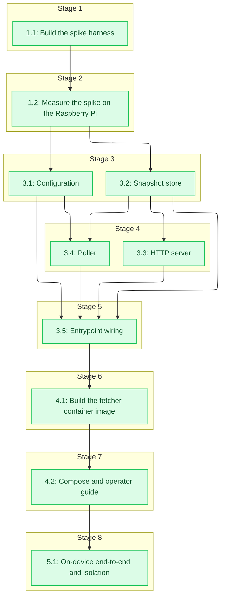

# Tasks: Advisory Fetcher (Playwright sidecar)

<!-- spec-nav:start -->
**Spec navigation:** [State](00_state.md) · [Discovery](01_discovery.md) · [Requirements](02_requirements.md) · [Design](03_design.md) · [Tasks](04_tasks.md) · [Execution](05_execution.md)
<!-- spec-nav:end -->

## Stage and Dependency Overview

> [!WARNING]
> Execute tasks in dependency order. Implementation begins only after this checklist is approved.
> The spike gate (Checkpoint 2) is a hard stop: build the fetcher only if the spike proves a
> repeatable Akamai bypass on the device.

## Implementation Checklist

- [x] 1. Prove the Akamai bypass and Pi memory fit (spike)
  - [x] 1.1 Build the spike harness
    - Write a self-contained spike that launches a headless-shell Chromium via Playwright, navigates the Amtrak notices page, waits for a `na-service-alert__*` gate selector, and records per-cycle whether the markup appeared.
    - Read peak resident memory from cgroup v2 (`/sys/fs/cgroup/memory.peak`) each run, and summarize success rate, longest consecutive-success streak, and peak RSS.
    - Include an Xvfb-headful fallback path (full Chromium under `xvfb-run`, with basic stealth — a realistic user-agent and viewport) that the operator can switch to if headless-shell is blocked, and a local-fixture mode for offline self-test.
    - **Files:** [advisory-fetcher/spike/spike.py](../../advisory-fetcher/spike/spike.py), [advisory-fetcher/spike/README.md](../../advisory-fetcher/spike/README.md)
    - **Dependency resolution:** none
    - **Dependency delivery:** none
    - **Depends on:** none
    - **Stage:** 1
    - **Interfaces:** Consumes: the notices URL, a `na-service-alert__*` gate selector, a cycle count, and the cgroup peak-memory path; Produces: `run_spike(cfg) -> SpikeReport` printing per-cycle markup-present booleans, success rate, max consecutive successes, and peak RSS in bytes
    - **Documentation:** Module docstring stating the gating question and how to run it; `run_spike` docstring describing the report contract.
    - **Verification:** Run in local-fixture mode against a saved page containing the gate markup and confirm the report fields; `python -m py_compile`.
    - **Estimated effort:** 2–3 hours
    - **Risk:** low; a throwaway harness with no rollback concern.
    - **Task category:** code_analysis
    - **Delegation:** sequential subagent
    - _Requirements: 7.1, 7.2_

  - [x] 1.2 Measure the spike on the Raspberry Pi
    - Run the spike on the Pi (`soham@141-hillside-1b`) inside a **throwaway** container: `docker run --rm` from the official `mcr.microsoft.com/playwright/python` image, no named volumes (bind-mount the spike script read-only), for at least 10 consecutive cycles. Remove the pulled image afterward so the Pi is left exactly as found.
    - Record the success rate and proof of at least three consecutive successes; if headless-shell is blocked, repeat with the Xvfb-headful fallback and record which mode passed. Report observed memory as an informational signal.
    - Write the outcome and the go/no-go decision; a failure routes to Approach B or shelving, leaving the service image untouched.
    - **Files:** [advisory-fetcher/spike/results.md](../../advisory-fetcher/spike/results.md)
    - **Scope note:** The bypass proof (R7.1, R7.2) is the gating result and it passed (headless-shell, 10/10). No hard memory cap is required (operator decision), so no cgroup measurement is needed; memory efficiency (single browser, no resident browser, subresource-blocking) is verified on-device in task 5.1.
    - **Dependency resolution:** none
    - **Dependency delivery:** none
    - **Depends on:** 1.1
    - **Stage:** 2
    - **Interfaces:** Consumes: `spike.py`, the official Playwright Python image run as a throwaway `--rm` container on the Pi, and at least 10 cycles; Produces: `results.md` recording the success rate, the consecutive-success proof, the observed memory footprint, the passing browser mode, and the go/no-go decision
    - **Documentation:** `results.md` narrative of method, measurements, and decision.
    - **Verification:** Results show a repeatable bypass (≥3 consecutive); otherwise the recorded decision is Approach B or shelve. The Pi is left with no residual container, volume, or image from the spike.
    - **Estimated effort:** 1–2 hours
    - **Risk:** high; the gate may fail. Fallback is Xvfb-headful, then Approach B or shelve per R7.3. No service code is touched, so there is nothing to roll back.
    - **Task category:** review
    - **Delegation:** controller
    - _Requirements: 1.1, 1.2, 7.1, 7.2, 7.3_

- [x] 2. Checkpoint — Spike gate: proceed to build only if the spike shows a repeatable bypass (at least three consecutive successes). Otherwise stop and choose Approach B or shelve, leaving the service image untouched (R7.3).

- [x] 3. Implement the fetcher
  - [x] 3.1 Configuration
    - Implement a frozen `Config` dataclass and `Config.from_env` reading the design's environment keys with the design defaults, validating integer fields and failing with a clear message on malformed values. Include a `BROWSER_MODE` key (`headless-shell` default, or `xvfb-headful`) and a `BLOCK_SUBRESOURCES` boolean (default on) so the poller launches the validated mode and can skip image/font/media/CSS requests.
    - **Files:** [advisory-fetcher/fetcher/config.py](../../advisory-fetcher/fetcher/config.py), [advisory-fetcher/tests/test_config.py](../../advisory-fetcher/tests/test_config.py)
    - **Dependency resolution:** none
    - **Dependency delivery:** none
    - **Depends on:** 1.2
    - **Stage:** 3
    - **Interfaces:** Consumes: environment keys `AMTRAK_SOURCE_URL`, `POLL_INTERVAL_SECS`, `NAV_TIMEOUT_SECS`, `MAX_STALE_SECS`, `LISTEN_PORT`, `SNAPSHOT_DIR`, `GATE_SELECTOR`, `BROWSER_MODE`, and `BLOCK_SUBRESOURCES`; Produces: a frozen `Config` and `Config.from_env(env) -> Config` applying the design defaults (interval 900, nav timeout 45, max stale 3600, port 8080, browser mode headless-shell, block subresources on)
    - **Documentation:** Docstrings on `Config` and each field, and on `from_env` describing defaults and validation.
    - **Verification:** `python -m pytest advisory-fetcher/tests/test_config.py` covering defaults, overrides, and malformed-integer handling.
    - **Estimated effort:** 1–2 hours
    - **Risk:** low; pure configuration, no external effects.
    - **Task category:** code_analysis
    - **Delegation:** parallel-safe
    - _Requirements: 6.1, 6.2_

  - [x] 3.2 Snapshot store
    - Implement `SnapshotStore` persisting the latest HTML atomically (temp file plus `os.replace`) with a `last_success` timestamp, skipping the payload rewrite when the fetched content is unchanged and only refreshing the freshness marker.
    - **Files:** [advisory-fetcher/fetcher/store.py](../../advisory-fetcher/fetcher/store.py), [advisory-fetcher/tests/test_store.py](../../advisory-fetcher/tests/test_store.py)
    - **Dependency resolution:** none
    - **Dependency delivery:** none
    - **Depends on:** 1.2
    - **Stage:** 3
    - **Interfaces:** Consumes: a `SNAPSHOT_DIR` path and HTML strings; Produces: `SnapshotStore.update(html) -> bool` (atomic replace, no rewrite when unchanged, stamps `last_success`) and `SnapshotStore.read() -> tuple[bytes, float] | None`
    - **Documentation:** Class and method docstrings stating the atomicity and no-churn contract.
    - **Verification:** `python -m pytest advisory-fetcher/tests/test_store.py` covering atomic replace, no-rewrite-when-unchanged (freshness bump only), and `read` returning `None` before the first write.
    - **Estimated effort:** 2–3 hours
    - **Risk:** low; local filesystem only, fail-open on I/O error.
    - **Task category:** code_analysis
    - **Delegation:** parallel-safe
    - _Requirements: 2.2, 2.3, 8.2_

  - [x] 3.3 HTTP server
    - Implement a `ThreadingHTTPServer` handler that serves the snapshot path with `200 text/html` while the last success is within `MAX_STALE_SECS`, `503` when the snapshot is absent or stale, `200` on `/healthz`, and `404` otherwise, performing no browser work.
    - **Files:** [advisory-fetcher/fetcher/server.py](../../advisory-fetcher/fetcher/server.py), [advisory-fetcher/tests/test_server.py](../../advisory-fetcher/tests/test_server.py)
    - **Dependency resolution:** none
    - **Dependency delivery:** none
    - **Depends on:** 3.2
    - **Stage:** 4
    - **Interfaces:** Consumes: a `SnapshotStore`, `MAX_STALE_SECS`, and `LISTEN_PORT`; Produces: a server factory and request handler mapping GET snapshot to 200 (fresh) or 503 (absent or stale), `/healthz` to 200, and other paths to 404
    - **Documentation:** Handler and factory docstrings describing the status semantics.
    - **Verification:** `python -m pytest advisory-fetcher/tests/test_server.py` covering 200 fresh, 503 absent, 503 stale, 404, and `/healthz`.
    - **Estimated effort:** 2–3 hours
    - **Risk:** low; read-only serving with no upstream calls.
    - **Task category:** code_analysis
    - **Delegation:** parallel-safe
    - _Requirements: 2.1, 2.3, 3.1, 8.1_

  - [x] 3.4 Poller
    - Implement `poll_once` launching Chromium in the mode `BROWSER_MODE` selects — `headless-shell` (headless, no channel, keeping `chromium-headless-shell`) or `xvfb-headful` (full Chromium via `channel="chromium"` under Xvfb with the basic stealth the spike validated) — plus `--disable-dev-shm-usage` and `--disable-gpu`. When `BLOCK_SUBRESOURCES` is on, register a `context.route` that aborts `image`/`font`/`media`/`stylesheet` requests while allowing `document`/`script`/`xhr`/`fetch` (so Akamai's sensor JS still runs). Navigate with a bounded timeout, wait for the gate selector, return `page.content()` on match and `None` otherwise, and close the browser in a `finally` block.
    - Use the browser mode the spike recorded as passing in [advisory-fetcher/spike/results.md](../../advisory-fetcher/spike/results.md); default to `headless-shell` (the efficient path).
    - Implement `run_forever` that calls `poll_once`, writes to the store on success, sleeps `POLL_INTERVAL_SECS`, and never raises out of a cycle (fail-open).
    - **Files:** [advisory-fetcher/fetcher/poller.py](../../advisory-fetcher/fetcher/poller.py), [advisory-fetcher/tests/test_poller.py](../../advisory-fetcher/tests/test_poller.py)
    - **Dependency resolution:** none
    - **Dependency delivery:** none
    - **Depends on:** 3.1, 3.2
    - **Stage:** 4
    - **Interfaces:** Consumes: a `Config`, a `SnapshotStore`, and the Playwright async API; Produces: `poll_once(cfg) -> str | None` and `run_forever(store, cfg) -> None` (launch-per-poll, browser closed each cycle, loop never raises)
    - **Documentation:** Docstrings on both functions describing fail-open behavior, launch-per-poll, and why the channel is left unset.
    - **Verification:** `python -m pytest advisory-fetcher/tests/test_poller.py` against a local fixture served over HTTP (markup present returns HTML and updates the store, absent returns `None` and leaves the store intact), asserting the browser is closed after each cycle, and that the subresource-blocking predicate aborts `image`/`font`/`media`/`stylesheet` while allowing `document`/`script`/`xhr`/`fetch`. Runs offline without contacting Amtrak.
    - **Estimated effort:** 3–4 hours
    - **Risk:** medium; Playwright async lifecycle. Rollback is reverting the file.
    - **Task category:** code_analysis
    - **Delegation:** parallel-safe
    - _Requirements: 1.1, 1.2, 1.3, 4.1, 4.2, 8.1, 8.3_

  - [x] 3.5 Entrypoint wiring
    - Implement `__main__` that builds `Config.from_env`, starts the HTTP server thread, runs the poll loop, and shuts down cleanly on SIGTERM.
    - **Files:** [advisory-fetcher/fetcher/__main__.py](../../advisory-fetcher/fetcher/__main__.py)
    - **Dependency resolution:** none
    - **Dependency delivery:** none
    - **Depends on:** 3.1, 3.2, 3.3, 3.4
    - **Stage:** 5
    - **Interfaces:** Consumes: `Config.from_env`, `SnapshotStore`, the server factory, and `run_forever`; Produces: a `python -m fetcher` process that serves the endpoint and runs the poll loop with clean SIGTERM shutdown
    - **Documentation:** Module docstring describing the wiring and shutdown behavior.
    - **Verification:** Smoke test that the process starts, serves `/healthz`, and after a fixture poll serves the snapshot on the endpoint.
    - **Estimated effort:** 1–2 hours
    - **Risk:** low; assembly of tested parts.
    - **Task category:** code_analysis
    - **Delegation:** sequential subagent
    - _Requirements: 3.1, 8.1_

- [x] 4. Package the fetcher container
  - [x] 4.1 Build the fetcher container image
    - Author a Dockerfile (base `python:3.12-slim`) that installs Playwright at an exact release (`pip install playwright==<exact>`), then installs the browser the spike validated: `playwright install --only-shell chromium` when headless-shell passed, or full Chromium plus Xvfb (`playwright install chromium` and the Xvfb system packages) when the Xvfb-headful fallback was required. Run as a non-root user and build a `linux/arm64` image whose entrypoint is `python -m fetcher`.
    - **Files:** [advisory-fetcher/Dockerfile](../../advisory-fetcher/Dockerfile), [advisory-fetcher/.dockerignore](../../advisory-fetcher/.dockerignore)
    - **Dependency resolution:** none
    - **Dependency delivery:** none
    - **Depends on:** 3.5
    - **Stage:** 6
    - **Scope note:** The fetcher is a separate Python image outside the Rust/Cargo dependency-audit surface this spec tooling inventories; its single runtime tool is fixed to an exact release directly in the Dockerfile (no separate manifest file), so resolution is `none` and correctness is verified by an exact-release install plus a reproducible build.
    - **Interfaces:** Consumes: the `fetcher` module, an exact Playwright release string, and the spike-validated browser mode; Produces: a `linux/arm64` image with the validated browser installed (headless-shell-only, or full Chromium plus Xvfb), running as non-root, entrypoint `python -m fetcher`
    - **Documentation:** Dockerfile comments explaining the slim base, the exact Playwright release, the headless-shell-only install, and the non-root user.
    - **Verification:** `docker build` for `linux/arm64` succeeds and the container serves `/healthz`; Playwright is installed at an exact release for a reproducible build.
    - **Estimated effort:** 2–4 hours
    - **Risk:** medium; arm64 build and browser system dependencies. Rollback is reverting the Dockerfile.
    - **Task category:** code_analysis
    - **Delegation:** controller
    - _Requirements: 5.2_

  - [x] 4.2 Compose and operator guide
    - Author `docker-compose.yml` running the fetcher with `restart: unless-stopped`, `shm_size` (ample `/dev/shm` without sharing the host IPC namespace), and no published ports (no hard `mem_limit` — operator decision), plus the service configured with `AMTRAK_ADVISORIES=on` and `AMTRAK_ADVISORIES_URL` pointing at the fetcher; write a README covering enable and rollback.
    - **Files:** [advisory-fetcher/docker-compose.yml](../../advisory-fetcher/docker-compose.yml), [advisory-fetcher/README.md](../../advisory-fetcher/README.md)
    - **Dependency resolution:** none
    - **Dependency delivery:** none
    - **Depends on:** 4.1
    - **Stage:** 7
    - **Interfaces:** Consumes: the fetcher image; Produces: a compose stack with the memory-capped auto-restarting fetcher and the service pointed at its endpoint, plus README operator instructions
    - **Documentation:** README operator guide for enabling, disabling, and the environment contract.
    - **Verification:** `docker compose config` validates and the memory limit and restart policy are present.
    - **Estimated effort:** 1–2 hours
    - **Risk:** low; declarative configuration.
    - **Task category:** code_analysis
    - **Delegation:** sequential subagent
    - _Requirements: 4.3, 6.2_

- [x] 5. Verify end-to-end on the device
  - [x] 5.1 On-device end-to-end and isolation
    - Bring up the compose stack on the Pi and record: a known station alert (`ALX`) and a route alert (Hartford Line) emitted by the unchanged service via the fetcher; the subresource-blocked bypass still succeeding on the shipped image (Akamai sensor JS runs with images/fonts/media/CSS blocked); a single browser per cycle and no browser process resident between polls; the fetcher resuming polling after a simulated crash/kill; the service image digest unchanged and still reporting no vulnerabilities; and the observed memory footprint (informational, no hard cap).
    - **Files:** [advisory-fetcher/E2E.md](../../advisory-fetcher/E2E.md)
    - **Dependency resolution:** none
    - **Dependency delivery:** none
    - **Depends on:** 4.2
    - **Stage:** 8
    - **Interfaces:** Consumes: the compose stack on the Pi and the unchanged service; Produces: `E2E.md` recording the emitted station and route alerts, the subresource-blocked bypass result, the single-browser/no-resident-browser observation, the restart-after-kill observation, the unchanged service-image evidence, and the observed memory footprint
    - **Documentation:** `E2E.md` narrative with the evidence observations.
    - **Verification:** All observations recorded and passing on the device: alerts emitted, subresource-blocked bypass holds, single browser per cycle with none resident between polls, restart-after-kill works, and the service image is unchanged.
    - **Estimated effort:** 2–3 hours
    - **Risk:** medium; runs on real hardware. No service code changes, so rollback is stopping the stack.
    - **Task category:** review
    - **Delegation:** controller
    - _Requirements: 2.4, 3.2, 4.1, 4.2, 4.3, 5.1, 8.1_

- [ ] 6. Checkpoint — Delivery gate: with the on-device end-to-end passing and the service image verified unchanged, hand off to spec-finish for the PR to main. The service's Rust surface is untouched, so there is no protected-main code change.

## Delivery Schedule

| Stage | Task | Estimate | Depends on | Critical path |
|---|---|---|---|---|
| 1 | 1.1 Spike harness | 2–3 hours | none | yes |
| 2 | 1.2 Measure on Pi | 1–2 hours | 1.1 | yes |
| 3 | 3.1 Config | 1–2 hours | 1.2 | no |
| 3 | 3.2 Store | 2–3 hours | 1.2 | yes |
| 4 | 3.3 Server | 2–3 hours | 3.2 | no |
| 4 | 3.4 Poller | 3–4 hours | 3.1, 3.2 | yes |
| 5 | 3.5 Entrypoint | 1–2 hours | 3.1, 3.2, 3.3, 3.4 | yes |
| 6 | 4.1 Image | 2–4 hours | 3.5 | yes |
| 7 | 4.2 Compose | 1–2 hours | 4.1 | yes |
| 8 | 5.1 On-device e2e | 2–3 hours | 4.2 | yes |

## Approval

Status: **Approved on 2026-08-18** (spike runs as a throwaway `--rm` container, no residue on the Pi).
