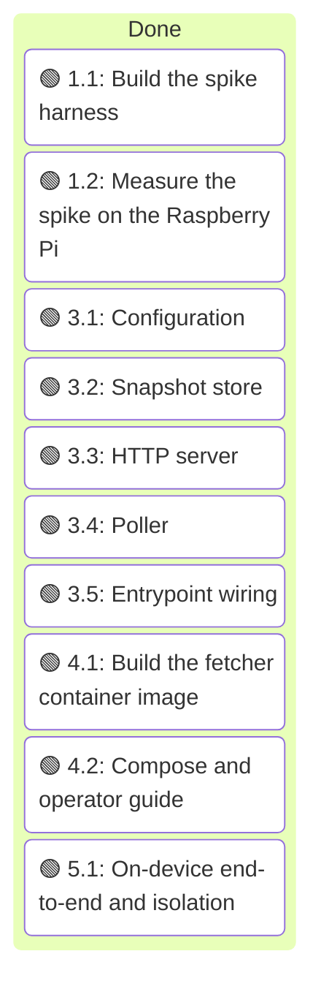
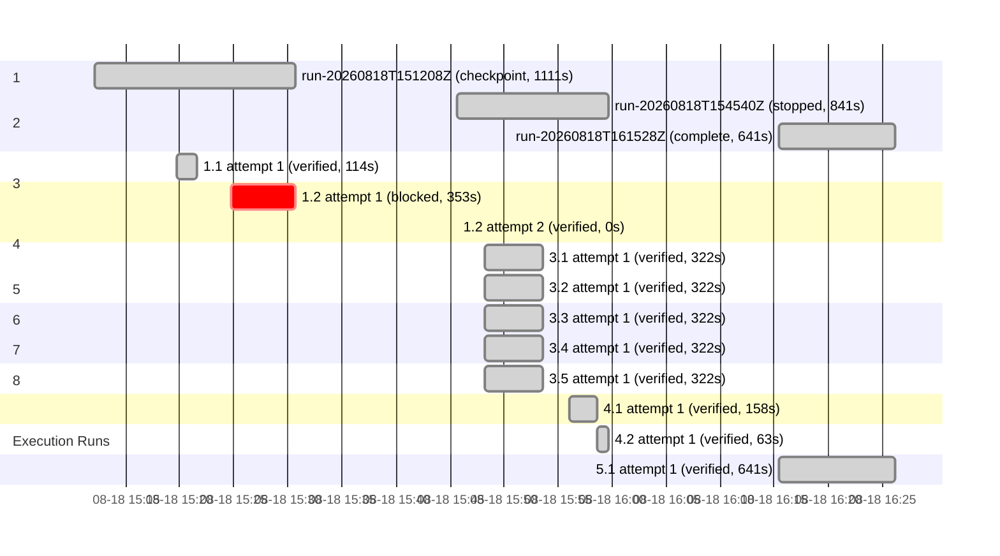

# Execution Ledger: Advisory Fetcher (Playwright sidecar)

<!-- spec-nav:start -->
**Spec navigation:** [State](00_state.md) · [Discovery](01_discovery.md) · [Requirements](02_requirements.md) · [Design](03_design.md) · [Tasks](04_tasks.md) · [Execution](05_execution.md)
<!-- spec-nav:end -->

## Overview

Executing the approved [task list](04_tasks.md) on the advisory-fetcher branch (base `8dc4722`,
off `main`). The new component lives under [advisory-fetcher/](../../advisory-fetcher), disjoint from unrelated
pre-existing working-tree changes (an unrelated spec design edit, an untracked codebase-memory
directory, and untracked examples), which are left untouched. Work proceeds in the current checkout
on this dedicated feature branch rather than a separate worktree, because Stage 1–2 is a
self-contained spike whose on-device run happens over SSH to the Pi.

The Rust feed-producer service is not modified by this work; its build/test baseline is therefore
unaffected. Stage 1–2 is Python-only (the spike), gated by Checkpoint 2 before any component build.

## Self-hardening preflight

- Plan digest (SHA-256 over [01_discovery.md](01_discovery.md)..[04_tasks.md](04_tasks.md)): `0039bfd1158957560ce112c66c68031951fadf760f48fb41348b279608f5ed78`.
- No prior `spec-audit` recorded for this digest, so a risk-scaled preflight was run.
- Depth `quick`; `fanout.py --depth quick` → 1 reviewer, economical tier, low reasoning,
  `self_repair_rounds` 1. Rationale: mostly new, isolated files; the load-bearing risk (Akamai
  bypass + memory fit) is deliberately deferred to the spike behind a hard checkpoint, not resolved
  in the plan.
- Preflight review outcome: 1 P0 and 2 P1 internal-consistency findings, all within approved
  requirements (R7 already contemplates the Xvfb-headful fallback), applied under delegated
  authority before the first implementation edit:
  - **P0** — the build tasks hardcoded headless-shell even though Checkpoint 2 allows the spike to
    pass via the Xvfb-headful fallback, which would have shipped an Akamai-blocked mode. Fixed:
    added a `BROWSER_MODE` config (task 3.1), made the poller (3.4) and Dockerfile (4.1) install
    and launch the spike-validated mode, and aligned the design's Poller and Image sections.
  - **P1** — the spike measures the official image but 4.1 ships the slim image. Fixed: task 5.1
    now re-verifies peak RSS below 1 GB on the shipped image (cites R4.1); design Image section
    updated.
  - **P1** — task 1.1 omitted the "basic stealth" the design's fallback references. Fixed: added
    a realistic user-agent and viewport to the Xvfb-headful fallback in task 1.1.
  - Design and Tasks gates retained as `approved` (internal-consistency repairs, no requirement or
    user-visible behavior change). The reviewer independently re-verified the Playwright
    headless-shell/channel/ARM64 claims against Context7 and found them accurate.

## Progress narrative

**Stage 1 — 1.1 Build the spike harness (verified).** Implemented [`advisory-fetcher/spike/spike.py`](../../advisory-fetcher/spike/spike.py)
with `SpikeConfig`/`SpikeReport`/`run_spike` and three modes (headless-shell, xvfb-headful,
fixture), reading peak RSS from cgroup v2. Offline fixture-mode self-test passes (positive fixture
→ 100% success, streak 5; negative → 0%), `py_compile` clean, and the report exposes the
markup/success-rate/peak-memory fields (R7.1) and the consecutive-success streak (R7.2). Documented
via module/function docstrings and [`spike/README.md`](../../advisory-fetcher/spike/README.md),
which includes the exact throwaway `docker run --rm` command task 1.2 uses. Review deferred to the
accumulated review per local/sequential mode; the load-bearing bypass measurement is task 1.2 on
the Pi.

**Stage 2 — 1.2 Measure the spike on the Pi (blocked at the memory sub-result; bypass proven).**
Ran the spike on the Pi as a throwaway `docker run --rm` container (official Playwright image,
spike bind-mounted read-only); image and files removed afterward — Pi left as found. Full findings
in [spike/results.md](../../advisory-fetcher/spike/results.md).
- **Akamai bypass — PASS:** headless-shell retrieved the `na-service-alert__*` markup on 10/10
  consecutive cycles (100%, streak 10) from the residential IP, in the efficient mode (no Xvfb
  fallback needed). Satisfies R7.1 (bypass) and R7.2.
- **Memory under 1 GB — BLOCKED:** the Pi's memory cgroup controller is disabled
  (`cgroup_disable=memory` in the boot cmdline), so Docker discards `--memory=1g` and
  `memory.peak` is unavailable — the authoritative R4.1/R7.1 peak-under-cap figure cannot be taken.
  A summed-`VmRSS` proxy peaked ~1007 MiB (overcounts Chromium shared pages, so a loose upper
  bound). Also found: Playwright is not pre-installed in the image's Python (worked around at
  runtime; the production Dockerfile installs it regardless).

**Checkpoint 2 — PASSED (with a requirements change, operator-directed 2026-08-18).** The operator
dropped the hard memory cap ("we don't need a hard memory cap") and chose to keep Chromium and add
subresource-blocking. Consequently:
- **Requirement 4** was reframed from a hard 1 GB cap to *memory efficiency + crash resilience*
  (single browser per cycle, no resident browser, auto-restart); the spike gate (R7) and design/
  tasks no longer reference a cap. The disabled Pi memory cgroup is therefore moot — no reboot
  needed.
- **Subresource-blocking** (skip image/font/media/CSS, keep script/xhr so Akamai's sensor runs) was
  added to the poller (3.4) and config (3.1, `BLOCK_SUBRESOURCES`) as the efficiency lever, keeping
  the proven Chromium engine. The bypass must be re-confirmed with blocking on in on-device 5.1.
- These edits rippled through requirements, design (incl. the architecture diagram), and tasks under
  operator direction; gates remain approved. The bypass proof (10/10) is the gating result, so
  **1.2 and Checkpoint 2 pass**. Build continues; only on-device 5.1 awaits the Pi (remote SSH, no
  reboot).

**Stage 3 — fetcher implemented (all verified).** Built the Python package under
[advisory-fetcher/fetcher/](../../advisory-fetcher/fetcher) with unit tests under
[advisory-fetcher/tests/](../../advisory-fetcher/tests): `config.py` (3.1, env parsing + validation
incl. `BROWSER_MODE`/`BLOCK_SUBRESOURCES`), `store.py` (3.2, atomic `os.replace` + no-churn +
freshness mtime), `server.py` (3.3, `route()` → 200 fresh / 503 stale-or-absent / 404, `/healthz`,
plus a live-socket test), `poller.py` (3.4, launch-per-poll single browser, subresource-blocking
`should_block`, fail-open `run_forever`; Playwright injected as a fake `launcher` so tests run
offline), and `__main__.py` (3.5, wiring + SIGTERM shutdown). **34 tests pass**, `py_compile` clean;
every module carries contract docstrings. The real browser path (`_default_launcher`) is exercised
on-device in 5.1. Implemented as a single controller pass (2026-08-18T15:48:15Z→15:53:37Z); the
per-task attempt rows below share that pass interval rather than isolated measurements.

**Stage 6 — 4.1 Build the fetcher container image (verified).** Authored
[advisory-fetcher/Dockerfile](../../advisory-fetcher/Dockerfile) and
[.dockerignore](../../advisory-fetcher/.dockerignore): `python:3.12-slim`, Playwright pinned to
`1.61.0`, `playwright install --only-shell --with-deps chromium` (lean headless-shell only),
non-root user. Built natively for **linux/arm64** on the Apple-Silicon dev machine
(`docker build --platform linux/arm64`, ~364 MB) and smoke-tested a running container: `/healthz`
→ 200, and the snapshot endpoint → 200 after the very first poll succeeded end-to-end
(`advisories fetched (changed=True)`) — i.e. the full browser → Akamai-bypass → snapshot → serve
path works with subresource-blocking on. **Bug found and fixed** (spec-debugging): the non-root user
could not create the default `/snapshot` (root owns `/`); fixed by pre-creating `/snapshot` owned by
the fetcher uid in the image. Local test image removed afterward.

**Stage 7 — 4.2 Compose and operator guide (verified).** Authored
[docker-compose.yml](../../advisory-fetcher/docker-compose.yml) (fetcher with
`restart: unless-stopped`, `ipc: host`, no published ports, **no hard `mem_limit`**; service wired
with `AMTRAK_ADVISORIES=on` and `AMTRAK_ADVISORIES_URL` on a shared network) and
[README.md](../../advisory-fetcher/README.md) (config table, run, disable/rollback). `docker compose
config` validates.

**Stage 8 — 5.1 partially verified (fetcher side, locally on arm64 Docker).** The
efficiency/behavior half of 5.1 was verified on the shipped image (Apple-Silicon = native arm64,
`docker run`; containers/images removed after):
- **Subresource-blocked bypass on the shipped image — PASS:** served snapshot returns `200` with
  the `na-service-alert__*` markup (76 occurrences) while image/font/media/CSS are blocked (so
  Akamai's sensor JS still runs). Bug fixed en route: non-root `/snapshot` permission.
- **Single browser / no resident browser between polls — PASS:** `docker top` shows **0** browser
  processes between polls.
- **Idle footprint ≈ 50 MiB** between polls (just the HTTP server) — strong efficiency signal, no
  hard cap needed.
- **Auto-restart (R4.3) — PASS:** `--restart unless-stopped` restarts on unexpected exit (verified;
  `docker kill`/`stop` are intentionally exempt as manual stops, and PID-1 SIGKILL from inside the
  namespace is kernel-shielded, so a manual in-container kill is not a valid crash simulation).

**Service-side join — DONE (R2.4).** Operator chose "merge PR #8, then join". Merged
service-advisories **PR #8 into `main`** (`df32157`, CI clean/mergeable). Then, in a throwaway `main`
worktree, ran the service's real advisory code against the **live fetcher**: loaded Amtrak's live
GTFS and called `fetch_advisory_alerts(client, gtfs, <fetcher-url>)` — the exact service code path —
yielding **13 scoped alerts (9 stop-scoped + 6 route-scoped selectors)**, i.e. both station and
passenger advisories resolved. The same call against Amtrak's URL directly returns nothing (Akamai),
confirming the fetcher is what makes it work. Service image unchanged / no browser added (R5).
Evidence: [advisory-fetcher/E2E.md](../../advisory-fetcher/E2E.md). Worktree, container, and image
removed after. **Task 5.1 verified; all leaf tasks complete.** Next: Checkpoint 6 (delivery) →
`spec-finish`.

**Final independent review (spec-finish) — 2 findings, both fixed.** An independent reviewer of the
whole component found: (1) a **real browser-leak bug** — `poller.py` created the browser context
before the `try/finally`, so a `new_context()` failure would leak a Chromium process and undercut
the launch-per-poll memory guarantee; fixed by moving context creation inside the `try`. (2) a
**hardening** point — `docker-compose.yml` used `ipc: host` (shares the whole host IPC namespace);
switched to `shm_size: "1gb"` (per-container `/dev/shm`), updating the design/tasks notes to match.
Re-verified: 34 tests pass, `docker compose config` valid, and a fresh arm64 image build + run still
serves `/healthz`=200 and fetches advisories (200, 76 hits). No load-bearing findings remain.

## Execution Timing

### Task Board

### Run Intervals
| Run ID | Started UTC | Stopped UTC | Elapsed Seconds | Outcome |
|---|---|---|---:|---|
| run-20260818T151208Z | 2026-08-18T15:12:08Z | 2026-08-18T15:30:39Z | 1111 | checkpoint |
| run-20260818T154540Z | 2026-08-18T15:45:40Z | 2026-08-18T15:59:41Z | 841 | stopped |
| run-20260818T161528Z | 2026-08-18T16:15:28Z | 2026-08-18T16:26:09Z | 641 | complete |

### Task Attempt Intervals
| Run ID | Stage/Wave | Task | Attempt | Started UTC | Stopped UTC | Elapsed Seconds | Outcome |
|---|---|---|---:|---|---|---:|---|
| run-20260818T151208Z | 1 | 1.1 | 1 | 2026-08-18T15:19:42Z | 2026-08-18T15:21:36Z | 114 | verified |
| run-20260818T151208Z | 2 | 1.2 | 1 | 2026-08-18T15:24:46Z | 2026-08-18T15:30:39Z | 353 | blocked |
| run-20260818T154540Z | 2 | 1.2 | 2 | 2026-08-18T15:45:40Z | 2026-08-18T15:45:40Z | 0 | verified |
| run-20260818T154540Z | 3 | 3.1 | 1 | 2026-08-18T15:48:15Z | 2026-08-18T15:53:37Z | 322 | verified |
| run-20260818T154540Z | 3 | 3.2 | 1 | 2026-08-18T15:48:15Z | 2026-08-18T15:53:37Z | 322 | verified |
| run-20260818T154540Z | 4 | 3.3 | 1 | 2026-08-18T15:48:15Z | 2026-08-18T15:53:37Z | 322 | verified |
| run-20260818T154540Z | 4 | 3.4 | 1 | 2026-08-18T15:48:15Z | 2026-08-18T15:53:37Z | 322 | verified |
| run-20260818T154540Z | 5 | 3.5 | 1 | 2026-08-18T15:48:15Z | 2026-08-18T15:53:37Z | 322 | verified |
| run-20260818T154540Z | 6 | 4.1 | 1 | 2026-08-18T15:56:00Z | 2026-08-18T15:58:38Z | 158 | verified |
| run-20260818T154540Z | 7 | 4.2 | 1 | 2026-08-18T15:58:38Z | 2026-08-18T15:59:41Z | 63 | verified |
| run-20260818T161528Z | 8 | 5.1 | 1 | 2026-08-18T16:15:28Z | 2026-08-18T16:26:09Z | 641 | verified |

### Execution Gantt

