# Discovery: Amtrak GTFS-RT Service

<!-- spec-nav:start -->
**Spec navigation:** [State](00_state.md) · [Discovery](01_discovery.md) · [Requirements](02_requirements.md) · [Design](03_design.md) · [Tasks](04_tasks.md) · [Execution](05_execution.md)
<!-- spec-nav:end -->

## Problem and Outcome

Amtrak publishes static schedule data and live operational data, but transit applications need a stable, standards-compliant GTFS and GTFS-Realtime interface. The product outcome is an internally operated service that converts Amtrak train status into GTFS-Realtime TripUpdates, VehiclePositions, and Alerts bound to the matching static GTFS feed for controlled downstream consumers.

The repository already contains a working Rust implementation described in the [project README](../../README.md). Discovery therefore needs to establish the next independently shippable boundary instead of pretending the project begins from an empty repository.

## Users and Current Workaround

Primary users are the service operator and controlled downstream transit systems that need machine-readable Amtrak status. Transit application developers and aggregators are potential beneficiaries of the generated feeds, but anonymous public access to this service is not part of the approved operating model.

Without this service, internal consumers must integrate Amtrak-specific sources, handle encrypted or unstable upstream data, match trains to scheduled GTFS trips, construct protobuf messages, and maintain compatibility with Amtrak's changing data. The current repository automates much of that path, but operators still lack a clearly defined internal service contract and production-quality freshness and correctness guarantees.

## Scope and Non-Goals

The product boundary includes:

- ingesting Amtrak's static GTFS and live operational data;
- matching live trains to scheduled trips;
- publishing GTFS-Realtime TripUpdates, VehiclePositions, and Alerts;
- publishing the exact static GTFS feed to which realtime identifiers bind;
- preserving last-good data through transient upstream failures;
- validating feed structure and cross-feed consistency; and
- exposing feeds over a controlled HTTP boundary for authorized internal consumers.

The proposed first spec increment does not include anonymous public API access, internet-scale demand management, a passenger-facing mobile application, a journey planner, ticketing, historical analytics, or a proprietary replacement for the GTFS standards. Additional realtime sources and public distribution may be considered later, but should not expand the first approved delivery boundary without a demonstrated need and a separate capacity and abuse-control plan.

## Constraints and Success Measures

Constraints established by repository evidence:

- The current implementation is a Rust service whose entry point is [`src/main.rs`](../../src/main.rs).
- It delegates the Amtrak-specific transform to the AGPL-licensed `catenarytransit/amtrak-gtfs-rt` dependency declared in [`Cargo.toml`](../../Cargo.toml), so distribution and hosted use must remain compatible with AGPL-3.0-only.
- Existing HTTP routes in [`src/serve.rs`](../../src/serve.rs) expose `/trip-updates.pb`, `/vehicle-positions.pb`, `/alerts.pb`, `/static.zip`, and `/health`.
- The existing poller in [`src/orchestrator.rs`](../../src/orchestrator.rs) retains last-good files when live sources fail.
- The static GTFS and each realtime feed must remain identifier-compatible.
- The service must stop reporting realtime readiness after five minutes without a successful realtime refresh, while retaining last-good artifacts for diagnosis and controlled consumption.
- The service must not assume capacity for uncontrolled public demand.

Success must be measurable through standards validation, controlled-consumer interoperability, a five-minute readiness threshold, identifier consistency, resilience during upstream failure, access-boundary enforcement, and operational visibility. Additional exact thresholds belong in the requirements phase after the delivery boundary is approved.

## Approaches Considered

| Approach | Benefits | Costs / risks | Reversibility | Decision |
|---|---|---|---|---|
| Harden the existing vertical slice as an internal service | Builds on a working pipeline; shortest path to controlled consumers; constrains capacity and access risk; exposes correctness and operational gaps with production evidence | Must carefully distinguish inherited upstream defects from service defects; internal access and readiness semantics need an explicit contract | High; later sources and delivery layers can be added behind existing seams | **Recommended** as the first independently shippable increment |
| Rewrite the service from first principles | Maximum control over matching, feed semantics, and licensing boundaries | Repeats substantial working functionality; highest delivery risk; requires reproducing Amtrak-specific decryption and matching expertise | Medium; migration can be staged, but parallel implementations increase maintenance | Reject unless discovery finds a blocking defect in the current dependency or architecture |
| Expand immediately into a multi-source, publicly hosted platform | Could improve availability and offer a turnkey endpoint to transit developers | Combines source integration, correctness, operations, hosting, capacity, abuse controls, and product policy into one oversized release with potentially high demand | Low to medium; infrastructure and public contracts become expensive to unwind | Defer until the internal feed contract and quality baseline are proven |

## Chosen Direction

The approved direction is to treat the existing implementation as a vertical-slice prototype and harden it into a trustworthy internal feed service. This preserves the current source seam, static-feed store, poller, atomic file publication, and HTTP delivery where they satisfy approved requirements, while constraining access to controlled consumers and allowing targeted changes where validation or operational evidence identifies gaps.

## Architecture and Flow Outline

The approved boundary keeps Amtrak-specific ingestion and standards conversion inside a controlled service boundary. Only authorized internal consumers receive the resulting feeds; anonymous public distribution and its capacity obligations remain outside this increment.

```mermaid
block
  columns 3
  block:internal_service["Internal Amtrak GTFS RT Service"]
    static_feed[("Versioned static GTFS")]
    realtime_conversion["Realtime fetch match and conversion"]
    last_good[("Validated last good feed set")]
    controlled_http["Controlled HTTP feed boundary"]
  end
  amtrak_sources[/"Amtrak static and realtime data"/]
  internal_consumers[/"Authorized internal consumers"/]
  amtrak_sources-- "schedule" -->static_feed
  amtrak_sources-- "live status" -->realtime_conversion
  static_feed-- "matching context" -->realtime_conversion
  realtime_conversion-- "validated feed set" -->last_good
  last_good-- "serve" -->controlled_http
  controlled_http-- "GTFS and GTFS RT" -->internal_consumers
```

The current high-level path is:

1. Download and parse Amtrak static GTFS into a versioned in-memory store.
2. Poll an Amtrak realtime source against that static schedule.
3. Normalize source output into TripUpdates, VehiclePositions, and Alerts.
4. Stamp realtime headers with the active static feed version and atomically publish feed files.
5. Serve the realtime protobuf files and matching static ZIP over HTTP.
6. Keep serving the last known good artifacts when an upstream fetch or refresh fails.

## Failure and Verification Strategy

The service should fail closed for newly generated artifacts: an unsuccessful fetch, parse, match, encode, validation, or grouped publication must not replace last-good output. Operational health must distinguish process liveness from feed readiness and freshness.

Verification should combine deterministic unit and integration tests, protobuf decoding, MobilityData static and realtime validators, cross-feed identifier checks, controlled upstream-failure tests, and at least one independent consumer compatibility test. Live tests are supporting evidence because Amtrak's upstream availability and active train set vary over time.

## Open Decisions

The requirements phase must define the controlled-consumer contract, five-minute readiness behavior, access-boundary outcomes, and which validator findings block release. Deployment topology and implementation mechanisms remain design decisions unless they alter externally observable behavior.

## Approval

Status: **Approved on 2026-08-11**
