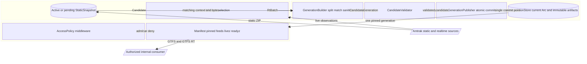
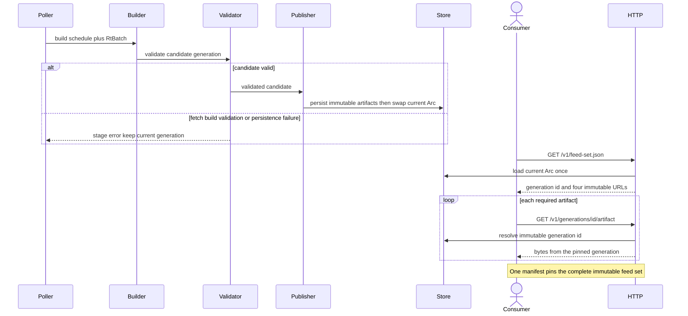

# Design: Amtrak GTFS-RT Service

<!-- spec-nav:start -->
**Spec navigation:** [State](00_state.md) · [Discovery](01_discovery.md) · [Requirements](02_requirements.md) · [Design](03_design.md) · [Tasks](04_tasks.md) · [Execution](05_execution.md)
<!-- spec-nav:end -->

## Overview

Harden the existing Rust vertical slice into an internally operated feed service. Each poll builds a complete candidate against one static schedule, separates and sanitizes the three GTFS-Realtime entity types, validates referential and wire-format invariants, persists immutable artifacts, and swaps one in-memory generation pointer only after every step succeeds. Consumers first fetch a manifest and then use its generation-pinned URLs; there are no mutable per-feed “current” URLs that can cross a publication boundary independently.

This realizes the approved direction in [01_discovery.md](01_discovery.md): preserve the existing source adapter, Tokio/Axum service, and validation tooling while replacing unsafe publication, health, and network defaults. A rewrite, a public multi-tenant API, and a database-backed platform remain rejected for this increment.

> [!IMPORTANT]
> Approval gate: approve this design before work begins on [04_tasks.md](04_tasks.md).

## Architecture

The repository graph confirms the current boundaries in [src/main.rs](../../src/main.rs), [src/orchestrator.rs](../../src/orchestrator.rs), [src/static_gtfs.rs](../../src/static_gtfs.rs), [src/serve.rs](../../src/serve.rs), and [src/writer.rs](../../src/writer.rs). The main architectural correction is to replace independently mutable static/realtime files and stores with one `GenerationStore` and one commit point.



Structured source: [diagrams/architecture.json](diagrams/architecture.json).

## Components and Interfaces

### Configuration and access policy

Extend `Config` in [src/config.rs](../../src/config.rs) and validate it before starting any long-running task.

```rust
pub struct Config {
    pub static_url: String,
    pub output_dir: PathBuf,
    pub poll_interval: Duration,
    pub static_refresh_interval: Duration,
    pub bind_addr: SocketAddr,              // default 127.0.0.1:8080
    pub allowed_peer_ips: BTreeSet<IpAddr>, // empty means loopback peers only
    pub freshness_limit: Duration,          // fixed default 300 s for this increment
    pub gtfs_validator_jar: PathBuf,         // pinned MobilityData validator 8.0.1
}

impl Config {
    pub fn from_env() -> Result<Self, ConfigError>;
    pub fn validate(self) -> Result<ValidatedConfig, ConfigError>;
}

pub enum AccessDecision { Allow, Deny }
pub fn authorize(policy: &AccessPolicy, peer: IpAddr) -> AccessDecision;
```

`AMTRAK_STATIC_URL`, `AMTRAK_OUTPUT_DIR`, `AMTRAK_POLL_SECS`, `AMTRAK_STATIC_REFRESH_SECS`, `AMTRAK_BIND_ADDR`, and `AMTRAK_GTFS_VALIDATOR_JAR` remain operator-controlled. The configured validator must be a readable local MobilityData GTFS validator `8.0.1` JAR whose SHA-256 matches the official release artifact; absence, digest mismatch, a missing `shasum`, or an unusable Java runtime fails startup. Digest, Java-version, and CLI smoke probes are time-bounded so configuration cannot hang startup indefinitely. `AMTRAK_ALLOWED_PEER_IPS` is a comma-separated exact-IP allowlist. A non-loopback bind with no allowlist is a startup error and therefore can never report ready. This increment is direct-connect-only: authorization uses the transport peer supplied by Axum connection metadata, fails closed when that metadata is absent, and ignores `Forwarded`, `X-Forwarded-For`, and similar caller-controlled identity headers. A reverse proxy may not be placed at this authorization boundary; a future trusted-proxy identity model requires a separate security specification. Liveness remains reachable for process supervision; feed, manifest, and readiness routes pass through authorization. Denials log peer address, route, and outcome but no authorization header, token, environment value, or other credential.

### Static schedule lifecycle

Replace the independently swappable `SharedStore<StaticFeed>` with static snapshots owned by candidate/current generations.

```rust
pub struct StaticSnapshot {
    pub version: String,
    pub parsed: Arc<Gtfs>,
    pub zip: Arc<[u8]>,
}

pub async fn fetch_static(url: &str) -> Result<StaticSnapshot, StaticError>;
pub trait StaticStandardsValidator {
    async fn validate(&self, zip: Arc<[u8]>) -> Result<(), StaticValidationError>;
}
pub async fn stage_static(current: &StaticSnapshot, url: &str)
    -> Result<Option<Arc<StaticSnapshot>>, StaticError>;
```

`fetch_static` performs exactly one HTTP fetch, retains those exact response bytes as `zip`, and parses and validates `Gtfs` from that same buffer. A non-empty `feed_info.feed_version` is used when present; otherwise the snapshot receives a service-generated unique version of the form `snapshot-<unix-nanoseconds>-<process-counter>`. The fallback is a persistent identifier for the accepted snapshot, not a content-integrity digest, and it can never be the non-identifying literal `unknown`.

The static refresher may stage a replacement but may not publish it. Before staging, it passes the exact retained ZIP bytes to a production `StaticStandardsValidator` adapter that invokes the locally provisioned, pinned MobilityData GTFS validator `8.0.1` and accepts only a successful report with zero `ERROR` findings. Validator unavailability, timeout, malformed output, or any error finding rejects the snapshot. The next successful realtime build uses the pending snapshot; only the resulting complete generation makes that static version current. Invalid, standards-nonconforming, or unloadable static data leaves the current generation untouched. In-process parse/load and referential checks remain an additional runtime publication gate; the same pinned validator is run independently in the release gate.

### Realtime acquisition and generation building

Keep the existing `RtSource` fallback boundary in [src/sources/mod.rs](../../src/sources/mod.rs), but make source selection return evidence with the data.

```rust
pub struct SelectedBatch {
    pub source_name: &'static str,
    pub batch: RtBatch,
}

pub async fn select_batch(
    sources: &[Arc<dyn RtSource>],
    static_feed: &Gtfs,
) -> Result<SelectedBatch, RefreshError>;

pub struct GenerationBuilder;
impl GenerationBuilder {
    pub fn build(
        static_snapshot: Arc<StaticSnapshot>,
        selected: SelectedBatch,
        generated_at: SystemTime,
    ) -> Result<CandidateGeneration, BuildError>;
}
```

`build` partitions entities by payload, removes `is_deleted` for `FULL_DATASET`, rejects invalid coordinates, omits unmatched trips and invalid stop/route/trip references, and normalizes each header to GTFS-Realtime `2.0`, `FULL_DATASET`, one `generated_at` timestamp, and the selected static version. TripUpdates, VehiclePositions, and Alerts are encoded independently; a combined upstream message is never copied wholesale into multiple products.

### Candidate validation

```rust
pub struct CandidateValidator;
impl CandidateValidator {
    pub fn validate(candidate: CandidateGeneration)
        -> Result<ValidatedGeneration, ValidationError>;
}
```

In-process validation decodes all three protobufs, verifies exactly the permitted entity payload per product, verifies header equality, checks referenced `trip_id`, `stop_id`, and `route_id` values against the candidate static snapshot, requires finite in-range coordinates, and requires non-empty alert text plus at least one valid informed entity. This is the runtime publication gate; the MobilityData validators remain the independent release gate.

### Atomic publication and generation store

```rust
pub struct GenerationStore {
    current: Arc<RwLock<Option<Arc<PublishedGeneration>>>>,
}

impl GenerationStore {
    pub async fn open(output_dir: &Path) -> Result<Self, StoreError>;
    pub async fn current(&self) -> Option<Arc<PublishedGeneration>>;
    async fn commit(&self, generation: PublishedGeneration);
    pub async fn get(&self, id: &GenerationId) -> Option<Arc<PublishedGeneration>>;
}

pub struct GenerationPublisher;
impl GenerationPublisher {
    pub async fn publish(
        output_dir: &Path,
        store: &GenerationStore,
        candidate: ValidatedGeneration,
    ) -> Result<Arc<PublishedGeneration>, PublishError>;
}
```

The publisher writes `generations/.<id>.tmp/`, syncs and closes every artifact and manifest, syncs the temporary directory, renames that directory once to `generations/<id>/`, and syncs the `generations/` parent. It then writes and syncs a temporary current-generation marker, atomically renames it over the marker, and syncs the marker's containing directory before swapping `GenerationStore.current`. A failed write, sync, rename, or marker-directory sync never changes the prior in-memory current generation; restart recovery treats only a complete validated marker target or finalized generation as current.

`GenerationStore::open` recovers the marker before the server starts, validates the named manifest and all four artifacts, and loads them into immutable `Arc<[u8]>` values. If the marker is missing or invalid, it deterministically scans finalized generation directories newest-first and repairs the marker to the newest complete valid generation; temporary, malformed, and partial directories are ignored. Startup can therefore serve the retained last-good generation even when upstream refresh is unavailable. HTTP responses use immutable artifacts from a single `PublishedGeneration`, so readers cannot observe a partial file. The current and preceding generation remain addressable for at least ten minutes; cleanup may remove an older on-disk generation only after that retention window and after it is non-current. Open `Arc` readers remain valid.

### HTTP delivery and health

```rust
pub fn router(state: AppState) -> Router;
pub async fn feed_set(State<AppState>) -> Result<Json<FeedSetManifest>, ApiError>;
pub async fn artifact(Path<(GenerationId, ArtifactName)>, State<AppState>)
    -> Result<ArtifactResponse, ApiError>;
pub async fn livez() -> StatusCode;
pub async fn readyz(State<AppState>) -> (StatusCode, Json<ReadinessBody>);
```

`GenerationId` has one strict parser for `<unix-nanoseconds>-<process-counter>` with ASCII decimal components and no separators beyond the single hyphen. `ArtifactName` is a closed enum for `static.zip`, `trip-updates.pb`, `vehicle-positions.pb`, and `alerts.pb`. Handlers resolve both through `GenerationStore`; route values are never joined to filesystem paths. Protected middleware requires `ConnectInfo<SocketAddr>` and returns `403` when transport peer metadata is missing.

Routes:

| Route | Authorization | Contract |
|---|---|---|
| `GET /livez` | supervisor-visible | `200` if the process can answer |
| `GET /readyz` | access policy | `200` only when current generation age is `< 300`; otherwise `503` |
| `GET /v1/feed-set.json` | access policy | current generation ID, timestamp, static version, counts, and four immutable URLs; `503` before first publication |
| `GET /v1/generations/{id}/static.zip` | access policy | `application/zip` from the named generation |
| `GET /v1/generations/{id}/{trip-updates,vehicle-positions,alerts}.pb` | access policy | `application/x-protobuf` from the named generation |

The mutable legacy `/static.zip` and per-feed `.pb` routes are removed. Controlled consumers must fetch one manifest and use only its pinned URLs. This is the protocol mechanism that makes a coherent feed set observable over separate HTTP requests.

### Supervision and telemetry

`main` passes named poller, static-refresher, and HTTP futures to a testable `supervise(...) -> Result<(), ServiceError>` function. Unexpected success or failure of any required future cancels its siblings, waits for cancellation, and returns an error that `main` maps to a nonzero process exit. Each refresh emits one structured completion event with `outcome`, `stage`, `source`, `generation_id`, `static_version`, duration, and per-feed entity counts when available. Logging fields are allowlisted; configuration values and secrets are never formatted wholesale.

## Data Models

```rust
pub struct GenerationId(String); // "<unix-nanoseconds>-<process-counter>"

pub struct CandidateGeneration {
    pub static_snapshot: Arc<StaticSnapshot>,
    pub generated_at: SystemTime,
    pub source_name: &'static str,
    pub trip_updates: FeedMessage,
    pub vehicle_positions: FeedMessage,
    pub alerts: FeedMessage,
}

pub struct PublishedGeneration {
    pub manifest: FeedSetManifest,
    pub static_zip: Arc<[u8]>,
    pub trip_updates: Arc<[u8]>,
    pub vehicle_positions: Arc<[u8]>,
    pub alerts: Arc<[u8]>,
}

#[derive(Serialize)]
pub struct FeedSetManifest {
    pub generation_id: GenerationId,
    pub generated_at_unix: u64,
    pub static_version: String,
    pub source: String,
    pub entity_counts: EntityCounts,
    pub urls: ArtifactUrls,
}

#[derive(Serialize)]
pub struct ReadinessBody {
    pub ready: bool,
    pub reason: ReadinessReason,
    pub generation_id: Option<GenerationId>,
    pub latest_success_unix: Option<u64>,
    pub age_seconds: Option<u64>,
}
```

The publisher creates the generation ID from the injected generation time plus a process-local monotonic counter and refuses a collision with an existing directory. It is an immutable lookup key, not an integrity claim or a secret. The generation's injected `generated_at_unix` is the one authoritative freshness timestamp in all realtime headers, the immutable manifest, and readiness. `latest_success_unix` becomes observable only after every artifact, directory entry, and current marker is durable, but its value is the generation time rather than publication time; a delayed publication never makes old train data appear fresh.

Validator exceptions in [validation/baseline.json](../../validation/baseline.json) change from `code -> string` to records:

```json
{
  "code": "E003",
  "upstream_cause": "Extra section absent from the published schedule",
  "owner": "repository maintainers",
  "review_on": "YYYY-MM-DD"
}
```

The release gate rejects missing/expired metadata and any unlisted error code.

## Sequence / Flows



Structured source: [diagrams/flows.json](diagrams/flows.json).

Refresh scheduling uses delayed intervals: after any recoverable failure, the poller logs the failed stage, preserves current, waits for the next configured tick, and tries source selection again without terminating. A pending static snapshot is retried with subsequent realtime candidates until it publishes successfully or is superseded by a newer valid static snapshot.

## Correctness Properties

### Property 1: Product separation and decodability

Every published generation contains parseable static GTFS and three independently decodable GTFS-Realtime messages. Each realtime message contains only its named payload type and all four artifacts belong to the same generation.

**Validates: Requirements 1.1, 1.2, 1.3, 1.4, 1.5, 1.6, 1.7, 1.8**

### Property 2: Truthful train semantics

For each matched source train, published predictions and valid coordinates identify the same scheduled trip; alerts contain valid targets and human-readable text. No entity claims an unmatched scheduled trip.

**Validates: Requirements 2.1, 2.2, 2.3, 2.4, 2.5, 2.6, 2.7**

### Property 3: Static-reference closure

Every realtime trip and stop reference resolves in the generation's static snapshot, every realtime header names that static version, and a replacement static snapshot becomes visible only in the same commit as realtime built against it.

**Validates: Requirements 3.1, 3.2, 3.3, 3.4, 3.5, 3.6**

### Property 4: Freshness is publication age

Only a committed generation updates latest success. Readiness is true exactly when that success is younger than 300 seconds, recovers after a new commit, exposes age, and is independent from liveness; each realtime header carries the common generation timestamp.

**Validates: Requirements 4.1, 4.2, 4.3, 4.4, 4.5, 4.6, 4.7**

### Property 5: Failed candidates are observationally inert

Source failure, empty input, build/validation failure, or publication failure leaves the current generation byte-for-byte and metadata-for-metadata unchanged; the scheduled poller continues after recoverable failures.

**Validates: Requirements 5.1, 5.2, 5.3, 5.4, 5.9**

### Property 6: Atomic availability

No artifact is served before full persistence and commit; a manifest names immutable URLs from one generation. Before the first commit, feed routes return unavailable and readiness returns not ready.

**Validates: Requirements 5.5, 5.6, 5.7, 5.8**

### Property 7: Controlled access

An admitted direct transport peer can retrieve available content; any other or missing peer identity is denied. Default startup binds to loopback, non-loopback startup without an allowlist is invalid, forwarding headers never influence authorization, and denial audit events contain no credential material.

**Validates: Requirements 6.1, 6.2, 6.3, 6.4, 6.5**

### Property 8: Validated operator configuration

Static source, poll interval, publication directory, and bind address are configurable without code changes; malformed values and unsafe exposure combinations fail startup with the field and reason.

**Validates: Requirements 7.1, 7.2, 7.3, 7.4, 7.9**

### Property 9: Safe refresh telemetry

Every refresh completion logs success/failure; success includes source and entity counts, failure includes its processing stage, and no event contains secrets or raw configuration.

**Validates: Requirements 7.5, 7.6, 7.7, 7.8, 7.11**

### Property 10: Fail-fast supervision

Unexpected completion or failure of any required long-running activity causes a nonzero process exit.

**Validates: Requirements 7.10**

### Property 11: Validator release ratchet

The release command validates static and each realtime product and rejects any static error, unapproved realtime error, or other deterministic verification failure.

**Validates: Requirements 8.1, 8.2, 8.3, 8.4, 8.10**

### Property 12: Accountable exceptions

Every approved realtime validator exception records its code, upstream cause, owner, and unexpired review date.

**Validates: Requirements 8.5, 8.6, 8.7, 8.8**

### Property 13: Independent consumer compatibility

The release gate decodes each produced realtime artifact with an implementation independent of the service's Rust protobuf path.

**Validates: Requirements 8.9**

## Error Handling / Edge Cases

| Condition | Result | Evidence emitted |
|---|---|---|
| No source returns a non-empty batch | No commit; keep current; retry next tick | `stage=source`, source errors summarized without payload dumps |
| Pending static fetch/parse/load fails | Discard pending candidate; keep current; exact fetched bytes are never published | `stage=static` |
| Entity has mixed/wrong payloads or unresolved IDs | Omit when safely attributable; reject candidate if closure cannot be proven | dropped counts or `stage=build/validate` |
| Coordinate is NaN, infinite, or out of range | Omit the position; do not publish invalid geometry | dropped count |
| Empty candidate after sanitization | No commit; keep current | `stage=build`, `reason=empty` |
| Artifact, directory, rename, or marker durability step fails | Remove only uncommitted temporary state on later cleanup; durable and in-memory current stay unchanged | `stage=publish` |
| Requested generation is unknown/expired | `404`; never substitute current | request outcome |
| No generation exists | Manifest/artifacts `503`; readiness `503` with `reason=no_generation` | health response |
| Generation age is exactly 300 seconds | Readiness `503` with age | health response |
| Unauthorized peer | `403`; no body revealing feed state | credential-free audit event |
| Peer metadata missing or forwarding headers supplied | Ignore forwarding identity and fail closed without peer metadata | credential-free audit event |
| Required task exits | Cancel siblings gracefully and exit nonzero | terminal task name/error |
| Restart while upstream is unavailable | Recover the current marker or newest complete finalized generation and serve it; ignore partial/temp generations | startup recovery event |

Wall-clock regressions cannot make stale data fresh: age is computed as `max(0, now - generated_at)` and tests use an injected clock. A candidate whose publication is delayed past the freshness limit may commit atomically but is immediately not ready. Duplicate entity IDs, impossible headers, or timestamp conversion overflow reject the candidate.

## Testing Strategy

- Unit tests inject maps into configuration parsing, an in-memory clock, mock `RtSource` and `StaticStandardsValidator` implementations, and temporary output directories. They cover safe defaults, validator provisioning/version failures, unsafe bind rejection, exact 300-second readiness, delayed publication, retries, source selection, entity partitioning, header normalization, referential filtering, and secret-free structured fields.
- Property tests generate mixed `FeedEntity` inputs and assert product separation, reference closure, collision-free generation IDs under an injected clock, decode-after-encode, and that any injected failure before commit leaves the prior `Arc<PublishedGeneration>` unchanged.
- Publication integration tests inject failures after every artifact sync, temporary-directory sync, rename, parent-directory sync, and current-marker boundary and race concurrent readers against commit. Restart tests recover the last durable complete generation during upstream outage. Every response must equal either a complete old immutable generation or a complete new immutable generation.
- Axum router tests use peer connection metadata to verify local-only and allowlist policy, missing-peer denial, ignored forwarding headers, traversal-shaped IDs/artifact names, `403/404/503` distinctions, content types, immutable generation lookup, manifest URL coherence, and independent liveness/readiness behavior.
- Supervision tests pass terminating and failing futures to `supervise`, assert sibling cancellation, and assert a nonzero top-level result.
- [scripts/validate-feeds.sh](../../scripts/validate-feeds.sh) is revised to consume the manifest, validate the four pinned artifacts with MobilityData GTFS validator `8.0.1` and GTFS-Realtime validator commit `7041fa3`, reject expired/malformed exception records, and decode each `.pb` through the validator's independent Java protobuf implementation.
- Release evidence includes `cargo fmt --check`, `cargo clippy --all-targets --all-features -- -D warnings`, `cargo test --all-targets --all-features`, the feed validator gate, and fresh dependency audits.

## Cross-Cutting Risk Gates

| Gate | Failure mode | Verification | Owner / decision |
|---|---|---|---|
| Security / authorization | Accidental public exposure or feed disclosure | config tests, peer-policy router tests, deployment probe from denied network | Operator owns allowlist; loopback is the code default; non-loopback without policy is rejected |
| Runtime standards validation | Upstream static replacement introduces GTFS errors after release | exact-byte mock tests plus pinned MobilityData `8.0.1` acceptance/rejection integration fixture | Operator provisions Java and the pinned JAR; service fails startup or retains last-good on validator failure |
| Privacy / secret handling | Credentials copied into telemetry | structured-field allowlist tests and log review | Maintainers; no request authorization value or complete config debug output |
| Performance / capacity | Slow clients or feed copies exhaust memory | benchmark manifest/artifact routes with bounded internal concurrency; verify `Arc<[u8]>` reuse | Internal-demand target only; internet-scale capacity remains out of scope |
| Observability | Stale or failed refresh appears healthy | injected-clock readiness tests and stage-failure metrics tests | Operator alerts on `ready=0` and refresh failures |
| Migration | Existing consumers continue using mutable legacy routes | deployment inventory plus explicit cutover to manifest contract; legacy routes return `404` after coordinated cutover | Operator coordinates all internal consumers before rollout |
| Rollout | New generation implementation publishes malformed data | shadow generation build, validator gate, then controlled restart | Maintainer promotes only after release evidence passes |
| Rollback | New binary cannot build/serve a valid generation | retain previous binary and immutable last-good generation directory; restart previous version against it | Operator; never downgrade by rewriting current artifacts |
| Accessibility | No human UI exists in this increment | not applicable; machine-readable interoperability is tested instead | Maintainers preserve documented JSON/protobuf contracts |

The local peer allowlist deliberately avoids selecting a new authentication dependency. If future deployment requires bearer, mTLS, or identity-provider integration, that is a separately specified security-boundary change rather than an ad hoc extension here.

## Current Technology Evidence

| Technology | Context7 identity/source | Exact selected version | Current-doc question | Decision |
|---|---|---|---|---|
| Axum | `/tokio-rs/axum/axum_v0_8_4` (official project docs; nearest indexed 0.8 documentation) | resolved `0.8.9` | Shared state and route-specific authorization middleware | Use typed `State<AppState>` and apply authorization only to the protected router before merging public liveness |
| GTFS-Realtime | [Official GTFS-Realtime reference](https://gtfs.org/documentation/realtime/reference/) | specification `2.0`; crate `gtfs-realtime 0.2.0` | Header, entity, static-reference, and `FULL_DATASET` semantics | Set version, incrementality, timestamp, and static `feed_version`; emit exactly one relevant payload per entity and strip `is_deleted` |
| Vehicle positions | [Official GTFS vehicle-position guidance](https://gtfs.org/documentation/realtime/feed-entities/vehicle-positions/) | specification `2.0` | Trip association, position coordinates, and timestamp meaning | Require valid WGS-84 latitude/longitude, associate matched positions to `trip_id`, and distinguish observation time from feed generation time |

Context7 was consulted for Axum through `/tokio-rs/axum`; it had no authoritative GTFS-Realtime identity, so the official GTFS specification is the primary fallback rather than a community library result. Implementation must re-query Axum documentation if the resolved version changes.

## Dependency Security Evidence

| Dependency / resolved version | Trigger and mode | Evidence | Result and decision |
|---|---|---|---|
| Runtime set: `amtrak-gtfs-rt 0.9.1@f3a83db0`, `axum 0.8.9`, `gtfs-realtime 0.2.0`, `gtfs-structures 0.46.1`, `prost 0.14.4`, `reqwest 0.13.4`, `tokio 1.53.1`, plus the remaining [Cargo.toml](../../Cargo.toml) dependencies | design baseline / `change` | [JSON](../../.security/dependency-audit/latest.json) · [Markdown](../../.security/dependency-audit/latest.md) | `warnings`; zero findings, but Cargo inventory was incomplete and KEV retrieval exceeded the tool limit. These are explicitly reviewed warnings, are not clean, and are acceptable for design only; decision: require complete delivery audits |

No new Rust package dependency is selected by this design. Java and a locally provisioned MobilityData GTFS validator `8.0.1` JAR become explicit operational runtime dependencies and must be version-probed at startup; they are not downloaded dynamically by the service. Before any Cargo dependency/resolution edit, tasks must run and review a pre-change `change` audit, edit [Cargo.toml](../../Cargo.toml) and [Cargo.lock](../../Cargo.lock) together, then run and review a fresh post-change `change` audit. Protected-main requires a fresh complete `main` audit; release requires a fresh complete `release` audit with timestamped JSON and Markdown evidence. An incomplete inventory, `blocked`, `unavailable`, or `invalid` result cannot pass those delivery gates and cannot ship.

## Approval

Status: **Approved on 2026-08-11**
