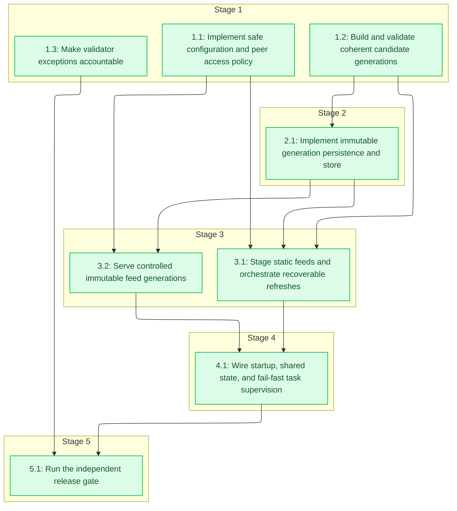

# Tasks: Amtrak GTFS-RT Service

<!-- spec-nav:start -->
**Spec navigation:** [State](00_state.md) · [Discovery](01_discovery.md) · [Requirements](02_requirements.md) · [Design](03_design.md) · [Tasks](04_tasks.md) · [Execution](05_execution.md)
<!-- spec-nav:end -->

## Stage and Dependency Overview

> [!WARNING]
> Execute tasks in dependency order. Implementation begins only after this checklist is approved, and release stops at the final evidence checkpoint unless every fail-closed gate passes.

## Implementation Checklist

- [x] 1. Establish independently testable contracts
  - [x] 1.1 Implement safe configuration and peer access policy
    - Extend `Config` with `allowed_peer_ips`, the 300-second `freshness_limit`, and a readable local MobilityData GTFS validator `8.0.1` JAR path; make `127.0.0.1:8080` the default bind and fail startup when its official SHA-256, `shasum`, Java 17+, or a bounded CLI smoke probe is unavailable.
    - Implement `Config::validate(self) -> Result<ValidatedConfig, ConfigError>` and `authorize(policy: &AccessPolicy, peer: IpAddr) -> AccessDecision` with exact-IP allowlisting and actionable field-specific failures; define this increment as direct-connect-only.
    - Test environment overrides, malformed values, loopback-only defaults, non-loopback-without-policy rejection, and the exact allow/deny decision matrix; document that forwarding headers never supply identity and a trusted-proxy model is out of scope. Credential-free HTTP denial auditing is verified with request context in task 3.2.
    - **Files:** [src/config.rs](../../src/config.rs), [src/main.rs](../../src/main.rs), [src/static_gtfs.rs](../../src/static_gtfs.rs)
    - **Scope note:** Changes in [src/main.rs](../../src/main.rs) are limited to enforcing validation before task/listener construction.
    - **Scope note:** Changes in [src/static_gtfs.rs](../../src/static_gtfs.rs) are limited to mechanically constructing the expanded test configuration.
    - **Dependency resolution:** none
    - **Dependency delivery:** none
    - **Depends on:** none
    - **Stage:** 1
    - **Interfaces:** Consumes: environment keys `AMTRAK_STATIC_URL`, `AMTRAK_OUTPUT_DIR`, `AMTRAK_POLL_SECS`, `AMTRAK_STATIC_REFRESH_SECS`, `AMTRAK_BIND_ADDR`, `AMTRAK_ALLOWED_PEER_IPS`, and `AMTRAK_GTFS_VALIDATOR_JAR`; Produces: `ValidatedConfig`, pinned validator configuration, `AccessPolicy`, `AccessDecision`, `Config::validate(self) -> Result<ValidatedConfig, ConfigError>`, and `authorize(&AccessPolicy, IpAddr) -> AccessDecision`
    - **Documentation:** Add Rust doc comments for `ValidatedConfig`, `AccessPolicy`, `AccessDecision`, `Config::validate`, and `authorize`, explaining the loopback default and why unsafe exposure fails closed; review comments with `code-documenting` during execution.
    - **Verification:** `cargo test config -- --nocapture`; inspect assertions for the exact bind/policy matrix and review public documentation.
    - **Estimated effort:** 1–2 hours
    - **Risk:** high; an authorization-default regression can expose feeds publicly, so rollback is the preceding loopback-safe configuration implementation.
    - **Task category:** heavy_reasoning
    - **Delegation:** controller
    - _Requirements: 6.2, 6.3, 6.4, 7.1, 7.2, 7.3, 7.4, 7.9, 7.11_

  - [x] 1.2 Build and validate coherent candidate generations
    - Add `StaticSnapshot`, `SelectedBatch`, `CandidateGeneration`, `ValidatedGeneration`, `GenerationId`, `FeedSetManifest`, entity-count, and artifact URL models to the existing orchestration boundary. Task 3.1 will own snapshot fetching/staging lifecycle rather than redefining the model.
    - Implement `GenerationBuilder::build(Arc<StaticSnapshot>, SelectedBatch, SystemTime) -> Result<CandidateGeneration, BuildError>` and `CandidateValidator::validate(CandidateGeneration) -> Result<ValidatedGeneration, ValidationError>`.
    - Split mixed upstream entities into exactly one feed type, remove `is_deleted` under `FULL_DATASET`, normalize all headers, retain matched predictions and coordinates, validate alert text/targets, and omit unresolved trip/stop/route references.
    - Add table/property-style tests for mixed payloads, invalid coordinates, unmatched trains, identifier closure, timestamps, feed versions, and protobuf round trips.
    - **Files:** [src/orchestrator.rs](../../src/orchestrator.rs), [src/sources/mod.rs](../../src/sources/mod.rs)
    - **Dependency resolution:** none
    - **Dependency delivery:** none
    - **Depends on:** none
    - **Stage:** 1
    - **Interfaces:** Consumes: existing `RtSource::fetch(&Gtfs) -> Result<RtBatch, SourceError>`, `RtBatch`, parsed `Gtfs`, static ZIP bytes, static version, and injected `SystemTime`; Produces: `StaticSnapshot`, `SelectedBatch`, `CandidateGeneration`, `ValidatedGeneration`, `GenerationBuilder::build`, `CandidateValidator::validate`, three separated GTFS-Realtime `FeedMessage` values, and one coherent `FeedSetManifest`
    - **Documentation:** Document the new generation types and builder/validator APIs, including why `FULL_DATASET` strips deletions and why unmatched references are omitted; review comments with `code-documenting`.
    - **Verification:** `cargo test orchestrator -- --nocapture`; `cargo test sources -- --nocapture`; decode every encoded feed with `prost::Message`, assert exact entity-type partitioning/reference closure, and review public documentation.
    - **Estimated effort:** 3–5 hours
    - **Risk:** high; incorrect filtering can silently misstate train status, so retain the pre-change converter until all semantic fixtures pass.
    - **Task category:** heavy_reasoning
    - **Delegation:** controller
    - _Requirements: 1.3, 1.4, 1.5, 1.6, 1.7, 1.8, 2.1, 2.2, 2.3, 2.4, 2.5, 2.6, 2.7, 3.1, 3.2, 3.3, 4.7_

  - [x] 1.3 Make validator exceptions accountable
    - Replace each realtime `code -> string` allowance with a record containing `code`, `upstream_cause`, `owner`, and `review_on`.
    - Extract the exception-schema and validator-ratchet decision into a pure offline path that runs before Java setup, downloads, or live feed discovery; inject an explicit as-of date.
    - Update the validation gate to reject malformed or expired exception records while preserving the zero-static-error and unapproved-realtime-error ratchet.
    - Add deterministic fixture coverage for accepted, missing-field, expired, new-error, and resolved-error cases without Java, network access, or a live Amtrak request.
    - **Files:** [validation/baseline.json](../../validation/baseline.json), [scripts/validate-feeds.sh](../../scripts/validate-feeds.sh)
    - **Dependency resolution:** none
    - **Dependency delivery:** none
    - **Depends on:** none
    - **Stage:** 1
    - **Interfaces:** Consumes: validator reports and the approved exception fields `code`, `upstream_cause`, `owner`, and `review_on`; Produces: a fail-closed exception parser and validator-ratchet decision for static and realtime error codes
    - **Documentation:** Update script comments and baseline notes to explain ownership, review-date semantics, and ratcheting; no public Rust surface.
    - **Verification:** Run the gate's offline fixture mode for valid, malformed, expired, and unapproved findings; run `bash -n` against [scripts/validate-feeds.sh](../../scripts/validate-feeds.sh); review inline contract comments.
    - **Estimated effort:** 1–2 hours
    - **Risk:** medium; a permissive parser could normalize away real regressions, so rollback is the prior baseline plus a blocked release.
    - **Task category:** code_analysis
    - **Delegation:** controller
    - _Requirements: 8.3, 8.4, 8.5, 8.6, 8.7, 8.8, 8.10_

- [x] 2. Introduce one atomic publication boundary
  - [x] 2.1 Implement immutable generation persistence and store
    - Replace per-file `write_atomic` publication with `GenerationStore` and `GenerationPublisher::publish(&Path, &GenerationStore, ValidatedGeneration) -> Result<Arc<PublishedGeneration>, PublishError>`.
    - Persist all artifacts under `generations/.<id>.tmp/`; sync artifacts and the temporary directory, rename once, sync the parent, write/sync and atomically replace a current marker, sync the marker's containing directory, then swap the current `Arc`; never alter in-memory current on any injected failure.
    - Implement `GenerationStore::open` to recover the durable marker or deterministically select the newest complete valid finalized generation while ignoring temporary/partial state; load recovery before serving.
    - Preserve task 1.2's injected `generated_at` as the single freshness timestamp in headers, manifest, and readiness; expose it as latest success only after durable publication, and prove delayed publication cannot make stale data ready.
    - Generate collision-checked `<unix-nanoseconds>-<process-counter>` IDs and retain current plus preceding generations for at least ten minutes.
    - Race readers against commits, inject failure after every artifact/directory/rename/marker boundary, and restart during an upstream outage to prove old-or-new complete observations and last-good recovery.
    - **Files:** [src/writer.rs](../../src/writer.rs)
    - **Dependency resolution:** none
    - **Dependency delivery:** none
    - **Depends on:** 1.2
    - **Stage:** 2
    - **Interfaces:** Consumes: task 1.2 `ValidatedGeneration`, `GenerationId`, `FeedSetManifest`, and output directory; Produces: `PublishedGeneration`, `GenerationStore::{open,current,get,commit}`, durable current marker/recovery, and `GenerationPublisher::publish` with immutable `Arc<[u8]>` artifacts and a single commit point
    - **Documentation:** Document store visibility, publisher durability order, retention, and failure atomicity on every public type/function; review comments with `code-documenting`.
    - **Verification:** `cargo test writer -- --nocapture`; run failure-injection and concurrent-reader tests repeatedly; inspect that no test can observe partial or mixed generations; review public documentation.
    - **Estimated effort:** 3–5 hours
    - **Risk:** high; filesystem ordering and concurrency errors can corrupt the publication contract, so preserve the previous last-good directory and never delete the current generation during rollback.
    - **Task category:** heavy_reasoning
    - **Delegation:** controller
    - _Requirements: 1.1, 3.5, 5.4, 5.5, 5.6, 5.7, 5.8_

- [x] 3. Connect refresh and delivery to the generation store
  - [x] 3.1 Stage static feeds and orchestrate recoverable refreshes
    - Introduce the replacement for the independently swappable `SharedStore<StaticFeed>` as `StaticSnapshot` plus active/pending snapshot state owned by the refresh pipeline; task 4.1 performs the composition-root cutover and removes the legacy store/refresher path after task 3.2 is also ready.
    - Implement `fetch_static` as one HTTP fetch whose exact retained ZIP bytes are parsed/validated, assign a unique persistent fallback version instead of `unknown`, and pass those same bytes through a `StaticStandardsValidator` production adapter invoking the locally provisioned MobilityData GTFS validator `8.0.1`; reject error findings, malformed output, timeout, or tool failure.
    - Implement `stage_static` plus polling logic that tries pending static first, calls task 1.2 build/validation, calls task 2.1 publication, and records success only after durable commit.
    - Preserve current for source failure, empty candidate, static failure, build/validation failure, and publication failure; continue later scheduled attempts without operator intervention.
    - Emit one structured refresh event with allowlisted outcome, stage, source, generation/static identifiers, duration, and entity counts.
    - **Files:** [src/static_gtfs.rs](../../src/static_gtfs.rs), [src/orchestrator.rs](../../src/orchestrator.rs), [src/main.rs](../../src/main.rs)
    - **Scope note:** Changes in [src/main.rs](../../src/main.rs) are limited to retaining the legacy poller call under its explicit compatibility name until task 4.1 replaces startup composition; task 3.1 completes and verifies the replacement lifecycle APIs rather than switching the executable before delivery task 3.2 exists.
    - **Dependency resolution:** none
    - **Dependency delivery:** none
    - **Depends on:** 1.1, 1.2, 2.1
    - **Stage:** 3
    - **Interfaces:** Consumes: task 1.1 pinned validator configuration, task 1.2 `GenerationBuilder`/`CandidateValidator`, task 2.1 `GenerationPublisher`/`GenerationStore`, existing `RtSource` list, configured intervals, and static URL; Produces: `StaticSnapshot`, `StaticStandardsValidator`, the MobilityData subprocess adapter, exact-byte `fetch_static`, standards-gated `bootstrap_static`, `stage_static`, a recoverable `run_poller`, pending-static promotion only through committed generations, and structured refresh outcomes
    - **Documentation:** Document static staging, refresh recovery, and telemetry field allowlists, including why static cannot switch independently; review comments with `code-documenting`.
    - **Verification:** `cargo test static_gtfs -- --nocapture`; `cargo test orchestrator -- --nocapture`; prove one fetch supplies retained/parser/validator bytes, two versionless snapshots receive distinct identifiers, pinned validator fixtures accept zero errors and retain last-good for errors/tool failures, and mock sources/static loaders plus injected failures preserve current state, pending-static promotion, retries, and credential-free telemetry; review public documentation.
    - **Estimated effort:** 3–5 hours
    - **Risk:** high; migration from two stores can expose mismatched identifiers, so rollback keeps the last persisted coherent generation and restores the preceding poller.
    - **Task category:** heavy_reasoning
    - **Delegation:** controller
    - _Requirements: 1.2, 3.4, 3.6, 4.1, 5.1, 5.2, 5.3, 5.9, 7.5, 7.6, 7.7, 7.8, 7.11_

  - [x] 3.2 Serve controlled immutable feed generations
    - Build `AppState` around task 1.1 policy and task 2.1 store; implement `router`, `feed_set`, `artifact`, `livez`, and `readyz` with Axum typed state.
    - Apply peer authorization to manifest, artifact, and readiness routes while leaving liveness independently observable; require Axum `ConnectInfo<SocketAddr>`, fail closed if absent, and ignore `Forwarded`/`X-Forwarded-For`; consult the design's Axum evidence and re-query Context7 if the installed Axum resolution differs or the middleware question is revised.
    - Parse `GenerationId` with its strict grammar and artifact names through a closed enum, resolving both only through `GenerationStore`; never join route-controlled values to filesystem paths.
    - Exclude mutable legacy feed routes from the replacement router and serve only generation URLs pinned by the feed-set document with exact `200/403/404/503` behavior and content types; task 4.1 removes the crate-private compatibility server during executable cutover.
    - Use an injected clock to test no-generation readiness, `<300`, exactly `300`, stale, and recovery states; update controlled-consumer instructions and migration notes.
    - **Files:** [src/serve.rs](../../src/serve.rs), [src/main.rs](../../src/main.rs), [README.md](../../README.md)
    - **Scope note:** Changes in [src/main.rs](../../src/main.rs) are limited to retaining the old server under an explicit compatibility name; task 4.1 switches the executable to `router(AppState)` with transport-peer propagation after both Stage 3 APIs are verified.
    - **Dependency resolution:** none
    - **Dependency delivery:** none
    - **Depends on:** 1.1, 2.1
    - **Stage:** 3
    - **Interfaces:** Consumes: task 1.1 `ValidatedConfig`/`AccessPolicy`, task 2.1 `GenerationStore`/`PublishedGeneration`, Axum `State<AppState>`, peer `SocketAddr`, and injected time; Produces: `router(AppState) -> Router`, `/livez`, `/readyz`, `/v1/feed-set.json`, immutable `/v1/generations/{id}/...` routes, and documented consumer cutover
    - **Documentation:** Document `AppState`, public handlers, HTTP status/content-type contracts, manifest-first consumption, and removal rationale for legacy routes; review Rust docs and [README.md](../../README.md) with `code-documenting`.
    - **Verification:** `cargo test serve::tests -- --nocapture`; exercise the router for allowed/denied/missing peers, spoofed forwarding headers, traversal-shaped identifiers, every health boundary, manifest coherence, immutable lookup, content types, and removed routes; review public documentation.
    - **Estimated effort:** 3–5 hours
    - **Risk:** high; route migration can interrupt internal consumers or bypass access control, so coordinate cutover and roll back to the previous binary without rewriting generation artifacts.
    - **Task category:** heavy_reasoning
    - **Delegation:** controller
    - _Requirements: 4.2, 4.3, 4.4, 4.5, 4.6, 5.6, 5.7, 5.8, 6.1, 6.2, 6.3, 6.4, 6.5_

- [x] 4. Integrate and supervise the complete service
  - [x] 4.1 Wire startup, shared state, and fail-fast task supervision
    - Construct validated configuration, recovered initial/pending static state, one `GenerationStore::open`, refresh activities, peer-aware Axum serving, and HTTP `AppState` in `main`.
    - Extract `supervise(...) -> Result<(), ServiceError>` and join the poller, static refresher, and HTTP server so unexpected success or failure cancels and awaits siblings before returning a nonzero process result.
    - Remove obsolete per-file publication wiring and assert one end-to-end mocked generation can be built, committed, discovered, and served through its manifest.
    - **Files:** [src/main.rs](../../src/main.rs), [src/writer.rs](../../src/writer.rs), [src/static_gtfs.rs](../../src/static_gtfs.rs), [src/orchestrator.rs](../../src/orchestrator.rs), [src/serve.rs](../../src/serve.rs), [README.md](../../README.md)
    - **Scope repair:** Executable cutover necessarily removes the compatibility entry points staged in tasks 3.1/3.2 and the temporary deployment warning from their owning modules; no new behavior beyond the approved composition/removal contract is added.
    - **Dependency resolution:** none
    - **Dependency delivery:** none
    - **Depends on:** 3.1, 3.2
    - **Stage:** 4
    - **Interfaces:** Consumes: task 3.1 refresh futures, task 3.2 `router(AppState) -> Router`, and task 2.1 durable recovery; Produces: one startup composition root, `supervise(...) -> Result<(), ServiceError>`, transport-peer propagation, nonzero failure propagation for each required activity, and an end-to-end coherent generation path
    - **Documentation:** Document the composition/supervision rationale and remove stale comments claiming sequential per-file renames are group-atomic; review changed comments with `code-documenting`.
    - **Verification:** `cargo test --all-targets --all-features`; run targeted supervision tests for each succeeding/failing future with sibling-cancellation assertions, restart against a retained generation while refresh fails, and run the mocked manifest-to-artifact flow; review composition comments.
    - **Estimated effort:** 2–4 hours
    - **Risk:** high; wiring errors can make the service appear alive while core work has stopped, so retain the previous binary and persisted last-good generation for rollback.
    - **Task category:** heavy_reasoning
    - **Delegation:** controller
    - _Requirements: 1.1, 1.2, 3.5, 4.1, 5.9, 7.5, 7.8, 7.10, 7.11_

- [x] 5. Checkpoint — release evidence and controlled rollout decision
  - [x] 5.1 Run the independent release gate
    - Adapt feed validation input discovery to fetch one feed-set document and validate exactly its four generation-pinned artifacts.
    - Run formatting, lint, all tests, static validation, three separate realtime validations, independent Java protobuf decoding, and the exception ratchet without accepting any new deterministic failure.
    - Run `dependency-security-audit` in `release` mode, review both reports, and require complete inventory plus a shippable result no older than 24 hours; unresolved design-baseline audit warnings do not count as release evidence.
    - Record the controlled-consumer migration and rollback decision; stop for user review rather than deploying or exposing the service.
    - **Dependency delivery evidence:** state=completed | mode=release | timestamp=2026-08-14T01:30:23.662401Z | revision=c52a97c5c7528f1f6d58456823b6c8096f8e8da4 | json=[release.json](../../.security/dependency-audit/release.json) | markdown=[release.md](../../.security/dependency-audit/release.md) | review=completed | result=unavailable | exit=2 | decision=BLOCK rollout; no deployment or consumer migration | warnings_reviewed=true | clean=false
    - **Files:** [scripts/validate-feeds.sh](../../scripts/validate-feeds.sh), [validation/baseline.json](../../validation/baseline.json), [validation-reports](../../validation-reports), [.security/dependency-audit](../../.security/dependency-audit)
    - **Dependency resolution:** none
    - **Dependency delivery:** release
    - **Depends on:** 1.3, 4.1
    - **Stage:** 5
    - **Interfaces:** Consumes: task 1.3 accountable exception schema, task 4.1 release candidate, `/v1/feed-set.json`, MobilityData GTFS validator `8.0.1`, GTFS-Realtime validator commit `7041fa3`, and dependency audit reports; Produces: deterministic validation reports, independent decode evidence, a fresh reviewed `release` dependency record, and an explicit ship-or-block decision
    - **Documentation:** Record validator versions, exception review, dependency evidence, migration prerequisites, and rollback decision in generated reports; no new public code surface.
    - **Verification:** `cargo fmt --check`; `cargo clippy --all-targets --all-features -- -D warnings`; `cargo test --all-targets --all-features`; run [scripts/validate-feeds.sh](../../scripts/validate-feeds.sh); verify report timestamps/inventory/status and manually review linked JSON and Markdown dependency reports plus documentation.
    - **Estimated effort:** 2–4 hours
    - **Risk:** high; stale, incomplete, warning-unreviewed, blocked, unavailable, invalid, or failing evidence stops release and leaves deployment unchanged.
    - **Task category:** review
    - **Delegation:** controller
    - _Requirements: 1.2, 1.3, 1.4, 1.5, 8.1, 8.2, 8.3, 8.4, 8.5, 8.6, 8.7, 8.8, 8.9, 8.10_

## Delivery Schedule

| Stage | Task | Estimate | Depends on | Critical path |
|---:|---|---|---|---|
| 1 | 1.1 | 1–2 hours | none | no |
| 1 | 1.2 | 3–5 hours | none | yes |
| 1 | 1.3 | 1–2 hours | none | no |
| 2 | 2.1 | 3–5 hours | 1.2 | yes |
| 3 | 3.1 | 3–5 hours | 1.2, 2.1 | yes |
| 3 | 3.2 | 3–5 hours | 1.1, 2.1 | yes |
| 4 | 4.1 | 2–4 hours | 3.1, 3.2 | yes |
| 5 | 5.1 | 2–4 hours | 1.3, 4.1 | yes |

Critical-path estimate: **13–23 hours**, excluding external validator download time and user review at the release checkpoint. No calendar dates are assumed.

## Approval

Status: **Approved 2026-08-13; execution checkpoint completed with rollout blocked 2026-08-14**
