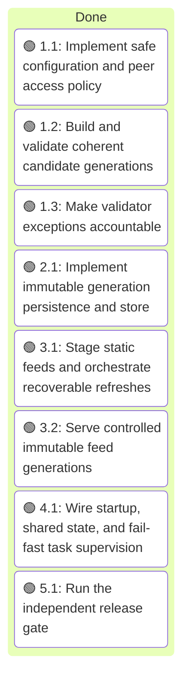
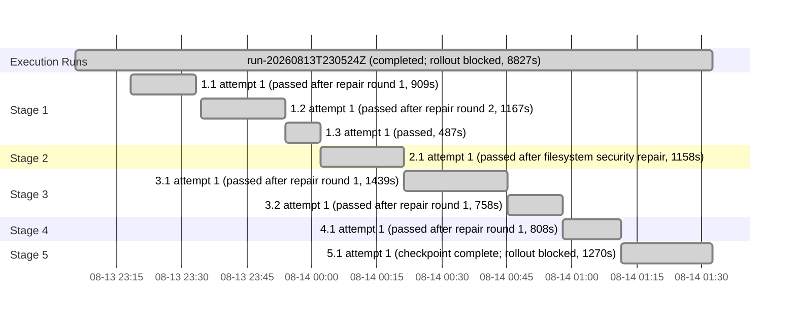

# Execution Ledger: Amtrak GTFS-RT Service

<!-- spec-nav:start -->
**Spec navigation:** [State](00_state.md) · [Discovery](01_discovery.md) · [Requirements](02_requirements.md) · [Design](03_design.md) · [Tasks](04_tasks.md) · [Execution](05_execution.md)
<!-- spec-nav:end -->

## Active Wave

| Task | Stage | Mode | Branch / worktree | State |
|---|---:|---|---|---|
| none | complete | controller | `amtrak-gtfs-rt-service-spec` / current checkout | awaiting integration choice; rollout blocked |

| Task | Status | Commit / diff | Verification | Reviewer | Notes |
|---|---|---|---|---|---|
| 1.1 | passed | working tree diff | 10 config tests; 3 affected regressions; rustdoc; unsafe-start rejection | 2 independent reviewers | Repair round 1 resolved validator pin, startup enforcement, typed errors, and bounded probes |
| 1.2 | passed | working tree diff | 8 orchestrator tests; 5 source tests; rustdoc; diff check | 2 independent reviewers | Repair round 2 resolved stop-update and alert-selector semantic closure |
| 1.3 | passed | working tree diff | 6 offline fixtures; shell syntax; JSON parse; diff check | 2 independent reviewers | Shared ratchet runs before external tooling and live discovery |
| 2.1 | passed | working tree diff | 7 writer tests repeated; rustdoc; diff check | 2 independent reviewers | Descriptor-relative recovery repaired symlink/TOCTOU findings |
| 3.1 | passed | working tree diff | 10 static tests; 11 orchestrator tests; rustdoc; diff/spec checks | 2 independent reviewers | Repair round 1 added standards-gated bootstrap, closed-field compatibility logging, and an explicit API/cutover boundary |
| 3.2 | passed | working tree diff | 7 isolated router tests; rustdoc; fmt/diff/spec checks | 2 independent reviewers | Repair round 1 made intermediate docs truthful and isolated the router verification filter |
| 4.1 | passed | working tree diff | 53 tests; six terminal supervision paths; panic attribution; validator process cancellation; restart under outage; manifest flow; rustdoc/diff | 2 independent reviewers | Repair round 1 made validator subprocess cancellation join-safe and retained exact activity diagnostics |
| 5.1 | checkpoint_complete_release_blocked | working tree diff | format/lint/docs; 54 tests; live manifest-first static/RT/Java gate; six ratchet fixtures; release dependency audit | 2 independent reviewers | Feed generation passed; rollout BLOCK because dependency evidence is unavailable/non-shippable |

## Baseline

| Revision | Command | Exit | Pre-existing failures |
|---|---|---:|---|
| `c52a97c5c7528f1f6d58456823b6c8096f8e8da4` | `cargo test --all-targets --all-features` | 0 | none; 19 passed, 2 ignored |

The approved specification is uncommitted, so an isolated worktree cannot reproduce the approved planning state from the base revision. Execution therefore uses the dedicated feature branch in the current checkout and preserves the existing untracked [.codebase-memory](../../.codebase-memory), [.security](../../.security), and [.specs](../../.specs) directories.

The first sandboxed baseline run reported one `PermissionDenied` in the Axum listener test because the sandbox denied binding `127.0.0.1:0`. The same targeted test and then the complete suite passed with the approved local-socket permission; this is an execution-environment restriction, not a repository baseline failure.

## Self-Hardening Preflight

- Initial artifact digest: `5b3bb4852472ff7a7a0c5c101c33e69ac9aa1f8ffded24c444f4f9637217856d`
- Hardened artifact digest: `3ce2dd9c4e347a8e0c1df25d1cc24aea3f76e0295d6083be66e00ccb279d300d`
- Depth: thorough (authorization, public compatibility, migration, and release-gate risk)
- Fan-out: 2 balanced reviewers at high reasoning; 2 self-repair rounds
- Status: passed; both targeted reviewers reported no remaining P0/P1 findings after repair round 2

Preflight decisions applied under the approved task plan's delegated hardening authority:

- Runtime publication parses the exact bytes from one static fetch and passes those same bytes through the locally provisioned MobilityData GTFS validator `8.0.1`; the release gate independently reruns the pinned validator.
- Durable current-generation recovery, complete filesystem sync ordering, strict route identifiers, one generation-based freshness timestamp exposed only after commit, fail-closed direct-peer authorization, a pure offline validator-ratchet path, and testable sibling-cancelling supervision are now explicit design/task obligations.
- Forwarded identity is deliberately unsupported in this increment; adding a trusted reverse-proxy boundary requires a separate security design.

## Execution Timing

### Task Board

### Run Intervals

| Run ID | Started UTC | Stopped UTC | Elapsed Seconds | Outcome |
|---|---|---|---:|---|
| run-20260813T230524Z | 2026-08-13T23:05:24Z | 2026-08-14T01:32:31Z | 8827 | completed; rollout blocked |

### Task Attempt Intervals

| Run ID | Stage/Wave | Task | Attempt | Started UTC | Stopped UTC | Elapsed Seconds | Outcome |
|---|---|---|---:|---|---|---:|---|
| run-20260813T230524Z | Stage 1 | 1.1 | 1 | 2026-08-13T23:18:08Z | 2026-08-13T23:33:17Z | 909 | passed after repair round 1 |
| run-20260813T230524Z | Stage 1 | 1.2 | 1 | 2026-08-13T23:34:24Z | 2026-08-13T23:53:51Z | 1167 | passed after repair round 2 |
| run-20260813T230524Z | Stage 1 | 1.3 | 1 | 2026-08-13T23:53:51Z | 2026-08-14T00:01:58Z | 487 | passed |
| run-20260813T230524Z | Stage 2 | 2.1 | 1 | 2026-08-14T00:01:58Z | 2026-08-14T00:21:16Z | 1158 | passed after filesystem security repair |
| run-20260813T230524Z | Stage 3 | 3.1 | 1 | 2026-08-14T00:21:16Z | 2026-08-14T00:45:15Z | 1439 | passed after repair round 1 |
| run-20260813T230524Z | Stage 3 | 3.2 | 1 | 2026-08-14T00:45:15Z | 2026-08-14T00:57:53Z | 758 | passed after repair round 1 |
| run-20260813T230524Z | Stage 4 | 4.1 | 1 | 2026-08-14T00:57:53Z | 2026-08-14T01:11:21Z | 808 | passed after repair round 1 |
| run-20260813T230524Z | Stage 5 | 5.1 | 1 | 2026-08-14T01:11:21Z | 2026-08-14T01:32:31Z | 1270 | checkpoint complete; rollout blocked |

## Checkpoints

- Feed evidence: PASS for manifest-pinned generation `1786670322000000000-0` (static plus three realtime artifacts, independent Java decoding, and exception ratchet).
- Dependency evidence: BLOCK (`UNAVAILABLE`, exit 2) despite complete 375-package inventory; rollout is prohibited.
- Deployment and controlled-consumer migration: not started. Rollback retains the prior binary and persisted last-good generation.
- Decision record: [release-decision.json](../../validation-reports/release-decision.json).

## Integration Decision

- Status: user authorized GitHub publication and merge on 2026-08-14; rollout remains blocked
- Base: `main`
- Result: [PR #1](https://github.com/sohampatwardhan/Amtrak-GTFS-RT/pull/1) is the authoritative integration record; its final state and merge commit govern this decision
- Post-integration verification: GitHub `Build and test` passed before this record update; final head and merge state are verified at PR #1
- Deployment: not authorized or performed

### Execution Gantt

