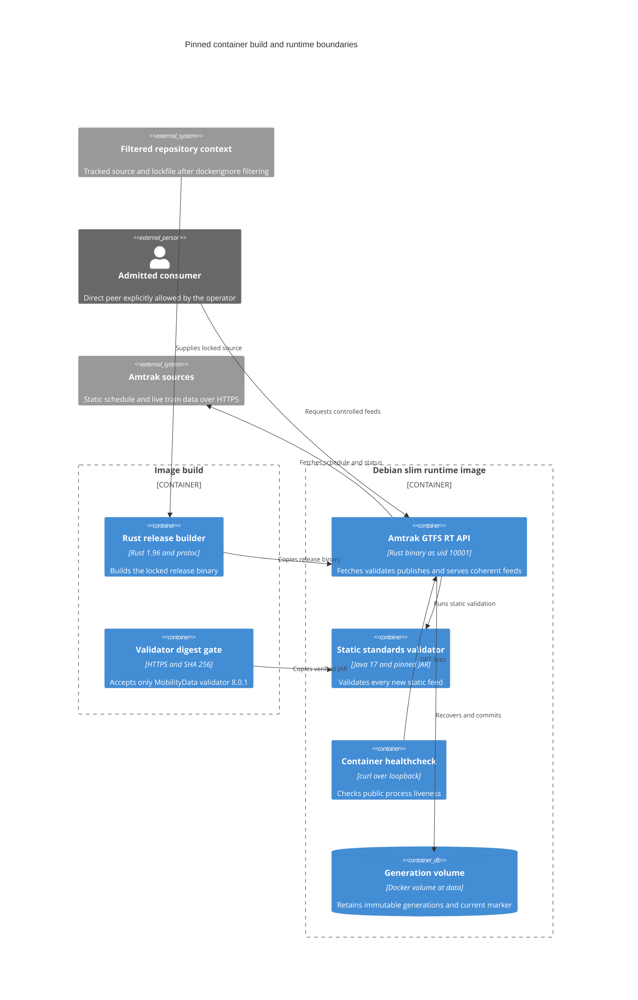
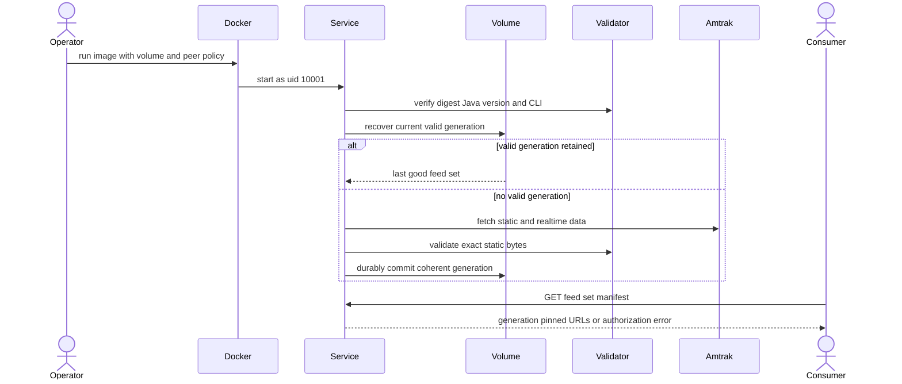

# Design: Containerized Service

<!-- spec-nav:start -->
**Spec navigation:** [State](00_state.md) · [Discovery](01_discovery.md) · [Requirements](02_requirements.md) · [Design](03_design.md) · [Tasks](04_tasks.md) · [Execution](05_execution.md)
<!-- spec-nav:end -->

## Security Remediation Amendment (authoritative)

This amendment supersedes the Debian/glibc runtime, prebuilt validator JAR, external `shasum`,
curl healthcheck, and Alpine-deferral decisions in the historical design below.

- Builder: `rust:1.96-alpine@sha256:a41f7740f8b45d45795624eec13a8b42263cc700f19f7e4e86e04d3dda08a479`;
  musl build with static OpenSSL and an assertion that no SSL/crypto/C++ runtime library is linked.
- Validator source: MobilityData v8.0.1 commit `d74d7177f9f7c6bc7adc69508bb939362f2cf770`, source archive
  SHA-256 `651872b1a7abbde5b999d7261f875532eebaee22a9d7ce4946b8f764cdf7b8a3`.
  [`container/validator-dependency-overrides.gradle`](../../container/validator-dependency-overrides.gradle)
  applies exact reviewed versions and normalizes archives. The Gradle 7.4 distribution uses its
  official SHA-256 and
  [`container/validator-verification-metadata.xml`](../../container/validator-verification-metadata.xml)
  strictly verifies the resolved Gradle/Maven graph. The build runs `test :cli:shadowJar` and
  accepts only JAR SHA-256 `24ca7e890ca15bfbb36fa889fcb16200f7276995b7e6ec75551a8b7175e818d7`.
- Runtime source: `amazoncorretto:17-alpine-jdk@sha256:e1138bf0cca62e04692de650ffe8923f35c39fcb554458c7acd98efc2d135144`.
  `jlink` retains only `java.base`, `java.desktop`, `java.logging`, and `java.xml`; the final stage
  is `scratch` and copies only Java, musl, zlib, CA roots, identity files, binary, and validator.
- Runtime identity and API contract remain UID/GID 10001, `/data`, port 8080, loopback binding,
  and exact direct-peer authorization. The binary calculates the JAR digest and performs its own
  bounded `/livez` health probe, so no shell, curl, checksum tool, or package database is shipped.
- Verification: two independent validator builds matched, the standalone JAR and final image had
  zero Grype matches, and the complete live/recovery harness passed on a 79 MiB image.

Current Gradle guidance was checked through Context7 `/gradle/gradle`: wrapper downloads are pinned
with `distributionSha256Sum`, and dependency verification is enabled by a root
`gradle/verification-metadata.xml` covering artifacts, POM metadata, and plugins in strict mode.

The lower sections document the original merged PR #2 design and remain only as decision history.

## Overview

The container packages the existing Rust API without changing [`src/main.rs`](../../src/main.rs), its HTTP routes, direct-peer authorization, feed generation, or durable writer. A BuildKit multi-stage Dockerfile compiles the locked release binary and independently retrieves the exact MobilityData validator. The final image is based on Debian 12 slim, contains only the binary and required runtime packages, runs as a fixed unprivileged user, and stores generations under a mounted `/data` directory.

Debian slim is retained as the approved compatibility-first choice. The resolved dependency graph in [`Cargo.lock`](../../Cargo.lock) includes a native TLS and OpenSSL path, and the running service also requires Java. A glibc-based runtime minimizes native compatibility risk; Alpine remains a future measured optimization rather than a second implementation path.

## Current Technology Evidence


| Technology              | Context7 identity/source                                                                                                                  | Exact selected version                                                                            | Current-doc question                                                                                       | Decision                                                                                                                  |
| ----------------------- | ----------------------------------------------------------------------------------------------------------------------------------------- | ------------------------------------------------------------------------------------------------- | ---------------------------------------------------------------------------------------------------------- | ------------------------------------------------------------------------------------------------------------------------- |
| Dockerfile and BuildKit | `/docker/docs` official project documentation                                                                                             | Dockerfile syntax major `1`                                                                       | Multi-stage Rust builds, read-only source mounts, Cargo caches, minimal runtime stages, and non-root users | Use BuildKit mounts and explicit final-stage copies                                                                       |
| C library base family   | `/docker/docs` official glibc-versus-musl guidance                                                                                        | Debian 12 bookworm slim                                                                           | Compatibility expectations for Java and native dependencies versus Alpine footprint                        | Use Debian slim now; measure a complete Alpine image before reconsidering                                                 |
| Rust builder image      | Docker Official Image manifest                                                                                                            | `rust:1.96-slim-bookworm@sha256:e18a79fc84dfcfc3ab5ba72290398a644c135c97eaa881447fddc354ee4701a3` | Immutable multi-platform base selection                                                                    | Retain the readable tag and pin the `FROM` reference to the index digest                                                  |
| Runtime image           | Docker Official Image manifest                                                                                                            | `debian:bookworm-slim@sha256:abd67ffcfa541b485a3dff59865ab629aa048a6c613e639d36e7456b0b229241`    | Immutable multi-platform base selection                                                                    | Retain the readable tag and pin the `FROM` reference to the index digest                                                  |
| Container health        | `/docker/docs` official Dockerfile reference                                                                                              | Docker Engine healthcheck contract current on 2026-08-14                                          | Interval, timeout, start-period, retries, and digest pinning                                               | Probe `/livez` over loopback every 30 seconds with a 120-second startup grace period, 5-second timeout, and three retries |
| Static GTFS validator   | [MobilityData GTFS validator release](https://github.com/MobilityData/gtfs-validator/releases/tag/v8.0.1) and repository runtime contract | Validator `8.0.1`, SHA-256 `19293ddd9b6f954f216d4f12054bd8a3232921751c4484339e339764a91000e2`     | Exact runtime artifact identity                                                                            | Download the official CLI JAR during the image build, verify the fixed digest, and let startup verify it again            |


Context7 was consulted through the official `/docker/docs` identity for Rust multi-stage builds, glibc versus musl selection, healthcheck behavior, and digest pinning. The decision is to use the exact versions and immutable digests above; implementation must re-check the official documentation before changing any selected base or Dockerfile contract.

## Dependency Security Evidence


| Dependency / exact resolved version                                                                                                                                                                                  | Trigger and mode                                 | Evidence                                                                                                                                                                                                                                                      | Result and decision                                                                                                                                |
| -------------------------------------------------------------------------------------------------------------------------------------------------------------------------------------------------------------------- | ------------------------------------------------ | ------------------------------------------------------------------------------------------------------------------------------------------------------------------------------------------------------------------------------------------------------------- | -------------------------------------------------------------------------------------------------------------------------------------------------- |
| Existing Rust snapshot in [`Cargo.lock`](../../Cargo.lock)                                                                                                                                                           | design baseline / `release`                      | [Latest JSON](../../.security/dependency-audit/latest.json) · [Latest Markdown](../../.security/dependency-audit/latest.md) · [Release JSON](../../.security/dependency-audit/release.json) · [Release Markdown](../../.security/dependency-audit/release.md) | `unavailable`; required sources were incomplete. Decision: containerization does not alter Cargo resolution or waive the existing deployment block |
| Rust builder `1.96-slim-bookworm@sha256:e18a79fc84dfcfc3ab5ba72290398a644c135c97eaa881447fddc354ee4701a3` and Debian runtime `bookworm-slim@sha256:abd67ffcfa541b485a3dff59865ab629aa048a6c613e639d36e7456b0b229241` | implementation / container evidence              | Image SBOM and Docker Scout CVE report are produced after the exact image exists                                                                                                                                                                              | Pending. Decision: local verification may proceed, but unavailable or policy-blocking image evidence cannot ship                                   |
| MobilityData validator `8.0.1` / SHA-256 `19293ddd9b6f954f216d4f12054bd8a3232921751c4484339e339764a91000e2`                                                                                                          | implementation / immutable artifact verification | Build-time digest check plus existing startup probe                                                                                                                                                                                                           | Pending implementation. Decision: any digest mismatch blocks the image build                                                                       |


No new Rust package dependency is selected. Protected-main requires a fresh complete `main` audit; release requires a fresh complete `release` audit with timestamped JSON and Markdown evidence no more than 24 hours old. A `blocked`, `unavailable`, or `invalid` result cannot pass those delivery gates and cannot ship.

## Architecture

The build and runtime boundaries are deliberately separate. Build tools and the repository never cross into the final image; only the release binary and digest-verified JAR do. The runtime process owns no implicit network trust and persists only through the mounted generation volume.



The structured source for this view is [`diagrams/architecture.json`](diagrams/architecture.json).

## Components and Interfaces

### Docker build context

[.dockerignore](../../.dockerignore) excludes version-control data, Rust build output, generated feed output, validator caches, security reports, specifications, editor files, environment files, keys, and certificates. The build step mounts only [`Cargo.toml`](../../Cargo.toml), [`Cargo.lock`](../../Cargo.lock), and [`src/`](../../src/) read-only, so unrelated tracked or untracked files cannot be consumed by compilation.

The public build interface is:

```text
docker build --tag amtrak-gtfs-rt:local .
```

The build requires BuildKit and network access to the configured Cargo sources, Debian repositories, and the fixed validator URL. It returns exit zero with a tagged local image or non-zero without a runnable final stage.

### Rust builder stage

The builder starts from:

```text
docker.io/library/rust:1.96-slim-bookworm@sha256:e18a79fc84dfcfc3ab5ba72290398a644c135c97eaa881447fddc354ee4701a3
```

It installs only build-time packages: `build-essential`, `ca-certificates`, `git`, `libssl-dev`, `pkg-config`, and `protobuf-compiler`. Read-only source mounts and cache mounts for the Cargo registry, Cargo Git checkout, and target directory feed `cargo build --locked --release`. The stage copies the compiled `amtrak-gtfs-rt-service` release executable to an isolated `/out/` path before the target cache disappears.

### Validator acquisition stage

The validator stage starts from the same digest-pinned Debian runtime base used by the final stage. It installs CA certificates, curl, and `libdigest-sha-perl`, downloads:

```text
https://github.com/MobilityData/gtfs-validator/releases/download/v8.0.1/gtfs-validator-8.0.1-cli.jar
```

The URL may be overridden by a build argument for negative testing or an approved mirror, but the expected digest is not configurable. `shasum -a 256 -c` must accept the fixed digest before `/out/gtfs-validator-v8.0.1-cli.jar` becomes copyable.

### Final runtime stage

The final stage starts from:

```text
docker.io/library/debian:bookworm-slim@sha256:abd67ffcfa541b485a3dff59865ab629aa048a6c613e639d36e7456b0b229241
```

It installs only `ca-certificates`, `curl`, `libdigest-sha-perl`, `libssl3`, and `openjdk-17-jre-headless`, then removes package indexes. It creates group and user ID `10001`, copies the service binary to `/usr/local/bin/amtrak-gtfs-rt-service`, copies the JAR to `/opt/amtrak/gtfs-validator-v8.0.1-cli.jar`, and creates `/data` owned by `10001:10001`. The binary and JAR are not writable by that user.

The image contract is:


| Surface                     | Value                                                           |
| --------------------------- | --------------------------------------------------------------- |
| User                        | `10001:10001`                                                   |
| Entrypoint                  | `/usr/local/bin/amtrak-gtfs-rt-service`                         |
| Documented port             | `8080/tcp`                                                      |
| Persistent path             | `/data`                                                         |
| `AMTRAK_OUTPUT_DIR`         | `/data`                                                         |
| `AMTRAK_GTFS_VALIDATOR_JAR` | `/opt/amtrak/gtfs-validator-v8.0.1-cli.jar`                     |
| `AMTRAK_BIND_ADDR`          | `127.0.0.1:8080` by default                                     |
| Peer allowlist              | unset by default; loopback-only policy remains active           |
| Healthcheck                 | `curl --fail --silent --show-error http://127.0.0.1:8080/livez` |


The final stage contains a shell only because Debian slim and the runtime packages supply it; no entrypoint wrapper is introduced. The Rust binary remains PID 1, so exit codes and process-supervision behavior remain unchanged.

### Persistent generation volume

`VOLUME ["/data"]` documents the persistence boundary. A new named volume inherits the image path's ownership; a bind mount must already be writable by UID 10001. [`GenerationStore::open`](../../src/writer.rs) remains the authority for path safety, marker recovery, and incomplete-generation rejection. The container layer never copies or mutates a generation outside that API.

### Network-policy handoff

The safe image default binds only to container loopback. That works directly with host networking but is intentionally unreachable through a normal port mapping. Bridged operation must explicitly set:

```text
AMTRAK_BIND_ADDR=0.0.0.0:8080
AMTRAK_ALLOWED_PEER_IPS=<exact bridge gateway or service peer IP>
```

The documented local bridge example creates a dedicated subnet and gateway, publishes the port only on host loopback, and admits that exact gateway. Implementation verification must confirm the peer address observed on both Linux and the available Docker Desktop environment before the example is finalized. No forwarding header, CIDR, wildcard, proxy, or token is added by this feature.

## Startup, Recovery, and Request Flow



The structured source for this view is [`diagrams/flows.json`](diagrams/flows.json).

## Error Handling


| Failure                                                                     | Observable outcome                                       | Preservation rule                                      |
| --------------------------------------------------------------------------- | -------------------------------------------------------- | ------------------------------------------------------ |
| Base image, Debian package, Cargo source, or validator download unavailable | Image build exits non-zero                               | No final image tag is produced by the documented build |
| Cargo lockfile drift or compilation error                                   | Builder exits non-zero                                   | No release binary reaches the final stage              |
| Validator bytes differ from the fixed hash                                  | Validator stage exits non-zero                           | Unverified JAR cannot be copied                        |
| Java, `shasum`, or JAR fails the application's startup probe                | Container exits non-zero before listener creation        | No unvalidated service becomes live                    |
| `/data` is unsafe or unwritable                                             | Container exits non-zero during store opening            | Existing mounted data is not replaced                  |
| Non-loopback bind lacks an allowlist                                        | Container exits non-zero during configuration validation | No uncontrolled HTTP boundary opens                    |
| Direct peer is denied                                                       | Controlled endpoint returns `403`                        | `/livez` remains public for supervision                |
| No generation exists                                                        | Admitted `/readyz` and manifest requests return `503`    | Liveness remains independent                           |
| Upstream or candidate generation fails                                      | Current generation remains unchanged                     | Retained artifacts survive container replacement       |
| Liveness probe fails after startup grace and retries                        | Docker reports `unhealthy`                               | Docker does not mutate or delete the generation volume |


## Verification Strategy

### Static and build verification

- Build from a clean context with `docker build --no-cache` at least once; ordinary verification may use BuildKit caches.
- Inspect image configuration for `User=10001:10001`, entrypoint, healthcheck, port, and environment defaults.
- Run `java --version`, `shasum -a 256`, and the validator CLI help inside the image.
- Assert `cargo`, `rustc`, and `protoc` are absent from the final image.
- Override only the validator URL with a known wrong-version artifact and assert the validator stage fails on the fixed digest.
- Export a Docker Scout SBOM and CVE report for the exact built image; retain the result without describing warnings as clean.

### Runtime smoke verification

1. Create an isolated bridge network with a known gateway and a fresh named generation volume.
2. Start the image with wildcard bind plus the exact gateway allowlist and publish `127.0.0.1:8080:8080`.
3. Confirm Docker health becomes `healthy`, `/livez` returns `200`, `/readyz` becomes `200`, and the manifest identifies one coherent generation.
4. Fetch and independently decode the manifest-selected static ZIP and three protobuf feeds.
5. Send spoofed forwarding headers from a denied peer and confirm they do not change the authorization result.
6. Stop and recreate the container using the same volume while making the upstream unavailable; confirm the retained manifest and artifacts recover before a successful refresh.
7. Mount an intentionally non-writable directory as `/data` and confirm startup exits non-zero.

Existing Rust formatting, lint, test, documentation, and live feed-validation gates remain required because the image packages the same binary.

## Cross-Cutting Risk Gates


| Gate                       | Failure mode                                                                                    | Verification                                                                                                      | Owner and decision                                                              |
| -------------------------- | ----------------------------------------------------------------------------------------------- | ----------------------------------------------------------------------------------------------------------------- | ------------------------------------------------------------------------------- |
| Security and authorization | Port publication silently broadens feed access                                                  | Non-loopback-without-policy startup failure, denied-peer tests, forwarding-header spoof test, non-root inspection | Operator owns exact peer values; no proxy trust is introduced                   |
| Dependency integrity       | Mutable base or altered validator reaches runtime                                               | Digest-qualified bases, fixed validator hash, SBOM, CVE report, fresh dependency audit at delivery                | Maintainer blocks image release on unavailable or policy-blocking evidence      |
| Data durability            | Container replacement loses or exposes partial generations                                      | Named-volume restart and corrupt-newest recovery tests                                                            | Existing writer remains the only generation authority                           |
| Observability              | Process is alive but feed is absent or stale                                                    | Docker liveness plus separate admitted readiness and manifest checks                                              | Operator monitors both states                                                   |
| Performance                | JRE and validator increase image size or startup time                                           | Record compressed image size, validator-probe duration, and time to health during verification                    | No size threshold is invented; Alpine reconsideration requires measured benefit |
| Migration and rollback     | Container image cannot recover host-generated data or prior image cannot recover container data | Exercise retained-volume restart with current and prior binaries                                                  | No on-disk schema change is permitted                                           |
| Privacy                    | Container packaging introduces no new personal-data flow                                        | Review final image and environment interface                                                                      | No additional privacy control is required                                       |
| Accessibility              | No human-facing interface is added                                                              | Confirm documentation remains text-based and command examples are copyable                                        | No UI accessibility surface exists                                              |
| Rollout                    | Local image is mistaken for approved deployment                                                 | Keep registry publication and deployment out of scope; retain explicit release block                              | User approval is required for any future publication or deployment              |


## Correctness Properties

### Property 1: Clean locked build

For any clean checkout, the build can consume only the three declared source inputs, resolves Cargo with `--locked`, and produces a final image only after the release binary exists. Host build output and metadata cannot alter the result.

**Validates: Requirements 1.1, 1.2, 1.3, 1.4, 1.5**

### Property 2: Validator identity is invariant

For every successful image build and startup, the packaged validator bytes equal the repository's fixed SHA-256, Java reports major version 17 or newer, `shasum` is executable, and the service completes its existing validator probe before opening the listener.

**Validates: Requirements 2.1, 2.2, 2.3, 2.4, 2.5**

### Property 3: Runtime privilege and contents are bounded

Every normal service process runs as UID and GID 10001, can read but not modify the binary and validator, can write `/data`, trusts installed CA roots, and has no Rust compiler, Cargo, protobuf compiler, repository secret, or untracked source file in the final filesystem.

**Validates: Requirements 3.1, 3.2, 3.3, 3.4, 3.5, 3.6, 3.7**

### Property 4: Volume replacement preserves last-good state

For any mounted volume, only a complete valid generation can become current. Recreating the container over the same volume exposes the same last-good generation before a successful refresh; an unwritable mount fails startup and an incomplete newer candidate remains invisible.

**Validates: Requirements 4.1, 4.2, 4.3, 4.4**

### Property 5: Container networking never expands trust implicitly

The image contains no wildcard allowlist. A wildcard bind without an exact allowlist fails before listening, authorization uses only the observed socket peer, forwarding headers cannot grant access, denied controlled requests return `403`, and operator documentation makes the bridge-policy requirement explicit.

**Validates: Requirements 5.1, 5.2, 5.3, 5.4, 5.5, 5.6**

### Property 6: Health does not substitute for feed readiness

Docker health observes only `/livez` through loopback and becomes unhealthy after the declared failed-probe threshold. Separately, admitted readiness is `200` only for a generation younger than 300 seconds; an absent generation returns `503`, and every successful manifest identifies four independently decodable artifacts from one generation.

**Validates: Requirements 6.1, 6.2, 6.3, 6.4, 6.5, 6.6**

### Property 7: Operations and rollback are reproducible

The README supplies exact build, safe run, health, readiness, manifest, artifact, configuration, volume-retention, and rollback commands. Replacing a candidate with the prior compatible image while retaining `/data` recovers the last valid generation without migration.

**Validates: Requirements 7.1, 7.2, 7.3, 7.4, 7.5, 7.6**

## Requirement Coverage


| Requirement | Design owners                                                 |
| ----------- | ------------------------------------------------------------- |
| 1.1–1.5     | Build context and Rust builder; Property 1                    |
| 2.1–2.5     | Validator acquisition and final runtime; Property 2           |
| 3.1–3.7     | Final runtime contents and ownership; Property 3              |
| 4.1–4.4     | Persistent generation volume and existing writer; Property 4  |
| 5.1–5.6     | Network-policy handoff and existing access policy; Property 5 |
| 6.1–6.6     | Healthcheck and runtime smoke verification; Property 6        |
| 7.1–7.6     | README operations and rollback verification; Property 7       |


## Approval

Status: **Approved on 2026-08-14, including the security remediation amendment**
