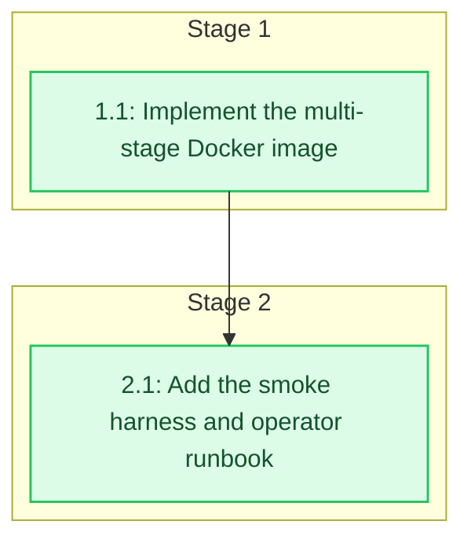

# Tasks: Containerized Service

<!-- spec-nav:start -->
**Spec navigation:** [State](00_state.md) · [Discovery](01_discovery.md) · [Requirements](02_requirements.md) · [Design](03_design.md) · [Tasks](04_tasks.md) · [Execution](05_execution.md)
<!-- spec-nav:end -->

## Stage and Dependency Overview

## Implementation Checklist

- [x] 1. Package the service as a pinned non-root image
  - [x] 1.1 Implement the multi-stage Docker image
    - Add a BuildKit Dockerfile with the approved digest-pinned Rust 1.96 builder and Debian 12 slim runtime. Install `build-essential`, Git, OpenSSL development files, `pkg-config`, and `protoc` only in the builder; mount [`Cargo.toml`](../../Cargo.toml), [`Cargo.lock`](../../Cargo.lock), and [`src/`](../../src/) read-only with Cargo registry, Git, and target caches; compile with `cargo build --locked --release`.
    - Add an independent validator acquisition stage whose URL may be overridden for testing but whose approved SHA-256 cannot be overridden. Download MobilityData validator 8.0.1, fail the build on any digest mismatch, and copy only accepted bytes into the final stage.
    - Assemble the final Debian slim stage with CA certificates, curl, `libdigest-sha-perl`, `libssl3`, and OpenJDK 17 headless. Create UID/GID 10001, install the read-only service binary and validator, create `/data` with correct ownership, set the approved environment defaults, document port 8080 and `/data`, run the Rust binary directly as PID 1, and add the loopback `/livez` healthcheck.
    - Add [.dockerignore](../../.dockerignore) rules excluding version-control metadata, host build output, generated feeds, validator caches, specifications, security reports, environment files, credentials, keys, certificates, and editor artifacts from the build context.
    - Build the image, inspect its metadata and filesystem, exercise the wrong-validator digest path, and verify the packaged Java, `shasum`, validator, TLS roots, UID/GID, healthcheck, volume, and absence of Cargo, Rust, `protoc`, repository source, and secret-shaped files.
    - **Files:** [Dockerfile](../../Dockerfile), [.dockerignore](../../.dockerignore)
    - **Dependency resolution:** none
    - **Dependency delivery:** none
    - **Depends on:** none
    - **Stage:** 1
    - **Interfaces:** Consumes: approved Rust image `rust:1.96-slim-bookworm@sha256:e18a79fc84dfcfc3ab5ba72290398a644c135c97eaa881447fddc354ee4701a3`, Debian image `debian:bookworm-slim@sha256:abd67ffcfa541b485a3dff59865ab629aa048a6c613e639d36e7456b0b229241`, [`Cargo.toml`](../../Cargo.toml), [`Cargo.lock`](../../Cargo.lock), [`src/`](../../src/), validator 8.0.1 URL, and fixed SHA-256 `19293ddd9b6f954f216d4f12054bd8a3232921751c4484339e339764a91000e2`; Produces: local image `amtrak-gtfs-rt:local` with entrypoint `/usr/local/bin/amtrak-gtfs-rt-service`, UID/GID `10001:10001`, `/data`, port `8080/tcp`, packaged validator, safe environment defaults, and Docker healthcheck
    - **Documentation:** Explain the digest pins, immutable validator hash, separated build/runtime responsibilities, non-root ownership, loopback-safe default, explicit bridge-policy requirement, and liveness-versus-readiness rationale in Dockerfile comments; review the comments with `code-documenting` during execution.
    - **Verification:** `docker build --tag amtrak-gtfs-rt:local .`; inspect image user, entrypoint, environment, volume, exposed port, and healthcheck; run final-stage tool/version and absence assertions; build with a known wrong validator URL and require digest failure; `git diff --check`; review Dockerfile contract comments.
    - **Estimated effort:** 1–2 hours
    - **Risk:** high; a mutable dependency, root process, permissive network default, or incorrect volume owner can defeat the approved runtime boundary. Rollback removes the unshipped local image and leaves the host-run binary and generation data unchanged.
    - **Task category:** heavy_reasoning
    - **Delegation:** controller
    - _Requirements: 1.1, 1.2, 1.3, 1.4, 1.5, 2.1, 2.2, 2.3, 2.4, 2.5, 3.1, 3.2, 3.3, 3.4, 3.5, 3.6, 4.1, 5.1, 5.2, 6.1, 6.2_

- [x] 2. Prove and document container operation
  - [x] 2.1 Add the smoke harness and operator runbook
    - Add [scripts/test-container.sh](../../scripts/test-container.sh) as a fail-closed, non-interactive harness that uses a dedicated bridge network with an explicit gateway, an isolated named volume, and a uniquely named container. It must clean up the container and network on every exit while preserving the named volume long enough to exercise restart recovery.
    - Start `amtrak-gtfs-rt:local` with `AMTRAK_BIND_ADDR=0.0.0.0:8080`, the exact observed bridge peer allowlist, `/data`, and host-loopback-only port publication. Wait within a bounded deadline for Docker health, readiness, and manifest availability; fetch all four manifest-selected artifacts and independently inspect the static ZIP and three protobuf messages.
    - Exercise denied peer and spoofed forwarding-header requests, non-loopback-without-policy rejection, a non-writable data mount, and container recreation with the same volume while upstream refresh is unavailable. Require recovered generation identity and artifact bytes to match the retained last-good generation.
    - Update [`README.md`](../../README.md) with image build, safe host-network and dedicated-bridge run examples, required container environment differences, health/readiness/manifest/artifact commands, volume retention, rollback, and the unchanged deployment block. Keep anonymous public exposure, proxy trust, registry publication, and orchestration out of scope.
    - Run the existing Rust and feed gates, record image size and time-to-health, export a Docker Scout SBOM and CVE report for the exact local image, and review all warnings without describing unavailable or warning-bearing evidence as clean. Do not publish or deploy the image.
    - **Files:** [scripts/test-container.sh](../../scripts/test-container.sh), [README.md](../../README.md)
    - **Dependency resolution:** none
    - **Dependency delivery:** none
    - **Depends on:** 1.1
    - **Stage:** 2
    - **Interfaces:** Consumes: task 1.1 image `amtrak-gtfs-rt:local`, UID/GID `10001:10001`, persistent path `/data`, port `8080`, `/livez`, `/readyz`, `/v1/feed-set.json`, four manifest-selected artifacts, direct-peer authorization, and existing validation commands; Produces: [scripts/test-container.sh](../../scripts/test-container.sh), a bounded bridge/volume/restart smoke result, independently inspected feed artifacts, image SBOM and CVE evidence, measured image size and time-to-health, and an operator runbook that preserves the deployment block
    - **Documentation:** Document every operator-controlled network and volume value, why `/livez` is the Docker health signal while `/readyz` is the feed-availability signal, why forwarded identity is ignored, and how retained volumes enable rollback; review shell comments and [README.md](../../README.md) with `code-documenting`.
    - **Verification:** `bash -n scripts/test-container.sh`; `scripts/test-container.sh amtrak-gtfs-rt:local`; `cargo fmt --check`; `cargo clippy --all-targets --all-features -- -D warnings`; `cargo test --all-targets --all-features`; `RUSTDOCFLAGS='-D warnings' cargo doc --no-deps`; run the offline and live feed validation gates; inspect Docker Scout SBOM/CVE output and confirm no registry push or deployment occurred; `git diff --check`; review operator documentation.
    - **Estimated effort:** 1–3 hours
    - **Risk:** high; Docker bridge peer identity differs across engines and destructive cleanup could remove retained evidence. The harness uses explicit unique names, validates exact targets before cleanup, retains the test volume through recovery, and never operates on unrelated containers, networks, or volumes.
    - **Task category:** heavy_reasoning
    - **Delegation:** controller
    - _Requirements: 4.1, 4.2, 4.3, 4.4, 5.2, 5.3, 5.4, 5.5, 5.6, 6.1, 6.2, 6.3, 6.4, 6.5, 6.6, 7.1, 7.2, 7.3, 7.4, 7.5, 7.6_

## Delivery Schedule

| Stage | Task | Estimate | Depends on | Critical path |
|---:|---|---|---|---|
| 1 | 1.1 | 1–2 hours | none | yes |
| 2 | 2.1 | 1–3 hours | 1.1 | yes |

Critical-path estimate: **2–5 hours**, excluding external image, package, Cargo, validator, and live Amtrak download time. No calendar dates are assumed.

## Approval

Status: **Approved on 2026-08-14**
