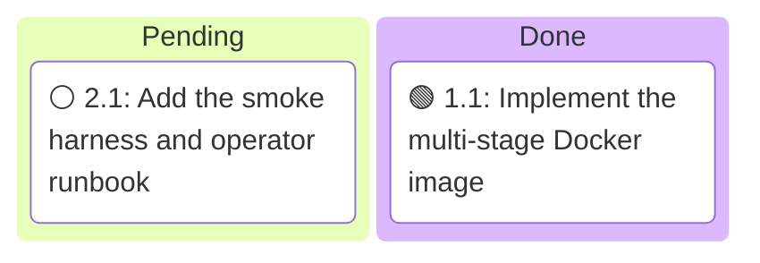
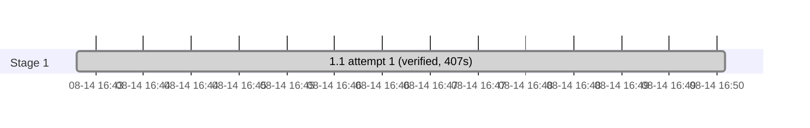

# Execution Ledger: Containerized Service

<!-- spec-nav:start -->
**Spec navigation:** [State](00_state.md) · [Discovery](01_discovery.md) · [Requirements](02_requirements.md) · [Design](03_design.md) · [Tasks](04_tasks.md) · [Execution](05_execution.md)
<!-- spec-nav:end -->

## Active Wave

| Task | Stage | Mode | Branch / worktree | State |
|---|---:|---|---|---|
| 2.1 | 2 | controller | `containerized-service` / current checkout | ready |

| Task | Status | Commit / diff | Verification | Reviewer | Notes |
|---|---|---|---|---|---|
| 1.1 | passed | working tree diff | build → 156 MB image; 24 image/runtime assertions; wrong-validator digest build fails; `git diff --check` clean | 1 independent reviewer | [report](execution/task-1.1-report.md) · [review](execution/task-1.1-review.md); no repair round needed |
| 2.1 | pending | — | — | — | Smoke harness and operator runbook; depends on 1.1 |

## Baseline

| Revision | Command | Exit | Pre-existing failures |
|---|---|---:|---|
| `ab3b848922479c4b859d8d4ecd9b480f624304bb` | `cargo test --all-targets --all-features` | 0 | none; 54 passed, 2 ignored |

The approved containerized-service specification is uncommitted, so an isolated worktree cannot
reproduce the approved planning state from the base revision. Execution therefore uses the
dedicated `containerized-service` feature branch in the current checkout and preserves the
pre-existing untracked [.codebase-memory](../../.codebase-memory) directory and the unrelated
modified [amtrak-gtfs-rt-service/03_design.md](../amtrak-gtfs-rt-service/03_design.md), which stay
out of every task commit.

Docker Engine `29.6.2` is available for the build and smoke tasks.

## Self-Hardening Preflight

- Artifact digest (`01`–`04`): `66ef99142d49f8c4c5b1de9a740d893140582e10de596adb1cba7a32a8697291`
- No prior passing `spec-audit` is recorded for this digest.
- Depth: medium (two controller tasks, high security-boundary risk but small, fully reviewable scope)
- Method: focused inline hardening review of both task contracts against the approved
  [design](03_design.md) and [requirements](02_requirements.md), under `spec-execute` delegated authority.
- Status: passed; no CERTAIN P0/P1 task-contract defect found. Task 1.1 and 2.1 file scopes,
  `Depends on`, interfaces, digest pins, env defaults, endpoints (`/livez`, `/readyz`,
  `/v1/feed-set.json`), and binary name (`amtrak-gtfs-rt-service`) are consistent with the existing
  source ([config.rs](../../src/config.rs), [serve.rs](../../src/serve.rs)) and the design contract.

## Execution Timing

### Task Board

### Run Intervals

| Run ID | Started UTC | Stopped UTC | Elapsed Seconds | Outcome |
|---|---|---|---:|---|
| run-20260814T164102Z | 2026-08-14T16:41:02Z | pending | pending | active |

### Task Attempt Intervals

| Run ID | Stage/Wave | Task | Attempt | Started UTC | Stopped UTC | Elapsed Seconds | Outcome |
|---|---|---|---:|---|---|---:|---|
| run-20260814T164102Z | Stage 1 | 1.1 | 1 | 2026-08-14T16:43:18Z | 2026-08-14T16:50:05Z | 407 | verified |

### Execution Gantt

