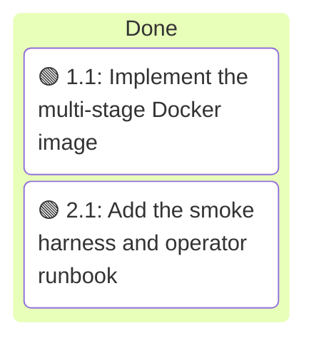
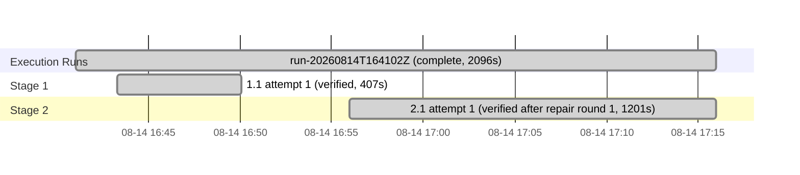

# Execution Ledger: Containerized Service

<!-- spec-nav:start -->
**Spec navigation:** [State](00_state.md) · [Discovery](01_discovery.md) · [Requirements](02_requirements.md) · [Design](03_design.md) · [Tasks](04_tasks.md) · [Execution](05_execution.md)
<!-- spec-nav:end -->

## Active Wave

| Task | Stage | Mode | Branch / worktree | State |
|---|---:|---|---|---|
| 3.1 | 3 | controller | `containerized-service` / current checkout | complete; implementation/runtime verification and authorized pre/post dependency audits passed with reviewed inherited warnings |

| Task | Status | Commit / diff | Verification | Reviewer | Notes |
|---|---|---|---|---|---|
| 1.1 | passed | `9954de2` | build → 156 MB image; 24 image/runtime assertions; wrong-validator digest build fails; `git diff --check` clean | 1 independent reviewer | [report](execution/task-1.1-report.md) · [review](execution/task-1.1-review.md); no repair round needed |
| 2.1 | passed | working tree diff | smoke harness PASSED after repair round 2 (guards, live health 7s, 4 artifacts decoded, denied/spoofed 403, R4.4 incomplete-newest, offline recovery byte-identical); fmt/clippy/54 tests/doc; offline + live feed gates; SBOM exported; fresh reviewable grype evidence (33C/74H/146M — not clean) | 1 independent reviewer + pre-approval review | [report](execution/task-2.1-report.md) · [review](execution/task-2.1-review.md); round 1 bounded guards and added R4.4/R6.6 coverage; round 2 made Docker rejection evidence fail closed and scan publication fresh/atomic |
| 3.1 | passed | current working tree | scratch/musl rebuild; reproducible hardened validator; upstream 69-task suite; Rust 57 passed/2 ignored; exact-image Grype zero findings; full smoke/recovery PASS, 79 MiB, healthy in 13s; complete pre/post inventories each reviewed with ten unchanged warnings, no blocked result, and no KEV match | controller verification | audit fingerprints `36998877…a75` → `725e3837…fc8`; four malformed GitHub CVSS enrichments retained as partial-source diagnostics; no image publication or deployment performed |

## Follow-up Security Remediation

After PR #2 merged, the user chose remediation rather than approving the proposed 401-finding
exception. Task 3.1 supersedes the rollout block described in the historical integration section:
the container-specific Critical/High findings and all lower-severity matches are absent from the
exact rebuilt image. The authorized Cargo comparison found ten inherited warning records in both
snapshots, no blocked result, and no KEV match; these remain explicit base-service technical debt.

## Baseline

| Revision | Command | Exit | Pre-existing failures |
|---|---|---:|---|
| `ab3b848922479c4b859d8d4ecd9b480f624304bb` | `cargo test --all-targets --all-features` | 0 | none; 54 passed, 2 ignored |

The approved containerized-service specification is uncommitted, so an isolated worktree cannot
reproduce the approved planning state from the base revision. Execution therefore uses the
dedicated `containerized-service` feature branch in the current checkout and preserves the
pre-existing untracked [.codebase-memory](../../.codebase-memory) directory and the unrelated
modified [amtrak-gtfs-rt-service/03_design.md](../amtrak-gtfs-rt-service/03_design.md), which stay
out of every task commit.

Docker Engine `29.6.2` is available for the build and smoke tasks.

## Self-Hardening Preflight

- Artifact digest (`01`–`04`): `66ef99142d49f8c4c5b1de9a740d893140582e10de596adb1cba7a32a8697291`
- No prior passing `spec-audit` is recorded for this digest.
- Depth: medium (two controller tasks, high security-boundary risk but small, fully reviewable scope)
- Method: focused inline hardening review of both task contracts against the approved
  [design](03_design.md) and [requirements](02_requirements.md), under `spec-execute` delegated authority.
- Status: passed; no CERTAIN P0/P1 task-contract defect found. Task 1.1 and 2.1 file scopes,
  `Depends on`, interfaces, digest pins, env defaults, endpoints (`/livez`, `/readyz`,
  `/v1/feed-set.json`), and binary name (`amtrak-gtfs-rt-service`) are consistent with the existing
  source ([config.rs](../../src/config.rs), [serve.rs](../../src/serve.rs)) and the design contract.

## Integration Decision

- Status: user chose push + PR on 2026-08-14; branch `containerized-service` pushed to `origin`.
- Base: `main`
- Result: [PR #2](https://github.com/sohampatwardhan/Amtrak-GTFS-RT/pull/2) is the authoritative
  integration record; its final state and merge commit govern this decision. Original task
  commits: `9954de2` (task 1.1 image), `f969404` (task 2.1 harness + runbook). Post-task security
  evidence began with `fb8aa09` (auth-free grype fallback); the proposed risk acceptance and its
  supporting triage are tracked in the same PR.
- Rollout: still blocked. CVE evidence is now **available** (grype: 33 Critical / 74 High / 146
  Medium — not clean; inherited from the JRE's OS packages and the bundled validator JAR), so the
  remaining decisions are (a) explicit owner approval of the
  [proposed risk acceptance](../../.security/risk-acceptance/containerized-service.md) and (b) the
  pre-existing base-service dependency-audit block (inherited from the catenary crate chain and
  unaffected by containerization). Remediation triage found no fixable Critical image finding;
  all 10 fixable High findings are embedded in the latest upstream validator JAR. A smaller
  runtime would not address those findings and would require a compatibility redesign. Image
  publication and deployment are out of scope and not authorized.

## Post-Task Security Evidence Repair

- Pre-approval review found that a Docker invocation error could count as a successful startup
  rejection and an earlier CVE file could survive a failed scan. Both false-positive paths were
  repaired in [the harness](../../scripts/test-container.sh).
- Focused Docker tests proved the guard distinguishes invocation failure, zero exit, timeout, and
  genuine non-zero rejection (`2`, `2`, `1`, `0` respectively).
- The complete harness passed against the rebuilt image. The fresh
  [scan summary](../../.security/risk-acceptance/evidence/containerized-service-scan-summary.json)
  and [finding table](../../.security/risk-acceptance/evidence/containerized-service-cves-grype.txt)
  are committed for PR review; the summary records checksums for the local raw grype JSON and SBOM.

## Execution Timing

### Task Board

### Run Intervals

| Run ID | Started UTC | Stopped UTC | Elapsed Seconds | Outcome |
|---|---|---|---:|---|
| run-20260814T164102Z | 2026-08-14T16:41:02Z | 2026-08-14T17:15:58Z | 2096 | complete |

### Task Attempt Intervals

| Run ID | Stage/Wave | Task | Attempt | Started UTC | Stopped UTC | Elapsed Seconds | Outcome |
|---|---|---|---:|---|---|---:|---|
| run-20260814T164102Z | Stage 1 | 1.1 | 1 | 2026-08-14T16:43:18Z | 2026-08-14T16:50:05Z | 407 | verified |
| run-20260814T164102Z | Stage 2 | 2.1 | 1 | 2026-08-14T16:55:57Z | 2026-08-14T17:15:58Z | 1201 | verified after repair round 1 |

### Execution Gantt

