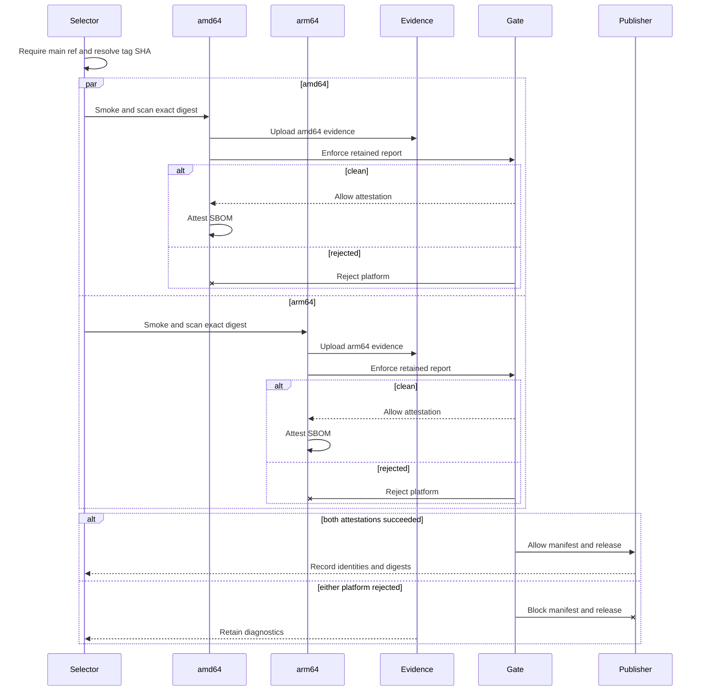

# Design: Repository Health Remediation

<!-- spec-nav:start -->
**Spec navigation:** [State](00_state.md) · [Discovery](01_discovery.md) · [Requirements](02_requirements.md) · [Design](03_design.md) · [Tasks](04_tasks.md) · [Execution](05_execution.md)
<!-- spec-nav:end -->

## Overview

This design realizes the comprehensive remediation selected in [discovery](01_discovery.md) without changing the Rust service or advisory-fetcher runtime. It adds complete component-level CI, separates release-control code from immutable release-source code during manual recovery, retains exact-digest evidence before applying the zero-match policy, and reconciles current documentation with GitHub release and deployment state.

The most important boundary is between two revisions in a manual recovery run:

- the **control revision** is the default-branch commit containing the corrected workflow and generic release-policy helpers;
- the **release revision** is the commit referenced by the immutable semantic-version tag and is the only source used to build or verify the released image.

A normal tag push resolves both roles to the tag commit. A manual recovery intentionally uses corrected controls from `main` while keeping all release payload, metadata, licenses, and image build inputs pinned to the selected tag.

## Existing Repository Evidence

- [`.github/workflows/ci.yml`](../../.github/workflows/ci.yml) currently has one Rust-only job.
- [`.github/workflows/release.yml`](../../.github/workflows/release.yml) currently derives version and revision from `GITHUB_REF_NAME` and `GITHUB_SHA`, which are correct for tag pushes but not sufficient for a manual run whose input names a different tag.
- The current scan step writes reports and immediately enforces zero findings. A failure prevents the later evidence-staging and upload steps from running.
- [`scripts/verify-release-image.sh`](../../scripts/verify-release-image.sh) already verifies OCI version, revision, architecture, user, healthcheck, license, and source metadata; it remains the authoritative platform-image identity check.
- The code graph identifies independent Rust and Python entry points and a cohesive advisory-fetcher test cluster. Workflow YAML and release scripts are not meaningfully modeled by the graph, so their behavior is grounded directly in the files above.

## Architecture

The authoritative component descriptions follow the diagram. The diagram shows the three independently reviewable surfaces and the one-way path from release identity to publication.

```mermaid
block
  columns 3
  block:ci["Continuous integration"]
    rust_tests["Rust build and tests"]
    python_tests["Python offline tests"]
  end
  block:release["Release control"]
    release_context["Canonical tag and revision"]
    platform_validation["Two platform validations"]
    diagnostic_evidence[("Retained exact digest evidence")]
    vulnerability_gate{"Zero match policy gate"}
    publisher["Attest and publish"]
  end
  block:docs["Project state"]
    operator_guides["Operator guides"]
    spec_ledgers["Spec state and evidence"]
  end
  release_context-- "identifies" -->platform_validation
  platform_validation-- "records" -->diagnostic_evidence
  diagnostic_evidence-- "evaluated by" -->vulnerability_gate
  vulnerability_gate-- "clean only" -->publisher
  publisher-- "status reflected in" -->operator_guides
  operator_guides-- "agrees with" -->spec_ledgers
```



The structured source is [`diagrams/architecture.json`](diagrams/architecture.json).

## Components and Interfaces

### Continuous-integration jobs

The existing Rust job in [`.github/workflows/ci.yml`](../../.github/workflows/ci.yml) retains its build and offline-test contract, but every mutable `uses:` reference is replaced with the reviewed full commit SHA selected below. Two sibling jobs are added:

1. `advisory-fetcher-tests` checks out the pull-request or `main` revision, provisions CPython 3.12.11 through `actions/setup-python` pinned to commit `5fda3b95a4ea91299a34e894583c3862153e4b97` (v7.0.0), installs the exact entries `pytest==9.0.3` and `playwright==1.61.0` from the planned [`advisory-fetcher/requirements.txt`](../../advisory-fetcher/requirements.txt), and runs [`advisory-fetcher/tests`](../../advisory-fetcher/tests) with no browser-install command.
2. `repository-controls` executes the deterministic release-control test harness described below. It needs only Bash, Git, and `jq`, all present on the hosted Ubuntu runner.

Each job is independently visible and fails the workflow when its command exits nonzero. The workflow keeps read-only repository permissions. The final workflow contains no mutable action, toolchain-channel, major-tag, or branch reference in a `uses:` value.

### Release context control

The planned [`scripts/release-context.sh`](../../scripts/release-context.sh) is generic workflow-control code, not release payload. It has two subcommands:

```text
release-context select EVENT_NAME REF_NAME INPUT_TAG CONTROL_REF DEFAULT_BRANCH OUTPUT_FILE
release-context verify TAG SOURCE_DIR OUTPUT_FILE
```

`select` accepts only `push` and `workflow_dispatch`. For a tag push it selects `REF_NAME`. For manual dispatch it requires `INPUT_TAG`, requires `DEFAULT_BRANCH` to equal the literal `main`, and requires `CONTROL_REF` to equal the literal `refs/heads/main`; this rejects a dispatch targeted at any other branch even if repository metadata reports that branch as the default. It rejects anything outside exact `vMAJOR.MINOR.PATCH` syntax and appends `tag=<tag>` plus `version=<version>` to `OUTPUT_FILE` using GitHub's output-file format.

`verify` requires `SOURCE_DIR` to be a Git checkout whose `HEAD` equals `TAG^{commit}`. It runs the tag's own [`scripts/check-release-metadata.sh`](../../scripts/check-release-metadata.sh) and appends `revision=<full SHA>` to `OUTPUT_FILE`. Missing tags, mismatched checkouts, or invalid release metadata are errors.

The `release-context` job in [`.github/workflows/release.yml`](../../.github/workflows/release.yml) performs these operations in order:

1. Check out the workflow execution revision at `control/`.
2. Run `control/scripts/release-context.sh select` with the event, pushed ref name, manual input, full `github.ref`, and `github.event.repository.default_branch`, then expose the selected tag/version as step outputs.
3. Check out the selected immutable tag at `source/`.
4. Run `control/scripts/release-context.sh verify` against `source/`.
5. Expose `tag`, `version`, `release_revision`, and `control_revision` as job outputs.

The workflow's concurrency key uses the manual tag input when present and otherwise the pushed ref, preventing two runs from acting on the same release identity concurrently. The documented recovery command always includes `--ref main`; the helper independently enforces that choice.

### Per-platform validation

Each matrix leg depends on `release-context` and checks out the same two revisions at `control/` and `source/`. All build and payload commands use `source/`; only the new generic context and vulnerability helpers use `control/`.

The platform leg performs this sequence:

1. Consume the manifest decision made once by the context job: an absent manifest means both legs build; an existing manifest is reusable only when it contains exactly one amd64 and one arm64 child and no extras. Every other existing shape fails before the matrix starts and is never retagged.
2. Reuse the digest mapped to this matrix platform or build from `source/` with OCI version and revision set from the canonical outputs.
3. Pull the exact digest and verify it with [`scripts/verify-release-image.sh`](../../scripts/verify-release-image.sh) before treating it as the release candidate.
4. Run the existing isolated container smoke harness from the tagged source before installing release scanners, then quarantine any smoke-harness scanner files under a clearly noncanonical directory.
5. Generate the canonical SBOM and exactly one canonical Grype JSON report for the exact local image after the smoke harness. Write the JSON to a private temporary path, validate it, and atomically move it to its canonical evidence name; every summary and policy decision derives from that one file.
6. Validate that the SBOM is an SPDX JSON object with a nonempty `packages` array, generate a deterministic human summary and exact digest record, and stage the digest, SBOM, JSON, summary, and image inspection under `release-evidence/`.
7. Upload the staged evidence before enforcing the zero-match decision.
8. Enforce the vulnerability policy. Only a clean report continues to the exact-platform SBOM attestation.

Existing artifacts are never rewritten. A version manifest with missing, duplicate, or extra platforms fails. [`scripts/verify-release-image.sh`](../../scripts/verify-release-image.sh) rejects a platform digest whose version or revision labels do not match the canonical release context.

### Vulnerability-report policy

The planned [`scripts/release-vulnerability-policy.sh`](../../scripts/release-vulnerability-policy.sh) exposes four deterministic commands:

```text
release-vulnerability-policy summarize REPORT_JSON SUMMARY_TEXT
release-vulnerability-policy enforce REPORT_JSON
release-vulnerability-policy validate-sbom SBOM_JSON
release-vulnerability-policy write-digest DIGEST OUTPUT_TEXT
```

The report commands require a JSON object with `.matches` as an array. Every match must contain a nonempty string at `.vulnerability.id`, `.vulnerability.severity`, `.artifact.name`, and `.artifact.version`, plus `.vulnerability.fix.versions` as an array of nonempty strings. An empty, correctly typed fix array is valid and renders as `none available`; a missing or wrongly typed identifying field makes the entire report malformed. `summarize` writes a tabular report with columns `ID`, `SEVERITY`, `ARTIFACT`, `INSTALLED`, and `FIXED`; it succeeds for both zero and nonzero match counts so evidence can be uploaded before the policy decision. `enforce` prints the match count and the same identifying fields, exits zero only for zero matches, and exits nonzero for findings or malformed input. `validate-sbom` requires a top-level SPDX JSON object with a nonempty `packages` array. `write-digest` accepts only `sha256:` followed by 64 lowercase hexadecimal characters and writes exactly that digest plus one newline. Missing or malformed evidence is never accepted as clean.

The planned [`scripts/test-release-controls.sh`](../../scripts/test-release-controls.sh) creates an isolated temporary Git repository and synthetic reports. It verifies tag-push selection; manual selection on `refs/heads/main`; rejection when either the control ref or reported default branch is not literally `main`; invalid/missing tag rejection; a successful tagged checkout whose emitted 40-character SHA exactly equals `git rev-parse TAG^{commit}`; checkout/tag mismatch rejection; tagged release-metadata failure; clean-report acceptance; vulnerable-report rejection with identifiers; missing/wrong-typed per-match field rejection; empty fix-list rendering; stable summary output; and valid, malformed, and empty-package SPDX fixtures plus exact digest-record syntax.

### Publication

The `publish` job depends on both `release-context` and every platform leg. GitHub's default success condition means any platform failure or skip prevents publication. The job checks out the release tag at `source/`, downloads the two evidence artifacts, verifies an exact two-platform digest set, and then preserves the current manifest, attestation, and GitHub Release logic with these substitutions:

- every use of `GITHUB_REF_NAME` becomes the canonical tag output;
- every use of `GITHUB_SHA` as release identity becomes the canonical release revision;
- release assets and notes come from `source/`;
- `image-release.txt` records the control revision in addition to tag, release revision, manifest digest, and platform digests.

The job remains the only place with `contents: write`. Platform jobs retain only the package and attestation permissions needed to push a missing digest and attach its SBOM. The context job and CI jobs remain read-only.

### Documentation and state

The documentation task updates:

- [`README.md`](../../README.md) with separate source, completed-release, and deployment status plus the post-merge recovery command;
- [`advisory-fetcher/README.md`](../../advisory-fetcher/README.md) to remove the false claim that PR #8 is not on `main`;
- [`containerized-service/00_state.md`](../containerized-service/00_state.md), [`amtrak-gtfs-rt-service/00_state.md`](../amtrak-gtfs-rt-service/00_state.md), and [`advisory-fetcher/00_state.md`](../advisory-fetcher/00_state.md) to preserve historical evidence while correcting current gate summaries and superseded change-control statements;
- this feature's execution and finish artifacts with the exact manual v0.3.0 recovery handoff and the unchanged status of PR #7.

No document claims v0.3.0 is a completed release until GitHub has a corresponding completed Release object. Merging this pull request does not dispatch recovery.

## Data Models

### `ReleaseContext`

| Field | Type | Source | Contract |
|---|---|---|---|
| `tag` | semantic-version tag string | pushed ref or manual input | Exact `vMAJOR.MINOR.PATCH`; exists and resolves to the source checkout |
| `version` | semantic version string | `tag` without `v` | Matches Cargo and changelog metadata in the tagged source |
| `release_revision` | 40-character Git SHA | `git rev-parse source/HEAD` | Equals `tag^{commit}` and all OCI revision labels |
| `control_revision` | 40-character Git SHA | workflow execution SHA | Identifies the corrected workflow/helper code; for manual recovery its ref is proven to be `refs/heads/main` |

### `PlatformEvidence`

| Field | Type | Contract |
|---|---|---|
| `slug` | `linux-amd64` or `linux-arm64` | Unique artifact namespace for the matrix leg |
| `digest` | `sha256:<64 lowercase hex>` | Exact pulled and inspected platform digest |
| `sbom` | SPDX JSON document | Top-level object with a nonempty `packages` array, validated before upload or attestation |
| `vulnerability_json` | Grype JSON document | Contains `.matches` as an array |
| `vulnerability_summary` | UTF-8 tabular text | Derived only from `vulnerability_json` |
| `image_inspect` | Docker inspection JSON | Records the exact local image used by smoke and scan |
| `policy_result` | clean or rejected | Clean only when the report is valid and has zero matches |

Both models are workflow outputs/artifacts, not new runtime persistence.

## Release Recovery Flow

The flow demonstrates that diagnostic evidence reaches retention before the gate branches. The failure branch never reaches the publisher.



The structured source is [`diagrams/flows.json`](diagrams/flows.json).

## Error Handling

| Failure | Observable result | Evidence retained |
|---|---|---|
| Unsupported event, missing manual input, non-main manual control ref, malformed tag, or absent tag | Context job fails before platform jobs start | Context logs identify the rejected field/ref |
| Source checkout does not equal the tag commit | Context job fails before image lookup/build | Selected tag and observed revision |
| Existing manifest has an invalid platform set | Affected platform or publish verification fails without retagging | Raw manifest inspection in logs |
| Existing image version/revision metadata mismatches | Platform validation fails before attestation | Image inspection and verifier diagnostic |
| Smoke or scanner execution fails | Platform validation fails; publication is skipped | Any evidence created before failure uploads under an `always()` diagnostic step |
| SBOM/report is missing or malformed | Platform validation fails and cannot attest | Partial diagnostic artifact when any files exist |
| One or more vulnerability matches | Summary and JSON are uploaded, then the policy step fails | Full exact-digest evidence artifact |
| One platform fails | Dependent publish job is skipped by the default success condition | Successful/partial artifacts remain per platform |
| Existing GitHub release evidence disagrees | Publish job fails without replacing the release | Generated and downloaded evidence remain in logs/workspace |

## Current Technology Evidence

Consulted Context7 using identity `/websites/github_en_actions` for current GitHub Actions semantics. The exact action versions and resulting decisions are recorded below.

| Technology | Context7 identity/source | Exact selected version | Current-doc question | Decision |
|---|---|---|---|---|
| GitHub Actions workflow semantics | Context7 `/websites/github_en_actions`, official GitHub Actions documentation consulted 2026-08-23 | Hosted service | Manual inputs exist only for `workflow_dispatch`; dispatch runs require the workflow on the default branch; `GITHUB_SHA`/`GITHUB_REF` describe the dispatched ref, job outputs cross `needs` boundaries, omitted job permissions become `none`, and `always()` preserves diagnostic steps after failure | Resolve the release tag explicitly, check out and verify the tag, pass canonical identity as job outputs, keep job-level least privilege, and use `always()` only for evidence retention |
| `actions/setup-python` | Official GitHub release/tag metadata consulted 2026-08-23 | v7.0.0 at `5fda3b95a4ea91299a34e894583c3862153e4b97` | Current immutable action revision for provisioning an exact Python version | Pin the full commit and request CPython 3.12.11 |
| `actions/checkout` | Official GitHub release metadata and existing repository pin | v7.0.1 at `3d3c42e5aac5ba805825da76410c181273ba90b1` | Current action supports explicit refs and separate checkout paths | Retain the existing full-SHA pin and use `control/` plus `source/` paths |
| `dtolnay/rust-toolchain` | Official repository `stable` commit resolved 2026-08-23 | `4360b52568e2003a75bf9bc1d59f33a8e3fc893c` | Immutable revision corresponding to the selected stable toolchain action | Replace `@stable` with this reviewed commit SHA and pass `toolchain: stable` explicitly |
| `Swatinem/rust-cache` | Official repository v2 annotated tag peeled 2026-08-23 | v2 at `6323deb102c322ba6fcbdcafc7e3dddab59af2b6` | Immutable revision corresponding to the selected v2 cache action | Replace `@v2` with this reviewed commit SHA |
| `actions/upload-artifact` | Official GitHub release metadata and existing repository pin | v7.0.1 at `043fb46d1a93c77aae656e7c1c64a875d1fc6a0a` | Current artifact action can run under `always()` and enforce missing-file behavior | Retain the existing pin; upload exact-digest evidence before the policy step and partial diagnostics after earlier failures when present |

## Dependency Security Evidence

The required CI gate selects resolved versions `CPython@3.12.11`, `pytest@9.0.3`, and `playwright@1.61.0`, plus four full-SHA action/toolchain revisions, so this feature uses dependency-security-audit `change` mode even though Cargo and the runtime image are unchanged. The [pre-change JSON](../../.security/dependency-audit/pre-change/latest.json) and [pre-change Markdown](../../.security/dependency-audit/pre-change/latest.md) completed at `2026-08-23T16:31:02.628182Z` for revision `eee4c6493ef4177bcf43fea8ffa63900194b85b1` and fingerprint `96f7a47d1656f4c350ee68a7ebaa9b2375270888439cde886ed29ed35ce61329`. Result: `warnings`, exit 0, complete 375-package inventory, zero blockers, and ten pre-existing Cargo advisories. The explicitly reviewed warnings are not clean. Decision: proceed with the bounded CI-only resolution and retain the warnings as existing technical debt.

The [post-change JSON](../../.security/dependency-audit/post-change/latest.json) and [post-change Markdown](../../.security/dependency-audit/post-change/latest.md) completed at `2026-08-23T17:32:14.051661Z` for the same revision and fingerprint `58c240bbac1925b6b04dc6080602803104c6a8165d63d362eeba34aca668df57`. The exact ten-package Python environment has zero advisory findings and zero blockers. Its result remains `warnings`, not clean, because pip inspection cannot prove resolved dependency edges and native pip-audit was unavailable. An unavailable required source cannot satisfy the gate or ship; in this audit pip-audit is optional corroboration and the limitation remains explicit. The audit exposed the originally planned vulnerable pytest 8.4.2; pytest 9.0.3 is the fixed pin and passed all 34 tests. Decision: proceed with the fixed exact CI environment and retain release-time Syft/Grype as mandatory evidence.

## Security and Cross-Cutting Risk Gates

| Gate | Failure mode | Verification and decision |
|---|---|---|
| Security / authorization | Manual dispatch blesses the wrong tag, control branch, or a vulnerable image | Require `refs/heads/main` for manual control code, exact tag syntax/existence/revision checks, OCI metadata verification, two platform gates, zero-match policy, and job-level permissions; repository write authorization remains GitHub-owned |
| Supply chain | Mutable action or untracked dependency changes behavior | Every action uses a reviewed full commit pin; test packages are exact-version pinned; pre/post change audits and project tests record the resolution decision |
| Observability | A failed gate leaves no actionable report | Evidence generation, human summary, `always()` partial upload, and pre-policy full upload are tested |
| Privacy | Evidence leaks credentials or personal data | Reports contain package/image metadata only; no secrets are printed or uploaded; not otherwise applicable |
| Accessibility | Repository controls create a user interface barrier | No visual product interface changes; logs and text artifacts remain the primary interface |
| Performance | Tagged smoke evidence and policy scanning duplicate work, or browser downloads inflate CI | Treat any tag-local smoke report as best-effort/noncanonical, generate exactly one canonical Grype JSON for policy, record hosted scanner availability, and do not install a browser in unit-test CI |
| Migration | Runtime data requires conversion | Not applicable: runtime code, API, and persisted generations are unchanged |
| Rollout | Merge unexpectedly publishes or deploys | Pull-request and `main` events do not satisfy release triggers; recovery requires explicit manual tag input after merge |
| Rollback | Control change must be reverted | Revert the workflow/helper/docs commit; immutable tags and images remain untouched |

## Testing Strategy

- Run `cargo test --all-targets` with normal localhost permissions; the two live upstream tests remain intentionally ignored.
- Run the advisory-fetcher suite under CPython 3.12.11 with `pytest==9.0.3` and `playwright==1.61.0`, without installing a browser.
- Run the [release-control fixture harness](../../scripts/test-release-controls.sh) against temporary Git/tag fixtures and clean, vulnerable, and malformed Grype fixtures.
- Run `bash -n` on every changed shell script.
- Run `actionlint` on every changed workflow; hosted GitHub Actions remains authoritative for expression, runner, registry, attestation, and release-service integration.
- Run the spec checker and JSON-sidecar freshness checks at every gate.
- Inspect the final diff for stale lifecycle claims and verify the feature branch is based only on current `origin/main` plus this remediation.

## Correctness Properties

### Property 1: Every maintained component participates in CI

For each pull request and `main` push, Rust and advisory-fetcher jobs run independently. The Python job uses exact test-tool versions, performs no browser installation, and fails visibly on any test failure.

**Validates: Requirements 1.1, 1.2, 1.3, 1.4, 1.5**

### Property 2: One canonical release identity controls the run

For either supported trigger, exactly one semantic tag is selected, checked out, and resolved to its actual commit. Missing, malformed, or mismatched identities fail before platform validation, and the same outputs reach every dependent job.

**Validates: Requirements 2.1, 2.2, 2.3, 2.4, 2.5, 2.6**

### Property 3: Artifact reuse is immutable and identity-preserving

An existing manifest is reusable only when its platform set is exact and each selected image's OCI version and revision match the canonical release. Otherwise the run fails without moving a tag or changing an image; absent platform artifacts are built only from the tagged source.

**Validates: Requirements 3.1, 3.2, 3.3, 3.4, 3.5, 3.6**

### Property 4: Every scan decision is explainable from retained evidence

Each exact platform digest produces an SBOM, Grype JSON, deterministic human summary, digest record, and image inspection. Findings list the required identifying fields. Missing or malformed evidence fails validation, while available evidence is retained even on failure.

**Validates: Requirements 4.1, 4.2, 4.3, 4.4, 4.5, 4.6**

### Property 5: Vulnerability policy fails closed

Only a valid report with zero matches permits platform attestation. Findings, scanner failure, missing data, or malformed data reject the platform, and any rejected platform prevents manifest-tag and GitHub Release publication.

**Validates: Requirements 5.1, 5.2, 5.3, 5.4, 5.5**

### Property 6: Manual recovery cannot bypass normal release gates

Manual and tag-push runs converge on identical platform and publication jobs. An explicit tag and `refs/heads/main` control ref are mandatory for manual recovery; tags are immutable; write permissions are limited to publishing jobs; and successful evidence records every canonical identity and digest.

**Validates: Requirements 6.1, 6.2, 6.3, 6.4, 6.5, 6.6, 6.7**

### Property 7: Repository lifecycle claims agree with authoritative state

Documentation consistently identifies PRs #8 and #9 as merged without contradictory current-state claims, the latest completed GitHub release, incomplete v0.3.0 publication, and the absence of deployment/public-exposure authorization. The handoff records the recovery command and keeps PR #7 separate.

**Validates: Requirements 7.1, 7.2, 7.3, 7.4, 7.5, 7.6, 7.7**

## Rejected Design Alternatives

- Running a corrected workflow directly against the dirty or mutable default-branch source was rejected because release payload must remain the immutable tag.
- Checking out only the tag during manual recovery was rejected because v0.3.0 cannot contain controls written after its tag.
- Inlining duplicate vulnerability logic in YAML was rejected because it would be difficult to fixture-test and reuse.
- Allowing known findings with a severity threshold was rejected because it changes the approved zero-match policy.
- Retagging v0.3.0 or silently releasing v0.3.1 was rejected in discovery.

## Approval

Status: **Re-approved on 2026-08-23 through the explicit direction to apply the audit fixes and execute.**
