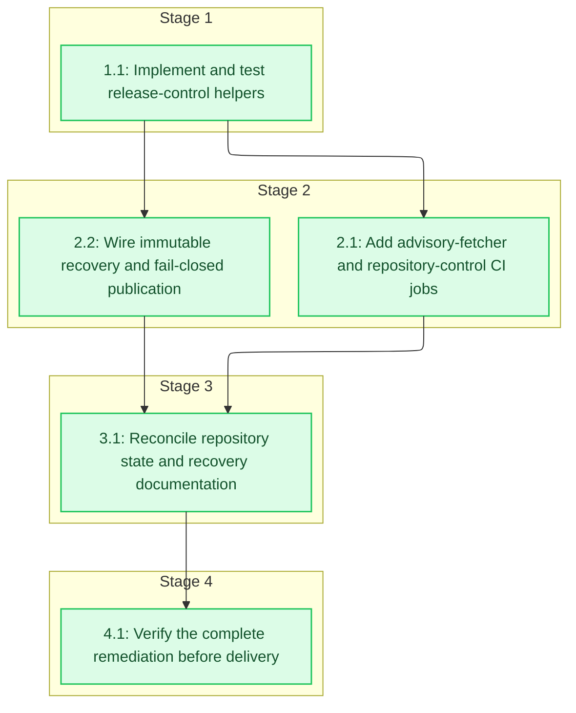

# Tasks: Repository Health Remediation

<!-- spec-nav:start -->
**Spec navigation:** [State](00_state.md) · [Discovery](01_discovery.md) · [Requirements](02_requirements.md) · [Design](03_design.md) · [Tasks](04_tasks.md) · [Execution](05_execution.md)
<!-- spec-nav:end -->

## Stage and Dependency Overview

> [!WARNING]
> Execute dependency stages in order. Run tasks concurrently only when each is marked
> `parallel-safe`, their ownership is disjoint, and isolated worktrees are available.

- [x] 1. Deterministic release controls
  - [x] 1.1 Implement and test release-control helpers
    - Create [`scripts/release-context.sh`](../../scripts/release-context.sh) with the exact `select EVENT_NAME REF_NAME INPUT_TAG CONTROL_REF DEFAULT_BRANCH OUTPUT_FILE` and `verify TAG SOURCE_DIR OUTPUT_FILE` interfaces from the approved design.
    - Make `select` accept only tag `push` and explicit-tag `workflow_dispatch`, require both `DEFAULT_BRANCH=main` and a manual control ref of `refs/heads/main`, validate exact `vMAJOR.MINOR.PATCH`, and emit canonical `tag` and `version` outputs.
    - Make `verify` require `SOURCE_DIR/HEAD == TAG^{commit}`, run the tagged source's release-metadata check, and emit the full canonical `revision`.
    - Create [`scripts/release-vulnerability-policy.sh`](../../scripts/release-vulnerability-policy.sh) with `summarize REPORT_JSON SUMMARY_TEXT` and `enforce REPORT_JSON`; validate `.matches` and every required identifying field/type, render an empty fix list as `none available`, accept only zero matches, and reject missing or malformed input.
    - Add `validate-sbom SBOM_JSON` and `write-digest DIGEST OUTPUT_TEXT` commands that require a top-level SPDX object with nonempty packages and exact lowercase SHA-256 digest-record syntax.
    - Create [`scripts/test-release-controls.sh`](../../scripts/test-release-controls.sh) with isolated temporary Git/tag fixtures plus clean, vulnerable, and malformed Grype fixtures. Cover push/manual selection, rejection when either the control ref or reported default branch is not literally `main`, invalid or absent tags, successful exact full-SHA emission, checkout mismatch, metadata-check failure, missing/wrong-typed match fields, deterministic summaries, and fail-closed enforcement.
    - **Files:** [`scripts/release-context.sh`](../../scripts/release-context.sh), [`scripts/release-vulnerability-policy.sh`](../../scripts/release-vulnerability-policy.sh), [`scripts/test-release-controls.sh`](../../scripts/test-release-controls.sh)
    - **Dependency resolution:** none
    - **Dependency delivery:** none
    - **Depends on:** none
    - **Stage:** 1
    - **Interfaces:** Consumes: Git event/ref/input/control-ref/default-branch strings, GitHub output-file path, immutable tagged checkout, and Grype JSON with typed identifying fields under every `.matches[]`; Produces: canonical `tag`, `version`, and `revision` output records plus deterministic human summaries and zero-only policy exit status
    - **Documentation:** document each script's public command contract, accepted inputs, output-file behavior, failure semantics, and the rationale for separating evidence generation from policy enforcement
    - **Verification:** run Bash syntax checking on the three linked scripts; run the linked release-control fixture harness; review command-contract and policy-rationale comments
    - **Estimated effort:** 1.5-2.5 hours
    - **Risk:** high; incorrect identity or fail-open parsing could publish the wrong or vulnerable artifact, while rollback removes the new helpers without migrating data
    - **Task category:** heavy_reasoning
    - **Delegation:** controller
    - _Requirements: 2.1, 2.2, 2.3, 2.4, 2.5, 4.3, 4.4, 4.6, 5.1, 5.2, 5.3, 6.2, 6.3, 6.7_

- [x] 2. Continuous integration and release orchestration
  - [x] 2.1 Add advisory-fetcher and repository-control CI jobs
    - Add [`advisory-fetcher/requirements.txt`](../../advisory-fetcher/requirements.txt) with exact entries `pytest==9.0.3` and `playwright==1.61.0`, then add `advisory-fetcher-tests` to the existing pull-request and `main` workflow using CPython 3.12.11, that exact resolution file, and `actions/setup-python` pinned to `5fda3b95a4ea91299a34e894583c3862153e4b97`.
    - Run the advisory-fetcher offline tests without a Playwright browser-install command and preserve normal nonzero test failure behavior.
    - Add a read-only `repository-controls` job that runs the [release-control fixture harness](../../scripts/test-release-controls.sh); retain the existing Rust job and workflow triggers while replacing `actions/checkout@v7`, `dtolnay/rust-toolchain@stable`, and `Swatinem/rust-cache@v2` with the reviewed SHAs in the design, passing `toolchain: stable` explicitly to the pinned toolchain action.
    - Set top-level `permissions: contents: read` so every CI job is read-only by default.
    - Reject every non-40-hex `uses:` ref during verification.
    - Re-consult the design's Current Technology Evidence before editing if the selected action version or GitHub Actions behavior has changed.
    - **Files:** [`.github/workflows/ci.yml`](../../.github/workflows/ci.yml), [`advisory-fetcher/requirements.txt`](../../advisory-fetcher/requirements.txt), [`.security/dependency-audit/.gitignore`](../../.security/dependency-audit/.gitignore), [`.security/dependency-audit/pre-change.json`](../../.security/dependency-audit/pre-change.json), [`.security/dependency-audit/pre-change.md`](../../.security/dependency-audit/pre-change.md), [`.security/dependency-audit/post-change.json`](../../.security/dependency-audit/post-change.json), [`.security/dependency-audit/post-change.md`](../../.security/dependency-audit/post-change.md), [`.security/dependency-audit/pre-change/latest.json`](../../.security/dependency-audit/pre-change/latest.json), [`.security/dependency-audit/pre-change/latest.md`](../../.security/dependency-audit/pre-change/latest.md), [`.security/dependency-audit/post-change/latest.json`](../../.security/dependency-audit/post-change/latest.json), [`.security/dependency-audit/post-change/latest.md`](../../.security/dependency-audit/post-change/latest.md)
    - **Dependency resolution:** change
    - **Dependency delivery:** none
    - **Context7 evidence:** state=completed | identity=/websites/github_en_actions | version=7.0.0 | decision=use full commit pins, explicit dispatch refs, top-level read-only CI permissions, exact CPython, and no browser installation; pytest 9.x CLI and Python 3.12 compatibility were separately confirmed through /pytest-dev/pytest
    - **Pre-change dependency audit:** state=completed | command=dependency-security-audit change | mode=change | timestamp=2026-08-23T16:31:02.628182Z | project_revision=eee4c6493ef4177bcf43fea8ffa63900194b85b1 | inventory_fingerprint=96f7a47d1656f4c350ee68a7ebaa9b2375270888439cde886ed29ed35ce61329 | json=[`.security/dependency-audit/pre-change.json`](../../.security/dependency-audit/pre-change.json) | markdown=[`.security/dependency-audit/pre-change.md`](../../.security/dependency-audit/pre-change.md) | review=completed | result=warnings | exit=0 | decision=proceed with bounded CI-only resolution after reviewing ten pre-existing Cargo advisories | warnings_reviewed=true | clean=false
    - **Resolution edit:** state=completed | files=[`.github/workflows/ci.yml`](../../.github/workflows/ci.yml), [`advisory-fetcher/requirements.txt`](../../advisory-fetcher/requirements.txt)
    - **Project tests:** state=completed | evidence=[`.specs/repository-health-remediation/05_execution.md`](../../.specs/repository-health-remediation/05_execution.md)
    - **Post-change dependency audit:** state=completed | command=dependency-security-audit change | mode=change | timestamp=2026-08-23T17:32:14.051661Z | project_revision=eee4c6493ef4177bcf43fea8ffa63900194b85b1 | inventory_fingerprint=58c240bbac1925b6b04dc6080602803104c6a8165d63d362eeba34aca668df57 | json=[`.security/dependency-audit/post-change.json`](../../.security/dependency-audit/post-change.json) | markdown=[`.security/dependency-audit/post-change.md`](../../.security/dependency-audit/post-change.md) | review=completed | result=warnings | exit=0 | decision=proceed because the exact CI environment has zero advisory findings; pip graph completeness and unavailable pip-audit remain explicit warnings | warnings_reviewed=true | clean=false
    - **Depends on:** 1.1
    - **Stage:** 2
    - **Interfaces:** Consumes: task 1.1 [release-control fixture harness](../../scripts/test-release-controls.sh), repository advisory-fetcher tests, and GitHub pull-request/`main` events; Produces: independently visible Rust, Python, and repository-control CI job results
    - **Documentation:** no public API; make job names, exact tool pins, offline-test intent, and read-only permissions self-explanatory in workflow YAML
    - **Verification:** parse the workflow as YAML; run the exact Python test command and the [release-control fixture harness](../../scripts/test-release-controls.sh); verify no browser-install command, no mutable `uses:` ref, and review workflow comments/names; then run and explicitly review the post-change dependency audit
    - **Estimated effort:** 30-60 minutes
    - **Risk:** medium; CI environment drift can block merges, and rollback restores the prior workflow with no migration
    - **Task category:** code_analysis
    - **Delegation:** parallel-safe
    - _Requirements: 1.1, 1.2, 1.3, 1.4, 1.5_

  - [x] 2.2 Wire immutable recovery and fail-closed publication
    - Add a required `workflow_dispatch` semantic-tag input and a `release-context` job that checks out the control revision at `control/`, rejects a manual `github.ref` other than `refs/heads/main`, selects the canonical tag with task 1.1, checks that tag out at `source/`, verifies its revision/metadata, and exports `tag`, `version`, `release_revision`, and `control_revision`.
    - Resolve manifest state once before the matrix: absent means build both platforms; exact-valid means exactly one amd64 and one arm64 child with no extras and passes a digest map to the legs; every other existing shape fails before builds or retagging. Make every platform leg use `source/` for release payload and task 1.1 helpers from `control/`, and verify canonical version/revision labels on reused digests.
    - Run the tag-local smoke harness before installing release scanners and quarantine any scanner files as noncanonical. Generate one canonical exact-digest SBOM and Grype JSON afterward, validate the SPDX object/nonempty packages and exact digest record, atomically promote the validated Grype JSON from a private temporary path, derive the human summary only from that JSON, and stage the evidence.
    - Upload the full evidence artifact before enforcement. Give the full upload a step ID and run a distinct partial-artifact upload only under `always() && steps.full_upload.outcome != 'success'`; only the partial upload may allow missing files.
    - Enforce the zero-match helper before platform attestation and keep publication dependent on both successful platform legs.
    - Make publication consume canonical tag/revision outputs, verify the exact two-platform digest set, and record control revision plus release and manifest/platform identities without moving the Git tag.
    - Keep write permissions limited to image upload, attestation, manifest, and GitHub Release jobs; update the concurrency key to use the canonical requested tag identity.
    - Re-consult the design's Current Technology Evidence before editing if GitHub Actions dispatch, output, condition, permission, checkout, or artifact semantics have changed.
    - **Files:** [`.github/workflows/release.yml`](../../.github/workflows/release.yml)
    - **Dependency resolution:** none
    - **Dependency delivery:** none
    - **Depends on:** 1.1
    - **Stage:** 2
    - **Interfaces:** Consumes: task 1.1 helper commands, pushed-ref or manual tag/control ref, repository default branch, tagged `source/` checkout, existing or newly built platform digests, image verifier, smoke harness, Syft, Grype, and GitHub outputs/artifacts; Produces: canonical release-context outputs, retained `PlatformEvidence` per platform, clean-only attestations, exact two-platform manifest, and completed GitHub Release evidence
    - **Documentation:** no product API; document the control/source checkout boundary, evidence-before-policy ordering, partial-diagnostic condition, permission rationale, and immutable recovery contract in workflow names/comments
    - **Verification:** run `actionlint` against [`.github/workflows/release.yml`](../../.github/workflows/release.yml); exercise valid, malformed, and empty-package SPDX fixtures plus exact digest-record validation; inspect YAML/output dependencies for one canonical identity, coherent absent/exact/invalid manifest handling, exact two-platform verification, nonconflicting full/partial artifact uploads, upload-before-enforce order, clean-only attest/publish, and least privilege; review workflow contract comments
    - **Estimated effort:** 2.5-4 hours
    - **Risk:** high; hosted release behavior can affect immutable public artifacts, while rollback reverts workflow controls and never moves tags or published digests
    - **Task category:** heavy_reasoning
    - **Delegation:** controller
    - _Requirements: 2.1, 2.2, 2.3, 2.4, 2.5, 2.6, 3.1, 3.2, 3.3, 3.4, 3.5, 3.6, 4.1, 4.2, 4.3, 4.4, 4.5, 4.6, 5.1, 5.2, 5.3, 5.4, 5.5, 6.1, 6.2, 6.3, 6.4, 6.5, 6.6, 6.7_

- [x] 3. Repository state and operator handoff
  - [x] 3.1 Reconcile repository state and recovery documentation
    - Update the root guide to distinguish source integration, latest completed release, incomplete v0.3.0 publication, and absent deployment; include the exact post-merge manual recovery command with `--ref main` and evidence checks.
    - Remove the advisory-fetcher guide's stale claim that PR #8 is not on `main` while retaining offline/unit-test and operational boundaries.
    - Correct the three existing feature state ledgers' current summaries and superseded change-control language without deleting historical execution evidence; explicitly identify PRs #8 and #9 as merged and remove contradictory current-state claims.
    - State that deployment, anonymous public exposure, proxy trust, and orchestration remain unauthorized/out of scope and that PR #7 is a separate unresolved stream.
    - **Files:** [`README.md`](../../README.md), [`advisory-fetcher/README.md`](../../advisory-fetcher/README.md), [`.specs/containerized-service/00_state.md`](../containerized-service/00_state.md), [`.specs/amtrak-gtfs-rt-service/00_state.md`](../amtrak-gtfs-rt-service/00_state.md), [`.specs/advisory-fetcher/00_state.md`](../advisory-fetcher/00_state.md)
    - **Dependency resolution:** none
    - **Dependency delivery:** none
    - **Depends on:** 2.1, 2.2
    - **Stage:** 3
    - **Interfaces:** Consumes: task 2.1 CI job names/commands, task 2.2 manual tag-input and evidence contracts, and authoritative current repository/release state; Produces: consistent maintainer/operator documentation and an executable v0.3.0 post-merge recovery handoff
    - **Documentation:** this task is documentation-only; preserve historical evidence, label current facts precisely, and explain why publication, deployment, and PR #7 remain separate
    - **Verification:** search all changed guides/state files for contradicted PR/release/deployment claims and require explicit merged status for PRs #8 and #9; cross-check the documented `--ref main` recovery command and evidence names against [`.github/workflows/release.yml`](../../.github/workflows/release.yml); review links and historical/current-state distinction
    - **Estimated effort:** 1-1.5 hours
    - **Risk:** medium; stale instructions can trigger unsafe operator action, while rollback restores prose only and has no migration
    - **Task category:** review
    - **Delegation:** controller
    - _Requirements: 7.1, 7.2, 7.3, 7.4, 7.5, 7.6, 7.7_

- [x] 4. Integrated verification
  - [x] 4.1 Verify the complete remediation before delivery
    - Run Rust all-target tests, advisory-fetcher offline tests with the designed exact tool versions, all release-control fixtures, and shell syntax checks.
    - Run `actionlint` against both changed workflows and inspect the final YAML for trigger, output, permission, evidence ordering, and publication dependencies that local execution cannot exercise.
    - Run the spec checker with fresh sidecars, review every changed public script/workflow/document contract, and inspect the final diff for accidental runtime behavior, dependency-resolution changes, stale lifecycle claims, or changes related to PR #7.
    - Record hosted scanner availability, any best-effort tag-local scan, the one canonical policy report, other hosted-only verification limitations, and the post-merge manual recovery handoff; do not dispatch recovery from the feature branch.
    - **Files:** [`.github/workflows/ci.yml`](../../.github/workflows/ci.yml), [`.github/workflows/release.yml`](../../.github/workflows/release.yml), [`scripts/release-context.sh`](../../scripts/release-context.sh), [`scripts/release-vulnerability-policy.sh`](../../scripts/release-vulnerability-policy.sh), [`scripts/test-release-controls.sh`](../../scripts/test-release-controls.sh), [`README.md`](../../README.md), [`advisory-fetcher/README.md`](../../advisory-fetcher/README.md), [`.specs/containerized-service/00_state.md`](../containerized-service/00_state.md), [`.specs/amtrak-gtfs-rt-service/00_state.md`](../amtrak-gtfs-rt-service/00_state.md), [`.specs/advisory-fetcher/00_state.md`](../advisory-fetcher/00_state.md)
    - **Dependency resolution:** none
    - **Dependency delivery:** none
    - **Depends on:** 3.1
    - **Stage:** 4
    - **Interfaces:** Consumes: all implementation outputs from tasks 1.1 through 3.1 and approved requirements/design contracts; Produces: an evidence-backed pass/fail delivery decision plus explicit hosted-only and post-merge handoff notes
    - **Documentation:** review all new script contracts, workflow rationale, and operator-facing state/recovery instructions; no additional public surface
    - **Verification:** `cargo test --all-targets`; exact-version advisory-fetcher pytest invocation; Bash syntax checking and the linked release-control fixture harness; run `actionlint` against [`.github/workflows/ci.yml`](../../.github/workflows/ci.yml) and [`.github/workflows/release.yml`](../../.github/workflows/release.yml); spec-check and final diff review
    - **Estimated effort:** 1-2 hours
    - **Risk:** high; a false pass could authorize unsafe publication, so any missing or inconclusive required evidence blocks delivery and rollback is an ordinary commit revert
    - **Task category:** review
    - **Delegation:** controller
    - _Requirements: 1.1, 1.2, 1.3, 1.4, 1.5, 2.1, 2.2, 2.3, 2.4, 2.5, 2.6, 3.1, 3.2, 3.3, 3.4, 3.5, 3.6, 4.1, 4.2, 4.3, 4.4, 4.5, 4.6, 5.1, 5.2, 5.3, 5.4, 5.5, 6.1, 6.2, 6.3, 6.4, 6.5, 6.6, 6.7, 7.1, 7.2, 7.3, 7.4, 7.5, 7.6, 7.7_

## Delivery Schedule

| Stage | Task | Estimate | Depends on | Critical path |
|---:|---|---|---|---|
| 1 | 1.1 | 1.5-2.5 hours | none | yes |
| 2 | 2.1 | 30-60 minutes | 1.1 | no |
| 2 | 2.2 | 2.5-4 hours | 1.1 | yes |
| 3 | 3.1 | 1-1.5 hours | 2.1, 2.2 | yes |
| 4 | 4.1 | 1-2 hours | 3.1 | yes |

No calendar dates are assigned. Estimated critical-path effort is 6-10 hours. Stage-2 tasks execute serially under their current delegation metadata.

## Approval

Status: **Re-approved on 2026-08-23 through the explicit direction to apply the audit fixes and execute.**
