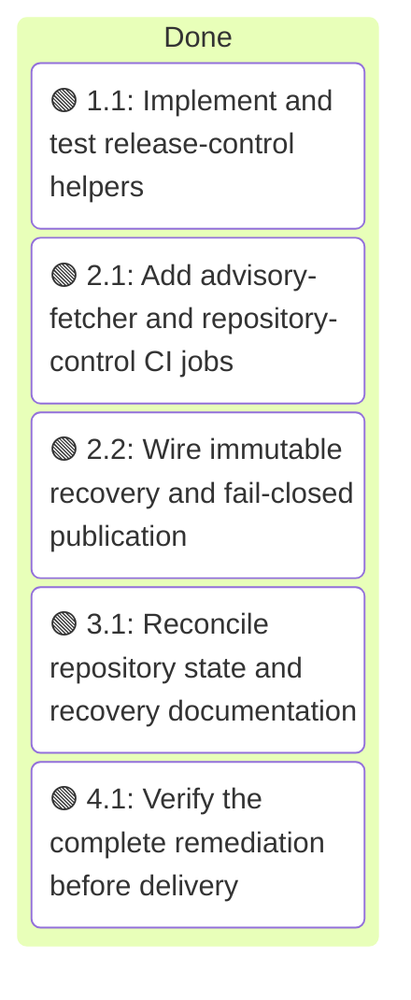
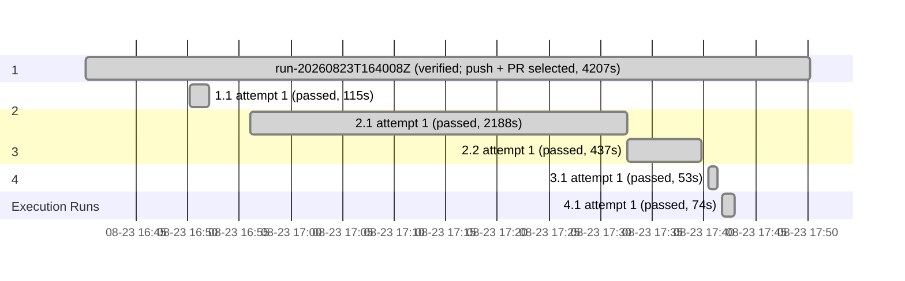

# Execution: Repository Health Remediation

<!-- spec-nav:start -->
**Spec navigation:** [State](00_state.md) · [Discovery](01_discovery.md) · [Requirements](02_requirements.md) · [Design](03_design.md) · [Tasks](04_tasks.md) · [Execution](05_execution.md)
<!-- spec-nav:end -->

## Execution Context

- Branch: `codex/repository-health-remediation`
- Isolated worktree: [repository root](../..)
- Base commit: `eee4c6493ef4177bcf43fea8ffa63900194b85b1` (`origin/main` at worktree creation)
- Initial dirty state: only the new repository-health spec and generated dependency-audit evidence; the user's original dirty checkout remains untouched.
- Delivery boundary: implementation, verification, commit, push, and pull request are authorized. v0.3.0 recovery dispatch remains a documented post-merge operator action and is not authorized from this branch.

## Execution Timing

### Task Board

### Run Intervals

| Run ID | Started UTC | Stopped UTC | Elapsed Seconds | Outcome |
|---|---|---|---:|---|
| run-20260823T164008Z | 2026-08-23T16:40:08Z | 2026-08-23T17:50:15Z | 4207 | verified; push + PR selected |

### Task Attempt Intervals

| Run ID | Stage/Wave | Task | Attempt | Started UTC | Stopped UTC | Elapsed Seconds | Outcome |
|---|---|---|---:|---|---|---:|---|
| run-20260823T164008Z | 1 | 1.1 | 1 | 2026-08-23T16:50:12Z | 2026-08-23T16:52:07Z | 115 | passed |
| run-20260823T164008Z | 2 | 2.1 | 1 | 2026-08-23T16:56:02Z | 2026-08-23T17:32:30Z | 2188 | passed |
| run-20260823T164008Z | 2 | 2.2 | 1 | 2026-08-23T17:32:30Z | 2026-08-23T17:39:47Z | 437 | passed |
| run-20260823T164008Z | 3 | 3.1 | 1 | 2026-08-23T17:40:25Z | 2026-08-23T17:41:18Z | 53 | passed |
| run-20260823T164008Z | 4 | 4.1 | 1 | 2026-08-23T17:41:45Z | 2026-08-23T17:42:59Z | 74 | passed |

## Preflight and Baseline

- The thorough spec audit found one P0, seven P1, and two P2 findings. The user explicitly authorized applying the fixes and executing; requirements, design, diagram IR, and tasks were re-approved with all certain findings applied and the uncertain scanner behavior converted into a hosted verification step.
- The pre-change dependency audit completed with warnings, zero blockers, and a complete inventory. Ten pre-existing Cargo advisories were explicitly reviewed and are not described as clean.
- Rust baseline: `cargo test --all-targets` passes outside the restricted sandbox with 64 passed, 0 failed, and 3 intentionally ignored live tests. The restricted run produced three `Operation not permitted` failures in tests that create local process/socket fixtures; those are environment artifacts, not repository failures.
- Python baseline: the system CPython 3.14 environment cannot start the suite because `pytest` is not installed. Task 2.1 provisions the approved CPython 3.12.11 and exact CI test dependencies before treating the Python suite as verified.
- Self-hardening digest: `796dac38f7d23a4def45b4f123dfbd37d1162fd2c092e08202be91b2b002d9c2`; depth `thorough`; fan-out two balanced-tier/high-reasoning reviewers. Both reviewers required repairs. Before the first implementation edit, the plan was tightened to require literal-main authorization, explicit stable-toolchain input, one coherent manifest decision, quarantined noncanonical smoke scans, atomic canonical Grype evidence, nonconflicting diagnostic uploads, top-level read-only CI permissions, fresh canonical sidecars, aligned dependency evidence, and deterministic SPDX/digest validation.

## Task Evidence

### Task 1.1 — Deterministic release controls

- RED: the [release-control fixture harness](../../scripts/test-release-controls.sh) failed because the two planned public helpers did not exist.
- GREEN: Bash syntax checking passed for the [context helper](../../scripts/release-context.sh), [policy helper](../../scripts/release-vulnerability-policy.sh), and fixture harness; the fixture harness then passed.
- Contract review: manual recovery requires both `DEFAULT_BRANCH=main` and `CONTROL_REF=refs/heads/main`; tag verification emits the exact full commit SHA and runs tagged metadata validation; Grype match fields are type-checked; zero matches alone pass enforcement; malformed/missing reports, malformed/empty SPDX, and invalid digest records fail closed.
- Criteria verdict: R2.1-R2.5, R4.3, R4.4, R4.6, R5.1-R5.3, R6.2, R6.3, and R6.7 passed by deterministic fixtures and source review.

### Task 2.1 — Complete CI gates

- `actionlint .github/workflows/ci.yml` passed; six `uses:` references are immutable 40-hex revisions and top-level permissions are read-only.
- Exact local CI environment: CPython 3.12.11, pytest 9.0.3, and Playwright 1.61.0. The suite passed with 34 tests outside the restricted socket sandbox. The initial root-directory run established a real CI defect (`fetcher` was not importable); setting the job's working directory to the [advisory-fetcher component](../../advisory-fetcher/README.md) made the contract green.
- Dependency debugging: the planned pytest 8.4.2 pin had PYSEC-2026-1845. Context7 confirmed pytest 9.x/Python 3.12 and `python -m pytest` compatibility; pytest 9.0.3 is the advisory's fixed release and passed all tests.
- Post-change audit: zero advisory findings and zero blockers for the exact ten-package Python environment. The result remains `warnings`, not clean, because pip inspection cannot prove resolved dependency edges and native pip-audit was unavailable; both limitations were reviewed explicitly.
- Criteria verdict: R1.1-R1.5 passed by workflow validation, exact-version tests, release-control fixtures, and dependency evidence.

### Task 2.2 — Immutable recovery and publication

- `actionlint .github/workflows/release.yml` passed; all 19 action references are immutable 40-hex commits.
- Static contract verification passed for manual semantic-tag input, literal-main guard handoff, canonical tag/revision outputs, one coherent absent/exact/invalid manifest decision, dual control/source checkouts, exact digest label verification, and publish dependency on both platform legs.
- Evidence ordering is smoke before scanner installation, one canonical Grype JSON generation, SPDX/digest validation, full artifact upload, zero-match enforcement, and then platform attestation. A distinct `always()` partial artifact runs only when the full upload did not succeed.
- Publication consumes two explicitly named full artifacts, validates the exact two-platform digest set, uses tagged source assets, records control and release revisions, and never moves the immutable Git tag. Recovery was not dispatched from this feature branch.
- Criteria verdict: R2.1-R6.7 passed by actionlint, deterministic helper fixtures, exact workflow-order assertions, permission/source-boundary review, and hosted-only limitation recording.

### Task 3.1 — Repository state and recovery handoff

- The root guide now separates integrated source, latest completed v0.2.0 release, incomplete v0.3.0 publication, absent deployment, and open/conflicting PR #7.
- The exact post-merge recovery command uses `gh workflow run release.yml --ref main -f tag=v0.3.0` and names the two full platform artifacts plus identity, scan, attestation, manifest, and GitHub Release checks.
- The advisory-fetcher guide and three historical state ledgers explicitly record PR #8 and PR #9 as merged, retain historical gate evidence, and remove superseded current-state claims.
- Documentation review found no remaining claim that PR #8 is unmerged or that v0.3.0/deployment is complete. Anonymous exposure, proxy trust, orchestration, and recovery dispatch remain unauthorized.
- Criteria verdict: R7.1-R7.7 passed by cross-document search, workflow-name comparison, and historical/current-state review.

### Task 4.1 — Integrated verification

- Rust: `cargo test --all-targets` passed with 64 tests, zero failures, and three intentionally ignored live tests.
- Python: CPython 3.12.11 with pytest 9.0.3 and Playwright 1.61.0 passed all 34 advisory-fetcher tests; no browser was installed.
- Controls: Bash syntax, ShellCheck, deterministic release-control fixtures, and `actionlint` for both changed workflows passed. Workflow invariants confirmed immutable action refs, one canonical Grype JSON, evidence-before-policy ordering, distinct partial diagnostics, and clean-only publication.
- Spec: all 42 criteria remain traced across five completed tasks; generated sidecars, Gantt, task board, and flowchart are fresh. Dependency reports correlate to one project revision with ordered, distinct fingerprints; both warning results are explicit and not described as clean.
- Scope/diff review: runtime Rust/Python behavior is unchanged. Changes are limited to CI/release controls, exact CI dependency resolution, retained dependency evidence, release helper tests, repository-state documentation, and this spec. PR #7 is documented but untouched.
- Hosted-only boundary: local validation cannot execute GitHub runner, GHCR, Syft/Grype download, attestation, or GitHub Release services. The workflow fails closed around those boundaries and retains canonical or partial diagnostics. The only authorized next operation is the documented post-merge `--ref main` recovery handoff; this branch did not dispatch it.
- Independent whole-change review found and closed two P1 races: every downstream source checkout now uses the verified release SHA and tag-push verification requires that SHA to equal the triggering commit; publication also re-confirms version-tag absence immediately before creation and refuses to overwrite a tag that appeared after context resolution.
- Criteria verdict: all R1.1-R7.7 passed; no required evidence is missing or inconclusive.

## Integration Decision

The user selected commit, push, and pull request against `main`. The isolated branch and worktree remain available for PR iteration. Release recovery and deployment remain separate and were not dispatched.

### Execution Gantt

