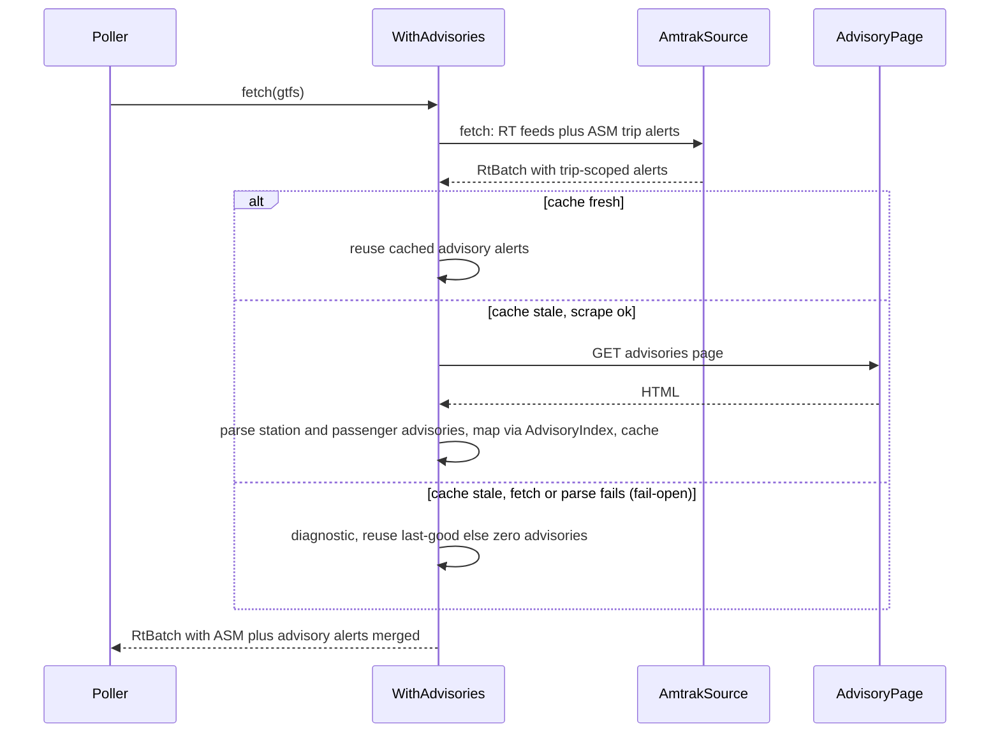

# Design: Service Advisories → Scoped GTFS-RT Alerts

<!-- spec-nav:start -->
**Spec navigation:** [State](00_state.md) · [Discovery](01_discovery.md) · [Requirements](02_requirements.md) · [Design](03_design.md) · [Tasks](04_tasks.md) · [Execution](05_execution.md)
<!-- spec-nav:end -->

## Overview

This design realizes the discovery-approved **producer-side, fail-open advisory scraper**
([`01_discovery.md`](01_discovery.md)) for the requirements in
[`02_requirements.md`](02_requirements.md). The feed-producer service gains a **best-effort alert
source** that scrapes Amtrak's Service Alerts & Notices page and merges **stop-scoped** station
advisories and **route-scoped** passenger advisories into each generation's `alerts` feed, alongside
the existing trip-scoped ASM alerts.

It is built as an [`RtSource`](../../src/sources/mod.rs) **decorator** — `WithAdvisories<S>` wrapping
`AmtrakSource` — exactly mirroring the existing `CapitalCorridorFiltered` decorator in
[`src/main.rs`](../../src/main.rs). The decorator calls the inner source, then appends advisory
alert entities to `RtBatch.alerts`. Scraping is **fail-open**: any fetch/parse failure yields zero
advisory alerts (or the last-good cached set) and a diagnostic, never a failed `fetch`, so the
generation always publishes. A TTL cache bounds how often the page is fetched.

## Architecture


IR source: [`diagrams/architecture.json`](diagrams/architecture.json).

## Current Technology Evidence

| Technology | Context7 identity/source | Exact selected version | Current-doc question | Decision |
|---|---|---|---|---|
| `scraper` | `/rust-scraper/scraper` | 0.22.0 | parse an HTML document, select by CSS selector, read element text and an attribute | `Html::parse_document(html)`, `Selector::parse("<css>")`, `document.select(&sel)` → `ElementRef`, `.text().collect::<String>()`, `.value().attr("data-href")`. Adopt as a **direct** dependency (already resolved transitively via `amtrak-gtfs-rt`, so no new family) |
| `gtfs-realtime` + `prost` | crate source (registry) | 0.2.0 / 0.14 | build an `Alert` with `informed_entity` scoped to a stop or route, plus `active_period` | Construct `Alert { informed_entity: vec![EntitySelector{ stop_id | route_id }], header_text, description_text, active_period, url }`; wrap in `FeedEntity` |
| `reqwest` | already-direct dependency | 0.13 | GET the advisories page HTML | Reuse the source's shared client |

The HTML-parsing approach was **consulted on Context7 `/rust-scraper/scraper`** on 2026-08-17 (the
`parse_document` + `Selector` + `.text()`/`.attr()` calls); the crate is also used exactly this way
by `amtrak-gtfs-rt`'s Pacific Surfliner scraper, confirming the API against running code.

## Dependency Security Evidence

| Dependency / resolved version | Trigger and mode | Evidence | Result and decision |
|---|---|---|---|
| `scraper@0.22.0` | dependency selection (promote transitive → direct) / `change` mode | fresh re-run: [latest JSON](../../.security/dependency-audit/latest.json) · [latest Markdown](../../.security/dependency-audit/latest.md); authoritative complete: [main JSON](../../.security/dependency-audit/main.json) · [main Markdown](../../.security/dependency-audit/main.md) · [release JSON](../../.security/dependency-audit/release-v0.2.0.json) · [release Markdown](../../.security/dependency-audit/release-v0.2.0.md) | `warnings` — the complete `main` and `release` audits both inventory `scraper@0.22.0` with **no finding on it**. These are **explicitly reviewed warnings**; such **warnings are not clean** and are recorded as reviewed, not clean. **Decision:** proceed — `scraper` is already in [`Cargo.lock`](../../Cargo.lock) (pulled by `amtrak-gtfs-rt`, which the service already links), so promoting it to a direct dependency adds no new resolved crate. |

Unlike the station-departures consumer, this feature **ships in the service binary**, so a status of
`blocked`, `unavailable`, or `invalid` cannot ship; only `pass` or explicitly reviewed `warnings`
may proceed. The audit tool cannot complete a fresh inventory in this environment (`cargo metadata`
output exceeds its cap), so the complete `main`/`release` audits — which inventory `scraper@0.22.0` —
are authoritative here, and a **fresh `main`/`release` audit is a required gate** at protected-main
integration and release for the changed service.

## Components and Interfaces

New module [`src/sources/advisories.rs`](../../src/sources/advisories.rs) (planned); wiring added in
[`src/main.rs`](../../src/main.rs) and [`src/config.rs`](../../src/config.rs).

### `WithAdvisories<S>` — RtSource decorator

Responsibility: append best-effort advisory alerts to the inner source's batch. Satisfies R4.1,
R4.2, R5.1, R5.2, R6.1.

```rust
pub struct AdvisoryConfig {
    pub url: String,          // default https://www.amtrak.com/service-alerts-and-notices
    pub ttl: Duration,        // cache TTL between page fetches
}

pub struct WithAdvisories<S> {
    inner: S,
    client: reqwest::Client,
    config: AdvisoryConfig,
    cache: tokio::sync::Mutex<Option<Cached>>,   // last-good alerts + fetch instant
}

struct Cached { fetched_at: Instant, alerts: Vec<gtfs_realtime::FeedEntity> }

#[async_trait::async_trait]
impl<S: RtSource> RtSource for WithAdvisories<S> {
    fn name(&self) -> &'static str { self.inner.name() }
    async fn fetch(&self, gtfs: &Gtfs) -> Result<RtBatch, SourceError> {
        let mut batch = self.inner.fetch(gtfs).await?;      // inner errors propagate as before
        let mut advisories = self.current_advisories(gtfs).await; // never errors (fail-open)
        batch.alerts.entity.append(&mut advisories);
        Ok(batch)
    }
}
```

`current_advisories` returns cached alerts when `fetched_at` is within `ttl`; otherwise it re-scrapes
via `fetch_advisory_alerts`, updates the cache on success, and on failure keeps and returns the
last-good cached set (or empty) — always returning a `Vec`, never erroring.

### Advisory scraping and mapping (free functions)

```rust
/// Best-effort: fetch the page and parse both advisory classes into scoped alert entities.
/// Any fetch/parse failure logs a diagnostic and returns an empty Vec (never errors).
pub async fn fetch_advisory_alerts(client: &reqwest::Client, gtfs: &Gtfs, url: &str)
    -> Vec<gtfs_realtime::FeedEntity>;

/// Lookup tables built once per generation from the static GTFS.
pub struct AdvisoryIndex {
    stop_by_code: HashMap<String, String>,   // uppercased station code -> stop_id
    route_by_name: HashMap<String, String>,  // route_long_name -> route_id
}
impl AdvisoryIndex { pub fn build(gtfs: &Gtfs) -> Self; }

/// Pure parsers over the page HTML (testable with fixture HTML, no network).
pub fn parse_station_advisories(html: &str, index: &AdvisoryIndex) -> Vec<gtfs_realtime::FeedEntity>;
pub fn parse_passenger_advisories(html: &str, index: &AdvisoryIndex) -> Vec<gtfs_realtime::FeedEntity>;

/// Effective-date text -> a definite (start, end) unix range, or None to omit active_period.
pub fn parse_effective_period(text: &str) -> Option<(i64, i64)>;
```

- **Station parser (R1.1/R1.2):** selects each station-advisory row, extracts the station code from
  the header (`"Alexandria, VA (ALX)"` → `ALX`), the title (link text), and effective text; resolves
  the code via `index.stop_by_code`. Unresolved code → skip + `tracing::warn` (R1.2).
- **Passenger parser (R2.1/R2.2/R2.3):** selects each passenger-advisory option, extracts the route
  name(s) (the `<h3>` and any tooltip `<p>` entries), the title, and effective text; resolves each
  name via `index.route_by_name`, emitting one `EntitySelector { route_id }` per resolved route
  (R2.2). A name resolving to nothing is dropped + diagnostic (R2.3); an advisory with no resolved
  route emits no alert.
- **Alert content (R3.1–R3.3):** `header_text` = title; `description_text` = title + effective text;
  `active_period` = `parse_effective_period(effective_text)` when `Some`, else omitted (R3.2/R3.3);
  `url` = the advisory's `data-href` (Open Decision 4 — included).

### Configuration wiring

`AdvisoryConfig` is read in [`src/config.rs`](../../src/config.rs) from `AMTRAK_ADVISORIES_URL`
(default the notices page) and `AMTRAK_ADVISORIES_TTL_SECS` (default e.g. 900). A boolean
`AMTRAK_ADVISORIES` (default enabled) gates whether [`src/main.rs`](../../src/main.rs) wraps the
Amtrak source in `WithAdvisories`; when disabled, the service behaves exactly as today.

## Data Models

```rust
enum AdvisoryScope { Station(String), Passenger(Vec<String>) }   // station code, or route names
struct ParsedAdvisory { title: String, effective_text: String, url: Option<String>, scope: AdvisoryScope }
```

`ParsedAdvisory` is the internal parse product; `AdvisoryIndex` maps its scope to GTFS ids; the
output is `Vec<FeedEntity>` merged into `RtBatch.alerts`. No persistence beyond the existing
generation store.

## Key Flows



IR source: [`diagrams/flows.json`](diagrams/flows.json).

## Error Handling

| Condition | Behavior | Requirement |
|---|---|---|
| Station code resolves to no GTFS stop | skip advisory, `tracing::warn` diagnostic | R1.2 |
| Passenger route name resolves to no GTFS route | drop that route, diagnostic; no alert if no route resolves | R2.3 |
| Effective dates not a definite range | omit `active_period`, keep text in description | R3.3 |
| Advisories page fetch fails | return last-good/empty advisories, diagnostic; inner batch still returned | R5.1 |
| Page HTML does not match expected structure | parsers yield zero advisories, diagnostic; no panic | R5.2 |

Inner-source (`AmtrakSource`) errors propagate unchanged — the decorator only ever *adds* alerts.

## Testing Strategy

- **Offline fixture tests** over a captured snapshot of the notices page (`station` and `passenger`
  sections): station advisory → stop-scoped alert with resolved `stop_id` (R1.1); unmapped code →
  skipped (R1.2); passenger advisory → route-scoped alert(s), multi-route → multiple selectors
  (R2.1/R2.2); unmapped route → dropped (R2.3); header/description/active-period content
  (R3.1–R3.3); a deliberately-broken HTML fixture → zero advisories, no panic (R5.2);
  `parse_effective_period` cases (single date, range, ambiguous).
- **Decorator tests** with a mock inner `RtSource` and a mock/stubbed fetch: merged batch contains
  inner ASM alerts plus advisory alerts (R4.1/R4.2); a fetch failure yields the inner batch
  unchanged plus zero advisories (R5.1); the cache reuses within TTL.
- **Live check** (ignored by default): a known station (`ALX`) and route advisory (Hartford Line /
  Valley Flyer) appear as correctly scoped alerts.

## Cross-Cutting Risk Gates

- **Security / release (primary):** this **changes the shipped service**, so it re-opens the
  container-scan, dependency-audit, and release gates. Failure mode: shipping a service whose new
  scraping path or `scraper` dependency introduces a finding — mitigated by the fresh `main`/`release`
  audit gate (Dependency Security Evidence) and the container smoke/scan harness. Owner: release
  checkpoint. The direct-peer authorization and immutable-generation contract are unchanged (R6.1).
- **Robustness / availability:** brittle HTML scraping is contained by fail-open (R5) plus the TTL
  cache and last-good reuse, so a website change degrades to "no new advisories", never a failed
  generation. Verified by the broken-fixture and fetch-failure tests.
- **Performance:** the TTL cache bounds page fetches to roughly one per TTL regardless of poll
  frequency; parsing is a single pass over a small page. Owner: this design.
- **Observability:** every skipped station/route and every fetch/parse failure emits a `tracing`
  diagnostic; advisory alert counts are visible in the generation's entity counts.
- **Privacy:** the page is public; no personal data. N/A.
- **Rollback / rollout:** gated by `AMTRAK_ADVISORIES` (default on) — disabling it makes the service
  behave exactly as v0.2.0. Rollback = disable the flag or drop the decorator; no data migration.

## Realizes Discovery Direction

This is discovery Approach A (scrape in the service). Approach B (upstream crate PR) and C (separate
sidecar) remain rejected as recorded in [`01_discovery.md`](01_discovery.md). The decorator keeps the
consumer contract untouched (Approach A's core benefit) — consumers still just read `alerts.pb`.

## Correctness Properties

1. **Station advisories are stop-scoped.** Each parsed station advisory whose code resolves yields
   an alert with a single `informed_entity.stop_id` equal to that stop. **Validates: Requirements
   1.1.**
2. **Unmapped station skipped, not misfiled.** A station advisory whose code resolves to no stop
   produces no alert and a diagnostic. **Validates: Requirements 1.2.**
3. **Passenger advisories are route-scoped.** Each parsed passenger advisory whose route(s) resolve
   yields an alert whose `informed_entity` route ids are exactly those routes. **Validates:
   Requirements 2.1.**
4. **Multi-route fan-out.** An advisory naming N resolvable routes yields N `informed_entity`
   selectors. **Validates: Requirements 2.2.**
5. **Unmapped route dropped.** A route name resolving to nothing contributes no selector and a
   diagnostic. **Validates: Requirements 2.3.**
6. **Advisory content.** Each advisory alert's header is the title and its description contains the
   title and the effective text. **Validates: Requirements 3.1.**
7. **Definite dates → active period.** When the effective text parses to a definite range, the alert
   carries that `active_period`. **Validates: Requirements 3.2.**
8. **Ambiguous dates → text only.** When it does not parse, `active_period` is omitted and the text
   stays in the description. **Validates: Requirements 3.3.**
9. **Coherent merge.** Advisory alerts are appended to the same generation's alerts feed as the ASM
   alerts. **Validates: Requirements 4.1.**
10. **ASM preserved.** Merging advisory alerts leaves every inner ASM trip alert intact. **Validates:
    Requirements 4.2.**
11. **Fetch failure fails open.** A page fetch failure returns the inner batch plus zero (or
    last-good) advisories and a diagnostic, and the generation still publishes. **Validates:
    Requirements 5.1.**
12. **Unparseable page fails open.** HTML not matching the expected structure yields zero advisories
    and a diagnostic without panicking. **Validates: Requirements 5.2.**
13. **Contract preserved.** Advisory alerts appear only in the existing alerts artifact; no feed
    route or generation-contract change. **Validates: Requirements 6.1.**

## Approval

Status: **Approved on 2026-08-17.** The producer-side decorator design was approved by the user:
`WithAdvisories<S>` RtSource decorator, fail-open with a TTL cache, station→stop_id and route→route_id
scoping, `AMTRAK_ADVISORIES` default-on toggle, two validated diagrams, and 13 correctness properties
covering all 13 criteria. This changes the shipped service, so a fresh `main`/`release` dependency
audit and the container scan are required at integration.
