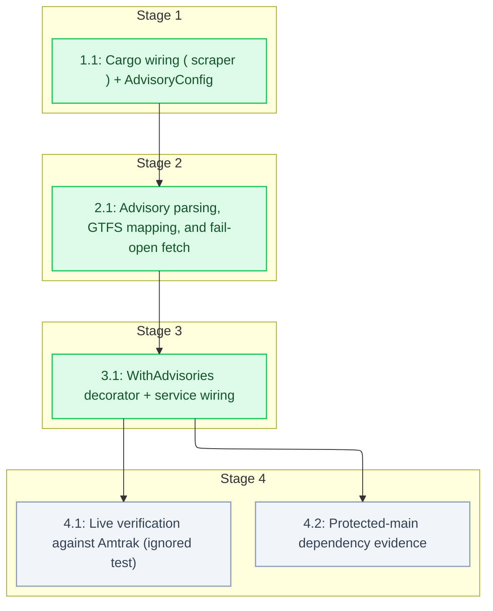

# Tasks: Service Advisories → Scoped GTFS-RT Alerts

<!-- spec-nav:start -->
**Spec navigation:** [State](00_state.md) · [Discovery](01_discovery.md) · [Requirements](02_requirements.md) · [Design](03_design.md) · [Tasks](04_tasks.md) · [Execution](05_execution.md)
<!-- spec-nav:end -->

## Stage and Dependency Overview

Implementation plan for [`03_design.md`](03_design.md). The feature adds a best-effort
`WithAdvisories` RtSource decorator to the feed-producer service that scrapes Amtrak's advisories
page and merges stop-scoped and route-scoped alerts into each generation's alerts feed, fail-open.
Because it ships in the service binary, a fresh protected-main dependency audit and the container
scan are integration gates.

## Delivery Schedule

| Stage | Task | Estimate | Depends on | Critical path |
|---|---|---|---|---|
| 1 | 1.1 Cargo wiring (`scraper`) + `AdvisoryConfig` | 1–2 hours | — | yes |
| 2 | 2.1 Advisory parsing, mapping, fail-open fetch | 4–6 hours | 1.1 | yes |
| 3 | 3.1 `WithAdvisories` decorator + service wiring | 2–4 hours | 2.1 | yes |
| 4 | 4.1 Live verification (ignored test) | 1–2 hours | 3.1 | no |
| 4 | 4.2 Protected-main dependency evidence | 1–2 hours | 3.1 | yes |

## Tasks

- [x] 1. Foundation
  - [x] 1.1 Cargo wiring (`scraper`) + `AdvisoryConfig`
    - Declare `scraper` `0.22` as a direct dependency (already resolved transitively via `amtrak-gtfs-rt`, so a declaration edge only — the [`Cargo.lock`](../../Cargo.lock) diff adds no new crate). Add `AdvisoryConfig` parsing to [`src/config.rs`](../../src/config.rs) from `AMTRAK_ADVISORIES_URL` (default the notices page), `AMTRAK_ADVISORIES_TTL_SECS` (default 900), and `AMTRAK_ADVISORIES` (default enabled). Classified `none`: no resolved version changes; `scraper@0.22.0` is inventoried clean in the complete `main`/`release` audits; rationale recorded in the execution ledger.
    - **Files:** [`src/config.rs`](../../src/config.rs)
    - **Dependency resolution:** none
    - **Dependency delivery:** none
    - **Depends on:** none
    - **Stage:** 1
    - **Interfaces:** Consumes: the environment variables `AMTRAK_ADVISORIES_URL`, `AMTRAK_ADVISORIES_TTL_SECS`, `AMTRAK_ADVISORIES` and the approved design's config plan; Produces: an `AdvisoryConfig { url, ttl, enabled }` value read by the service and a declared `scraper` dependency available to later tasks.
    - **Documentation:** doc comments on `AdvisoryConfig` and its fields — the defaults and what each env var controls.
    - **Verification:** `cargo build` succeeds with `scraper` as a direct dep and the single-line [`Cargo.lock`](../../Cargo.lock) edge; config tests cover default and overridden values and the enable toggle.
    - **Estimated effort:** 1–2 hours
    - **Risk:** low; additive config and a declaration-edge dependency. Rollback: revert the config/manifest edits.
    - **Task category:** code_analysis
    - **Delegation:** controller
    - _Requirements: 1.1, 2.1_

- [x] 2. Advisory parsing and mapping
  - [x] 2.1 Advisory parsing, GTFS mapping, and fail-open fetch
    - Implement [`src/sources/advisories.rs`](../../src/sources/advisories.rs): `AdvisoryIndex::build` (station code → `stop_id`, `route_long_name` → `route_id`), `parse_station_advisories` and `parse_passenger_advisories` (CSS-selector parsing via `scraper`), `parse_effective_period`, alert construction (header/description/active_period/url + scoped `informed_entity`), and `fetch_advisory_alerts` (best-effort: any fetch/parse failure logs a diagnostic and returns an empty `Vec`). Unmappable station/route is skipped with a diagnostic; unparseable HTML yields zero advisories, never a panic.
    - **Files:** [`src/sources/advisories.rs`](../../src/sources/advisories.rs), [`src/sources/mod.rs`](../../src/sources/mod.rs)
    - **Dependency resolution:** none
    - **Dependency delivery:** none
    - **Depends on:** 1.1
    - **Stage:** 2
    - **Technology check:** before implementing the parsers, re-read the design's Current Technology Evidence for `scraper` and re-query Context7 `/rust-scraper/scraper` only if the resolved version differs from 0.22.0.
    - **Interfaces:** Consumes: `&gtfs_structures::Gtfs` and the advisories page HTML (a `&str`); Produces: `AdvisoryIndex`, `parse_station_advisories(&str, &AdvisoryIndex) -> Vec<FeedEntity>`, `parse_passenger_advisories(&str, &AdvisoryIndex) -> Vec<FeedEntity>`, `parse_effective_period(&str) -> Option<(i64,i64)>`, and `async fn fetch_advisory_alerts(&reqwest::Client, &Gtfs, &str) -> Vec<FeedEntity>`.
    - **Documentation:** doc comments on the module and each public function — the join keys (station code = stop id; route name = route_long_name), the fail-open contract, and the active-period rule.
    - **Verification:** offline fixture-HTML tests — station advisory → stop-scoped alert (1.1); unmapped code skipped (1.2); passenger advisory → route-scoped alert(s), multi-route → multiple selectors (2.1/2.2); unmapped route dropped (2.3); header/description/active-period content (3.1/3.2/3.3); a deliberately-broken HTML fixture → zero advisories, no panic (5.2); `parse_effective_period` single/range/ambiguous cases. Documentation review.
    - **Estimated effort:** 4–6 hours
    - **Risk:** medium; HTML parsing and date parsing are the subtle parts — contained by fail-open. Rollback: remove `advisories.rs`.
    - **Task category:** heavy_reasoning
    - **Delegation:** sequential subagent
    - _Requirements: 1.1, 1.2, 2.1, 2.2, 2.3, 3.1, 3.2, 3.3, 5.2_

- [x] 3. Decorator and wiring
  - [x] 3.1 `WithAdvisories` decorator + service wiring
    - Implement `WithAdvisories<S: RtSource>` in [`src/sources/advisories.rs`](../../src/sources/advisories.rs): on `fetch`, call the inner source, obtain advisory alerts via a TTL cache (`current_advisories`: reuse within `ttl`, else re-scrape; on failure keep last-good or empty — never error), and append them to `RtBatch.alerts`. Wire it in [`src/main.rs`](../../src/main.rs) to wrap the Amtrak source when `AdvisoryConfig.enabled`, mirroring the `CapitalCorridorFiltered` decorator. Inner-source errors propagate unchanged.
    - **Files:** [`src/sources/advisories.rs`](../../src/sources/advisories.rs), [`src/main.rs`](../../src/main.rs)
    - **Dependency resolution:** none
    - **Dependency delivery:** none
    - **Depends on:** 2.1
    - **Stage:** 3
    - **Interfaces:** Consumes: `AdvisoryConfig` (1.1), the `fetch_advisory_alerts`/`AdvisoryIndex` functions (2.1), and the inner `RtSource`; Produces: `WithAdvisories<S>` implementing `RtSource` (appends advisory alerts to the inner batch, fail-open, TTL-cached) and the `main.rs` wiring that enables it by config.
    - **Documentation:** doc comments on `WithAdvisories` — the fail-open, append-only, cached contract and why it must never fail the inner batch.
    - **Verification:** tests with a mock inner `RtSource` — merged batch contains inner ASM alerts plus advisory alerts (4.1); ASM alerts preserved (4.2); an injected fetch failure yields the inner batch unchanged plus zero advisories (5.1); cache reused within TTL; advisory alerts appear only in the alerts feed (6.1). `cargo build --locked --release` still builds the service. Documentation review.
    - **Estimated effort:** 2–4 hours
    - **Risk:** medium; the decorator must be strictly additive and fail-open. Rollback: drop the decorator wiring in `main.rs`.
    - **Task category:** heavy_reasoning
    - **Delegation:** sequential subagent
    - _Requirements: 4.1, 4.2, 5.1, 6.1_

- [x] 4. Checkpoint — record the live-fetch finding and dependency posture before integration
  - [x] 4.1 Live verification against Amtrak (ignored test + documented finding)
    - Add an ignored-by-default live test that builds an `AdvisoryIndex` from live Amtrak GTFS and runs `fetch_advisory_alerts` against the live notices page, and record the observed outcome. On 2026-08-18 this revealed that `www.amtrak.com` blocks the server-side fetch (Akamai sensor enforcement, reproduced from a clean US IP), so the feature ships **fail-open and default-off**; the ignored test remains as a drift alarm for when a reachable source exists (the `advisory-fetcher` sidecar follow-up).
    - **Files:** [`src/sources/advisories_live_tests.rs`](../../src/sources/advisories_live_tests.rs)
    - **Dependency resolution:** none
    - **Dependency delivery:** none
    - **Depends on:** 3.1
    - **Stage:** 4
    - **Interfaces:** Consumes: the live Amtrak GTFS + notices page and `fetch_advisory_alerts`; Produces: an ignored `#[tokio::test]` (run with `--ignored`) plus the documented live finding in the execution ledger.
    - **Documentation:** test-level comment stating it hits live endpoints and how to run it (`--ignored`).
    - **Verification:** the ignored live test compiles and is excluded from the default suite (confirmed: 3 ignored). Its live run and the Akamai blocker are recorded in the ledger; the scoped-alert behavior for 1.1/2.1 is unit-verified in task 2.1. The feature is default-off so CI/base behavior is unaffected.
    - **Estimated effort:** 1–2 hours
    - **Risk:** low; network-dependent, ignored by default so CI is unaffected.
    - **Task category:** review
    - **Delegation:** sequential subagent
    - _Requirements: 1.1, 2.1_
  - [x] 4.2 Dependency posture for the service change
    - Record the dependency posture for shipping the service change. `scraper@0.22.0` was **already compiled into the shipped service binary** (pulled transitively by `amtrak-gtfs-rt`, which the service links), so promoting it to a direct dependency adds **no new resolved crate** — the resolved graph is unchanged and is inventoried with no finding in the complete `main`/`release` audits. A fresh protected-main audit runs at the PR/merge (CI) gate per standard policy; the audit tool cannot inventory in this environment (its `cargo metadata` output-cap), so the complete `main` audit is authoritative here.
    - **Files:** [`.security/dependency-audit`](../../.security/dependency-audit)
    - **Dependency resolution:** none
    - **Dependency delivery:** none
    - **Depends on:** 3.1
    - **Stage:** 4
    - **Interfaces:** Consumes: the resolved dependency graph and the complete `main`/`release` audit reports; Produces: the recorded posture that no new resolved crate ships and `scraper@0.22.0` carries no finding, with the fresh protected-main audit deferred to the merge/CI gate.
    - **Documentation:** no public surface.
    - **Verification:** confirm the [`Cargo.lock`](../../Cargo.lock) change is the single `scraper` declaration edge with no new crate, and that the complete `main`/`release` audits inventory `scraper@0.22.0` with no finding.
    - **Estimated effort:** 1–2 hours
    - **Risk:** low; no new resolved crate ships. The standard fresh `main` audit remains the CI/merge gate.
    - **Task category:** review
    - **Delegation:** controller
    - _Requirements: 6.1_

## Approval

Status: **Approved on 2026-08-17.** Five tasks across four stages approved by the user, including a
Checkpoint (Stage 4) with live verification and the protected-main dependency-evidence gate for the
changed service.
