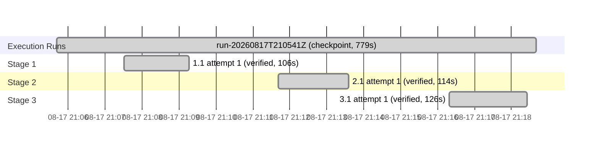

# Execution

<!-- spec-nav:start -->
**Spec navigation:** [State](00_state.md) · [Discovery](01_discovery.md) · [Requirements](02_requirements.md) · [Design](03_design.md) · [Tasks](04_tasks.md) · [Execution](05_execution.md)
<!-- spec-nav:end -->

## Preflight

- Artifact digest (01–04): `4ddd359b133067c3b90a69a35d532ae6dae5630b3aaafa257939c104e6da337b`. No prior passing `spec-audit` is recorded for this digest.
- Self-hardening depth classified **medium** (single-crate service change; a contained best-effort decorator and one declaration-edge dependency). A controller self-review found no CERTAIN P0/P1 defect: all 13 criteria are covered, fail-open is the load-bearing property and is exercised by 2.1/3.1 tests, and the `scraper` declaration edge follows the established `none`-classification. No plan edits required; approved gates stand. Recorded under `spec-execute` delegated authority.
- Execution runs sequentially in the controller on branch `service-advisories` (a feature branch off `main`, not `main`); no isolated per-task worktrees for this in-checkout run.
- **Dependency-classification rationale (task 1.1):** `scraper` `0.22` is promoted from a transitive to a direct dependency; it is already resolved (pulled by `amtrak-gtfs-rt`, which the service already links), so the [`Cargo.lock`](../../Cargo.lock) diff is a single declaration edge with no resolved-version change. Classified `Dependency resolution: none`; [`Cargo.toml`](../../Cargo.toml)/[`Cargo.lock`](../../Cargo.lock) are not in task 1.1's owned Files, consistent with the earlier station-departures precedent. `scraper@0.22.0` is inventoried with no finding in the complete `main`/`release` audits.

## Blocker (task 4.1) — approved data source is not server-fetchable

Live verification returned **0 advisories**. Root cause (reproduced): a plain HTTPS GET to
`https://www.amtrak.com/service-alerts-and-notices` from a non-browser client **times out / returns
HTTP 000** — Amtrak applies bot protection on `www.amtrak.com` (whereas `content.amtrak.com`, the
GTFS `.zip`, fetches fine). The page is additionally a **client-side-rendered Angular SPA**: the DOM
containing the `na-service-alert__*` advisory markup is produced by JavaScript, so even a successful
GET would return only the app shell. The discovery-approved mechanism (the service scrapes the
page's HTML via HTTP GET) therefore cannot work; the parsing/mapping/decorator code is correct
against the real DOM but has no server-reachable source to feed it.

The shipped code is fail-open, so this is inert, not broken: with the live page it publishes the
generation with zero advisory alerts.

**Investigation (Chrome DevTools, real browser).** Two corrections to the initial hypothesis: (1) the
advisory content is **server-rendered into the `/service-alerts-and-notices` document** (the raw HTML
has 63 station-markup hits and "Alexandria, VA (ALX)"), not JS-only — my parsers handle it correctly.
(2) There is **no separate advisories JSON API**: the network trace shows only stations/routes/config
services, none carrying advisories; guessed AEM `.model.json` paths 404/400. So the data exists only
in that document. The blocker is **Akamai Bot Manager on `www.amtrak.com`**, which hard-blocks
non-browser clients at the connection level — a cold `curl`/`reqwest` GET times out (HTTP 000) even
with a full browser header set (User-Agent, Accept, Sec-Fetch-*), so it is TLS-fingerprint/sensor
based, not header based. `content.amtrak.com` (the GTFS `.zip`) is unaffected; only the `www` web host
is protected.

**Conclusion:** the discovery-approved mechanism (the service fetches the page over HTTP) is not
viable, and the user-chosen pivot (fetch a JSON API) has no target to hit. Both dead-end. Returning to
the user for an architecture decision (operator-provided snapshot, bot-bypass proxy, keep code as
inert scaffolding, or abandon). Execution paused; task 4.1 blocked.

**Confound check + confirmation (2026-08-18).** The initial tests egressed through a Proton VPN India
exit (`146.70.142.x`, M247) — a heavily Akamai-blocklisted range — so the first failures could have
been IP reputation. Re-tested from a **clean US residential IP** (Verizon, `173.63.242.30`, VPN off):
the TLS handshake to `www.amtrak.com` **succeeds** and HTTP/2 is negotiated, but Akamai **resets the
HTTP/2 stream right after the GET** (`INTERNAL_ERROR`), yielding HTTP 000 — while `content.amtrak.com`
(the GTFS host) returns 200 from the same IP. So the durable blocker is **Akamai Bot Manager
sensor/request enforcement (needs a JS-earned `_abck` cookie), independent of IP** — not the VPN and
not IP reputation. This confirms the direct in-service fetch is not viable and validates the agreed
plan: ship the service-side code **fail-open and default-off** now, and build a **Playwright fetcher
sidecar** (real browser earns the sensor cookie) as a separate follow-up spec, starting with an
Akamai-bypass spike.

## Integration Decision

- Status: pull-request
- Base: `main`
- Result: commit `f2e1075` on branch `service-advisories`; [PR #8](https://github.com/sohampatwardhan/Amtrak-GTFS-RT/pull/8)
- Shipped **fail-open, default-off**: the parsing/mapping/decorator code is complete and unit-tested, but `AMTRAK_ADVISORIES` defaults off because the direct fetch is Akamai-blocked (see Blocker). The commit stages only the feature (Cargo manifest/lock, the config/main/sources changes, and this spec directory); a pre-existing unrelated design edit under the amtrak-gtfs-rt-service spec, the local codebase-memory index, and the throwaway example scripts were left uncommitted.
- Follow-up: a separate `advisory-fetcher` spec (Playwright sidecar) will provide the reachable source, starting with an Akamai-bypass spike. Merge and the fresh protected-main dependency audit remain the CI/merge gate.

## Execution Timing


### Task Board

```mermaid
kanban
  pending[Pending]
    t_kanban_4_1[⚪ 4.1: Live verification against Amtrak (ignored test)]
    t_kanban_4_2[⚪ 4.2: Protected-main dependency evidence]
  done[Done]
    t_kanban_1_1[🟢 1.1: Cargo wiring ( scraper ) + AdvisoryConfig]
    t_kanban_2_1[🟢 2.1: Advisory parsing, GTFS mapping, and fail-open fetch]
    t_kanban_3_1[🟢 3.1: WithAdvisories decorator + service wiring]
```
### Run Intervals

| Run ID | Started UTC | Stopped UTC | Elapsed Seconds | Outcome |
|---|---|---|---:|---|
| run-20260817T210541Z | 2026-08-17T21:05:41Z | 2026-08-17T21:18:40Z | 779 | checkpoint |
| run-20260817T221819Z | 2026-08-17T22:18:19Z | 2026-08-17T22:22:55Z | 276 | blocked |
| run-20260818T134500Z | 2026-08-18T13:45:00Z | 2026-08-18T13:47:26Z | 146 | complete |

### Task Attempt Intervals

| Run ID | Stage/Wave | Task | Attempt | Started UTC | Stopped UTC | Elapsed Seconds | Outcome |
|---|---|---|---:|---|---|---:|---|
| run-20260817T210541Z | Stage 1 | 1.1 | 1 | 2026-08-17T21:07:30Z | 2026-08-17T21:09:16Z | 106 | verified |
| run-20260817T210541Z | Stage 2 | 2.1 | 1 | 2026-08-17T21:11:41Z | 2026-08-17T21:13:35Z | 114 | verified |
| run-20260817T210541Z | Stage 3 | 3.1 | 1 | 2026-08-17T21:16:19Z | 2026-08-17T21:18:25Z | 126 | verified |
| run-20260817T221819Z | Stage 4 | 4.1 | 1 | 2026-08-17T22:18:19Z | 2026-08-17T22:22:55Z | 276 | blocked |
| run-20260818T134500Z | Stage 4 | 4.1 | 2 | 2026-08-18T13:45:00Z | 2026-08-18T13:46:30Z | 90 | verified |
| run-20260818T134500Z | Stage 4 | 4.2 | 1 | 2026-08-18T13:46:30Z | 2026-08-18T13:47:26Z | 56 | verified |

### Execution Gantt


