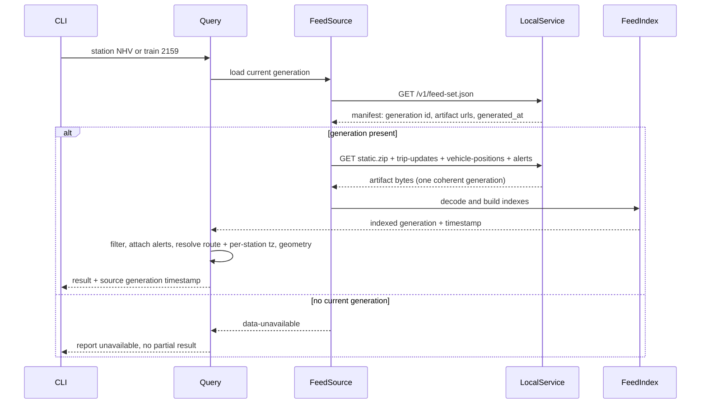

# Design: Station & Train Status Queries

<!-- spec-nav:start -->
**Spec navigation:** [State](00_state.md) · [Discovery](01_discovery.md) · [Requirements](02_requirements.md) · [Design](03_design.md) · [Tasks](04_tasks.md) · [Execution](05_execution.md)
<!-- spec-nav:end -->

## Overview

This design realizes the discovery-approved **standalone consumer** direction
([`01_discovery.md`](01_discovery.md)) for the requirements in
[`02_requirements.md`](02_requirements.md). It adds a consumer that reads one coherent immutable
generation published by the existing service and answers two queries — *train status by number* and
*station departures board* — each enriched with the train's service alert, per-station local time,
and (for a train) its route geometry.

The consumer is packaged as an **optional-feature binary** so the shipped service and its container
image are unchanged: `cargo build --locked --release` (the [Dockerfile](../../Dockerfile) build)
does not build the new binary and does not compile any consumer-only dependency, because the target
carries `required-features = ["status"]`. The already-validated prototype
([`examples/station_departures.rs`](../../examples/station_departures.rs)) proved the station join;
this design generalizes it and adds the train and alert joins.

Priority follows the approved requirements: **complete train answers first** (alerts, live status,
geometry, one coherent generation, per-station local time), **station board last**.

## Architecture

The consumer is a small library (a shared core plus two query modes) behind a thin CLI. External
feed sources sit upstream; the local service's immutable generation is the default source, with a
direct-Amtrak dev fallback.

```mermaid
block
  block:sources["Feed sources"]
    localsvc["Local service /v1 generation"]
    amtrak["Amtrak upstream (dev fallback)"]
  end
  block:core["Consumer core (library)"]
    source["FeedSource: acquire one generation"]
    loader["GenerationLoader: decode static + 3 RT feeds"]
    index["FeedIndex: stop-code, train-number, trip to update/vehicle/alert, shapes"]
    enrich["Enrichment: routes, alerts, per-station tz, geometry"]
  end
  block:modes["Query modes"]
    station["StationQuery"]
    train["TrainQuery"]
  end
  block:outputs["Outputs"]
    cli["CLI"]
    board["Departures board"]
    status["Train status view"]
  end
  localsvc-->source
  amtrak-->source
  source-->loader
  loader-->index
  index-->station
  index-->train
  station-->enrich
  train-->enrich
  enrich-->board
  enrich-->status
  cli-->station
  cli-->train
```



IR source: [`diagrams/architecture.json`](diagrams/architecture.json).

## Current Technology Evidence

| Technology | Context7 identity/source | Exact selected version | Current-doc question | Decision |
|---|---|---|---|---|
| `chrono-tz` | `/chronotope/chrono-tz` | 0.10.4 | parse an IANA zone name at runtime and convert a unix instant to local wall-clock with DST | Use `"<zone>".parse::<Tz>()` + `DateTime::from_timestamp(unix,0)?.with_timezone(&tz)` for R6.1; adopt as an *optional direct* dep gated by the `status` feature (already resolved transitively, so no new family) |
| `gtfs-structures` | crate source (registry) 0.46.1 | 0.46.1 | parse a static GTFS `.zip` from in-memory bytes and read shapes/timezone/short-name fields | Use `Gtfs::from_reader(Cursor::new(bytes))`; read `shapes`, `Stop.timezone`, `Trip.trip_short_name`, `Route.{short_name,long_name}` |
| `gtfs-realtime` + `prost` | crate source (registry) 0.2.0 / 0.14 | 0.2.0 / 0.14 | decode `FeedMessage` and read trip/stop/vehicle/alert fields | Decode via `prost::Message::decode`; join on `StopTimeUpdate.stop_id` (station code), `TripUpdate.trip`, `VehiclePosition.position`, `Alert.informed_entity[].trip` |
| `reqwest` | already-direct dependency | 0.13 | fetch feed-set manifest + artifacts over HTTP | Reuse existing client; pinned to match `catenary` |

Provenance recorded so a later task can repeat the queries; documentation text is not copied here.
The timezone decision was **consulted on Context7 `/chronotope/chrono-tz`** on 2026-08-17 (the
runtime `FromStr` parse + `DateTime::from_timestamp(..).with_timezone(&tz)` conversion); the other
rows were verified directly against pinned crate source rather than Context7.

## Dependency Security Evidence

| Dependency / resolved version | Trigger and mode | Evidence | Result and decision |
|---|---|---|---|
| `chrono-tz@0.10.4` | dependency selection (promote transitive → optional direct) / `change` mode | fresh re-run: [latest JSON](../../.security/dependency-audit/latest.json) · [latest Markdown](../../.security/dependency-audit/latest.md); authoritative complete: [main JSON](../../.security/dependency-audit/main.json) · [main Markdown](../../.security/dependency-audit/main.md) · [release JSON](../../.security/dependency-audit/release-v0.2.0.json) · [release Markdown](../../.security/dependency-audit/release-v0.2.0.md) | `warnings` — the complete `main` and `release` audits both inventory `chrono-tz@0.10.4` with **no finding on it** (the project's documented inherited warnings are unrelated to it). These are **explicitly reviewed warnings**; such **warnings are not clean** and are recorded as reviewed, not clean. **Decision:** proceed — this feature adds no new resolved crate (chrono-tz is already in [`Cargo.lock`](../../Cargo.lock)), so the resolved graph audited at main/release is unchanged. |

The fresh `change`-mode `latest` re-run on 2026-08-17 could not complete its inventory in this
environment: `cargo metadata` output exceeded the audit tool's capture cap, which also suppressed
cargo ecosystem detection, so `latest.json`/`latest.md` record an incomplete (0-package) inventory.
The authoritative evidence is therefore the existing **complete** `main` and `release` audits of the
identical resolved graph, both of which inventory `chrono-tz@0.10.4`. Because the consumer is a
`required-features` binary, the shipped service binary and container image link no additional code,
so the released artifact's audited attack surface is unchanged. Per project policy, a status of
`blocked`, `unavailable`, or `invalid` cannot ship; only `pass` or explicitly reviewed `warnings`
may proceed, and a fresh `main`/`release` audit remains the required gate at protected-main
integration and release.

## Components and Interfaces

All consumer code lives under [`src/bin/status/`](../../src/bin/status/) (module tree) with the CLI entry at
[`src/bin/amtrak_status.rs`](../../src/bin/amtrak_status.rs), compiled only under `--features status`.

### FeedSource (core)

Responsibility: acquire exactly one coherent generation and hand back decoded feeds. Satisfies
R5.1, R5.2, R5.5, R5.4, R7.1.

```rust
pub struct GenerationData {
    pub generation_id: String,
    pub generated_at_unix: u64,
    pub static_gtfs: gtfs_structures::Gtfs,
    pub trip_updates: gtfs_realtime::FeedMessage,
    pub vehicle_positions: gtfs_realtime::FeedMessage,
    pub alerts: gtfs_realtime::FeedMessage,
}

pub enum SourceError {
    Unavailable,          // no current generation (maps R5.4)
    Fetch(String),        // network/HTTP failure, credential-free message (maps R7.1)
    Decode(String),       // zip/protobuf decode failure (maps R7.1)
}

#[async_trait::async_trait]
pub trait FeedSource {
    /// Loads one immutable generation's four artifacts, or fails without a partial result.
    async fn load(&self) -> Result<GenerationData, SourceError>;
}

pub struct LocalServiceSource { pub base_url: String, pub client: reqwest::Client }
pub struct AmtrakDirectSource { pub static_url: String, pub client: reqwest::Client }
```

`LocalServiceSource::load` GETs `{base_url}/v1/feed-set.json`, reads
`generation_id`, `generated_at_unix`, and the four artifact URLs from the manifest, GETs each
artifact from that one generation, parses `static.zip` via `Gtfs::from_reader(Cursor::new(bytes))`
and each `.pb` via `prost`. A `503`/absent generation → `Unavailable`; any other transport or
decode error → `Fetch`/`Decode`. `AmtrakDirectSource::load` (dev fallback, R5.5) fetches the static
GTFS and calls `amtrak_gtfs_rt::fetch_amtrak_gtfs_rt` to obtain the three RT feeds, filling the same
`GenerationData` (with `generation_id = "amtrak-direct"` and the fetch time as timestamp).

### FeedIndex (core)

Responsibility: build lookup indexes once so both query modes are $O(1)$/$O(\log n)$ per lookup.

```rust
pub struct FeedIndex<'g> {
    generated_at_unix: u64,
    generation_id: &'g str,
    gtfs: &'g gtfs_structures::Gtfs,
    // Amtrak station code (uppercased) -> station(s)
    stop_by_code: HashMap<String, Vec<&'g gtfs_structures::Stop>>,
    // Amtrak train number (trip_short_name) -> trip id(s) for the service day
    trips_by_number: HashMap<String, Vec<&'g gtfs_structures::Trip>>,
    // trip_id -> real-time views
    update_by_trip: HashMap<String, &'g gtfs_realtime::TripUpdate>,
    vehicle_by_trip: HashMap<String, &'g gtfs_realtime::VehiclePosition>,
    // trip_id -> ASM alert message texts (from Alert.informed_entity.trip)
    alerts_by_trip: HashMap<String, Vec<String>>,
    // count of loaded alerts whose informed_entity matched no trip (maps R1.3)
    unmatched_alerts: Vec<String>,
}
```

Construction attaches each alert to a trip via `informed_entity[].trip.trip_id` (falling back to
`route_id` scoping only if a route-level match is later added); alerts matching no loaded trip are
collected into `unmatched_alerts` and reported as a diagnostic (R1.3), never dropped silently.

### RouteResolver / TimeFormatter / AlertAttacher (enrichment, core)

```rust
// route_id -> display name: Route.long_name, else short_name, else the id (maps R2.3, R3 rows)
pub fn route_display_name(gtfs: &Gtfs, route_id: &str) -> String;

// unix + IANA zone -> local "HH:MM" (or full local datetime); DST-correct (maps R6.1)
pub fn local_time(unix: i64, tz_name: &str) -> Result<String, TzError>;
// IF the station has no tz, callers pass the agency tz and flag the fallback (maps R6.2)
pub fn station_tz<'g>(gtfs: &'g Gtfs, stop: &Stop) -> (String /* iana */, bool /* is_fallback */);
```

`local_time` parses `tz_name` to `chrono_tz::Tz`, builds `DateTime::from_timestamp(unix,0)`, and
`with_timezone`.

### StationQuery (mode)

Responsibility: produce a time-ordered board for a resolved station. Satisfies
R2.1–R2.5, R1.1/R1.2/R1.4, R6.1/R6.2.

```rust
pub struct DepartureRow {
    pub time_unix: i64,
    pub kind: StopKind,              // Departure | Arrival (R2.2)
    pub is_realtime: bool,           // real-time vs. scheduled indication (R2.3)
    pub canceled: bool,              // canceled stop labeled, not dropped (R2.4)
    pub route_name: String,          // (R2.3)
    pub train_number: String,        // (R2.3)
    pub headsign: String,            // (R2.3)
    pub station_tz: String,          // resolved IANA zone (R6.1)
    pub tz_is_fallback: bool,        // (R6.2)
    pub alerts: Vec<String>,         // (R1.1/R1.2/R1.4)
}
pub enum StationResult { Board { generation_id: String, generated_at_unix: u64, rows: Vec<DepartureRow> },
                         Unresolved { identifier: String } }   // (R2.5)

pub fn station_query(index: &FeedIndex, identifier: &str, now_unix: i64) -> StationResult;
```

Rows are the `StopTimeUpdate`s across all trip updates whose stop matches the resolved station code,
with $\texttt{time\_unix} \ge \texttt{now\_unix}$, sorted ascending. Departure event preferred; arrival-only ⇒
`Arrival`. Station-identifier resolution accepts the forms decided below (Open Decision 2).

### TrainQuery (mode)

Responsibility: produce live status for a train number. Satisfies R3.1–R3.5, R4.1/R4.2,
R1.1/R1.2/R1.4, R6.1, R5.3.

```rust
pub struct StopStatus {
    pub stop_code: String, pub stop_name: String,
    pub arrival_unix: Option<i64>, pub departure_unix: Option<i64>,
    pub canceled: bool, pub tz: String,
}
pub struct TrainStatus {
    pub train_number: String, pub trip_id: String,
    pub route_name: String, pub headsign: String,
    pub origin: String, pub destination: String,      // distinguishes duplicates (R3.4)
    pub position: Option<(f64, f64)>,                  // (R3.1)
    pub overall_delay_secs: Option<i64>,               // (R3.3)
    pub remaining_stops: Vec<StopStatus>,              // (R3.2)
    pub shape: Option<Vec<(f64, f64)>>,                // (R4.1); None + flag ⇒ (R4.2)
    pub shape_unavailable: bool,
    pub alerts: Vec<String>,                           // (R1.x)
}
pub enum TrainResult { Trains { generation_id: String, generated_at_unix: u64, trains: Vec<TrainStatus> },
                       NotRunning { train_number: String } }   // (R3.5)

pub fn train_query(index: &FeedIndex, train_number: &str, now_unix: i64) -> TrainResult;
```

More than one active trip for a number returns all, each with origin/destination (R3.4). Geometry is
the trip's `shape_id` points from `gtfs.shapes`; a missing shape sets `shape=None,
shape_unavailable=true` (R4.2).

### CLI (`amtrak_status`)

`amtrak-status station <code> [--limit N]` and `amtrak-status train <number>`; `--source
local|amtrak` (default `local`), `--base-url` (default `http://127.0.0.1:8080`). Renders results
including the generation timestamp (R5.3); prints `Unresolved`/`NotRunning`/`data-unavailable`
distinctly from an empty-but-successful result (R2.5, R3.5, R5.4); exits non-zero on `SourceError`
(R7.1).

## Data Models

The types above are the data model; there is no persistence. All inputs are borrowed from the single
in-memory `GenerationData`, guaranteeing every field of a result derives from one generation (R5.1).

## Key Flows



IR source: [`diagrams/flows.json`](diagrams/flows.json).

## Error Handling

| Condition | Behavior | Requirement |
|---|---|---|
| Alert `informed_entity` matches no loaded trip | collected in `unmatched_alerts`, reported as diagnostic | R1.3 |
| Station identifier resolves to nothing | `StationResult::Unresolved` | R2.5 |
| Stop flagged canceled (`schedule_relationship`) | row kept, `canceled=true` | R2.4 |
| Train number has no active trip | `TrainResult::NotRunning` | R3.5 |
| Trip references a shape absent from static | `shape=None, shape_unavailable=true` | R4.2 |
| Local service has no current generation (503) | `SourceError::Unavailable` → distinct message | R5.4 |
| Station lacks `stop_timezone` | agency tz used, `tz_is_fallback=true` | R6.2 |
| Any feed fetch/decode failure | `SourceError::Fetch`/`Decode`, non-zero exit, no partial output | R7.1 |

## Testing Strategy

- **Offline fixture tests** (no network) build small in-memory generations (a static `.zip` via the
  same fixture pattern as [`src/main.rs`](../../src/main.rs) tests, plus hand-built `FeedMessage`s)
  and assert: station ordering and arrival-only labeling (R2.1/R2.2), canceled labeling (R2.4),
  unresolved station (R2.5), train resolution incl. duplicate same-day numbers (R3.4) and not-running
  (R3.5), alert attachment and unmatched-alert diagnostic (R1.1–R1.4), geometry present/absent
  (R4.1/R4.2), per-station tz incl. a non-Eastern zone and the fallback (R6.1/R6.2), and
  generation-timestamp presence (R5.3).
- **Source tests** against a mocked HTTP server assert manifest-driven single-generation loading
  (R5.1/R5.2), `Unavailable` on 503 (R5.4), and fail-closed on fetch/decode errors (R7.1).
- **Live check** (ignored by default, like the crate's live test): `station NHV` and a live delayed
  train cross-checked against Amtrak's own status page (success measures).

## Cross-Cutting Risk Gates

- **Security / authorization:** the consumer only *reads* the service's already-authorized loopback
  endpoints as an ordinary peer; it adds no new exposure and no new route. Failure mode: leaking
  upstream URLs/credentials in errors — mitigated by credential-free `SourceError` messages
  mirroring the service's fail-closed style. Owner: this design. It does **not** re-open the
  producer's direct-peer authorization (that stays in the service's change control).
- **Privacy:** feeds carry no personal data; N/A beyond the above.
- **Performance:** one generation fetch + in-memory indexes; a station/train query is a single pass
  over $\le$ a few thousand entities. No pagination or caching needed; failure mode (re-fetching per
  query) is acceptable for a CLI. Owner: this design.
- **Observability:** results always carry the generation id + timestamp (R5.3); unmatched alerts and
  fallback timezones are surfaced (R1.3, R6.2).
- **Accessibility:** CLI text output; when a future HTTP surface (discovery Approach C) is built it
  inherits an accessibility gate then. N/A now.
- **Migration / rollback:** additive, feature-gated; nothing to migrate. Rollback = don't build the
  `status` feature; the service is untouched.
- **Rollout:** the container/release pipeline is unchanged because the default build excludes the
  feature-gated binary (verification: `cargo build --locked --release` builds no new target).

## Realizes Discovery Direction

This is discovery Approach A (standalone consumer). Approach B (a route on the producer) and C (a
separate query service) remain rejected/deferred exactly as recorded in
[`01_discovery.md`](01_discovery.md); this design does not reopen that choice. The library boundary
(core + modes) keeps Approach C a clean future addition.

## Correctness Properties

1. **Single-generation coherence.** Every field of every result is borrowed from one
   `GenerationData` obtained by a single `FeedSource::load`. **Validates: Requirements 5.1, 5.2.**
2. **Timestamped results.** Each successful `StationResult::Board`/`TrainResult::Trains` carries the
   source `generation_id` and `generated_at_unix`, and the CLI prints them. **Validates: Requirements
   5.3.**
3. **Fail-closed acquisition.** If any artifact fetch or decode fails, `load` returns
   `Fetch`/`Decode` and the CLI exits non-zero with no result body; a 503/absent generation returns
   `Unavailable`. **Validates: Requirements 5.4, 7.1.**
4. **Direct-Amtrak fallback.** With `--source amtrak`, all feeds come from Amtrak for that query and
   no local-service call is made. **Validates: Requirements 5.5.**
5. **Alert attachment completeness.** Every result train carries exactly the alert texts whose
   `informed_entity` identifies its trip; a train with none is present with an empty alert list;
   multiple alerts all appear. **Validates: Requirements 1.1, 1.2, 1.4.**
6. **No silent alert loss.** An alert matching no loaded trip appears in `unmatched_alerts` and is
   reported as a diagnostic. **Validates: Requirements 1.3.**
7. **Ordered upcoming board.** For a resolved station, rows are exactly the stop updates at that
   station with $\text{time} \ge \text{now}$, sorted ascending. **Validates: Requirements 2.1.**
8. **Arrival-only terminus.** A train arriving without departing the station appears labeled
   `Arrival`. **Validates: Requirements 2.2.**
9. **Complete departure row.** Each row carries route display name, train number, headsign, and a
   real-time/scheduled flag. **Validates: Requirements 2.3.**
10. **Canceled kept and labeled.** A canceled stop appears with `canceled=true`, never omitted.
    **Validates: Requirements 2.4.**
11. **Unresolved station distinct.** An unresolvable identifier yields `Unresolved{identifier}`,
    distinguishable from an empty board. **Validates: Requirements 2.5.**
12. **Live position.** A resolved train with an available vehicle position reports its lat/lon.
    **Validates: Requirements 3.1.**
13. **Remaining stops ordered.** A train's status lists remaining stops with predicted
    arrival/departure times in stop-sequence order. **Validates: Requirements 3.2.**
14. **Overall delay.** When derivable, the train's overall delay is reported. **Validates:
    Requirements 3.3.**
15. **Duplicate-number disambiguation.** A number resolving to multiple active trips returns all,
    each with distinguishing origin/destination. **Validates: Requirements 3.4.**
16. **Not-running distinct.** A number with no active trip yields `NotRunning`, not an obscure
    failure. **Validates: Requirements 3.5.**
17. **Geometry present.** A train whose trip has a static shape exposes its ordered lat/lon points.
    **Validates: Requirements 4.1.**
18. **Geometry absent flagged.** A missing shape yields `shape=None, shape_unavailable=true` with the
    rest of the status intact. **Validates: Requirements 4.2.**
19. **Per-station local time.** Every printed clock time is rendered in the station's
    `stop_timezone` with the correct DST offset for the date. **Validates: Requirements 6.1.**
20. **Timezone fallback flagged.** A station without a timezone renders in the agency timezone with
    `tz_is_fallback=true`. **Validates: Requirements 6.2.**

## Approval

Status: **Approved on 2026-08-17.** The standalone-consumer design was approved by the user: optional
`status`-feature binary (service/container unchanged), chrono + chrono-tz for per-station local time,
two validated diagrams, and 20 correctness properties covering all 24 requirement criteria. Resolved
open decisions: station identifier accepts Amtrak code + GTFS `stop_id`; alerts match trip-scoped via
`informed_entity.trip`.
