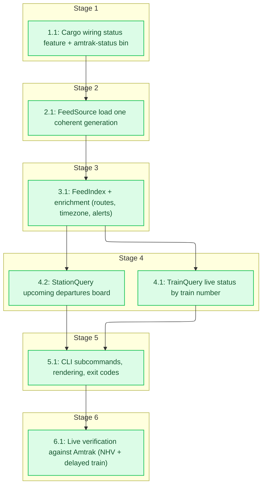

# Tasks: Station & Train Status Queries

<!-- spec-nav:start -->
**Spec navigation:** [State](00_state.md) · [Discovery](01_discovery.md) · [Requirements](02_requirements.md) · [Design](03_design.md) · [Tasks](04_tasks.md) · [Execution](05_execution.md)
<!-- spec-nav:end -->

## Stage and Dependency Overview

Implementation plan for [`03_design.md`](03_design.md). All consumer code lives under
[`src/bin/status/`](../../src/bin/status/) with the CLI at [`src/bin/amtrak_status.rs`](../../src/bin/amtrak_status.rs), compiled only under
`--features status`, so the shipped service binary and container image are unchanged. Build order
follows the approved priority: the shared core first, then the **train-status** mode, then the
**station board** (lowest priority), then the CLI, then a live check.

## Delivery Schedule

| Stage | Task | Estimate | Depends on | Critical path |
|---|---|---|---|---|
| 1 | 1.1 Cargo wiring + feature/bin scaffold | 1–2 hours | — | yes |
| 2 | 2.1 FeedSource (local generation + Amtrak fallback) | 3–5 hours | 1.1 | yes |
| 3 | 3.1 FeedIndex + enrichment (routes, timezone, alerts) | 3–5 hours | 2.1 | yes |
| 4 | 4.1 TrainQuery (train status by number) | 3–5 hours | 3.1 | yes |
| 4 | 4.2 StationQuery (departures board) | 2–4 hours | 3.1 | no |
| 5 | 5.1 CLI: modes, rendering, exit codes | 2–3 hours | 4.1, 4.2 | yes |
| 6 | 6.1 Live verification vs Amtrak | 1–2 hours | 5.1 | yes |

## Tasks

- [x] 1. Foundation
  - [x] 1.1 Cargo wiring: `status` feature + `amtrak-status` bin
    - Add a `status` Cargo feature that enables an optional `chrono-tz` crate, an `amtrak-status` `[[bin]]` target with `required-features = ["status"]` (path [`src/bin/amtrak_status.rs`](../../src/bin/amtrak_status.rs)), and a [`src/bin/status/mod.rs`](../../src/bin/status/mod.rs) stub. Confirm the default/release build is unaffected. Classified `none`: the `chrono-tz` entry is a declaration edge for an already-resolved crate (single-line [`Cargo.lock`](../../Cargo.lock) diff, no resolved version affected); `chrono-tz@0.10.4` is inventoried clean in the complete `main`/`release` audits, and the rationale for `none` is recorded in [`05_execution.md`](05_execution.md).
    - **Files:** [`src/bin/amtrak_status.rs`](../../src/bin/amtrak_status.rs), [`src/bin/status/mod.rs`](../../src/bin/status/mod.rs)
    - **Dependency resolution:** none
    - **Dependency delivery:** none
    - **Depends on:** none
    - **Stage:** 1
    - **Interfaces:** Consumes: the approved design's feature and binary-target plan; Produces: a `status` feature, an `amtrak-status` binary target gated by `required-features = ["status"]`, and an empty [`src/bin/status/mod.rs`](../../src/bin/status/mod.rs) module root that later tasks extend.
    - **Documentation:** module-level `//!` doc on [`src/bin/status/mod.rs`](../../src/bin/status/mod.rs) stating the consumer's purpose and the feature gate; no other public surface yet.
    - **Verification:** `cargo build --features status` builds the `amtrak-status` binary; `cargo build --locked --release` builds no new target and leaves the service binary unchanged; `cargo test --features status` passes.
    - **Estimated effort:** 1–2 hours
    - **Risk:** low; additive and feature-gated — rollback is dropping the feature/target with no service impact.
    - **Task category:** code_analysis
    - **Delegation:** controller
    - _Requirements: 6.1, 6.2_

- [x] 2. Feed acquisition
  - [x] 2.1 FeedSource: load one coherent generation
    - Implement `GenerationData`, `SourceError`, the `FeedSource` trait, `LocalServiceSource` (GET `/v1/feed-set.json` → read `generation_id`, `generated_at_unix`, artifact URLs → GET the four artifacts of that one generation → parse `static.zip` via `Gtfs::from_reader(Cursor)` and each `.pb` via `prost`), and `AmtrakDirectSource` (dev fallback via `amtrak_gtfs_rt::fetch_amtrak_gtfs_rt`). A `503`/absent generation ⇒ `Unavailable`; any other transport/decode failure ⇒ `Fetch`/`Decode`, never a partial result.
    - **Files:** [`src/bin/status/source.rs`](../../src/bin/status/source.rs), [`src/bin/status/mod.rs`](../../src/bin/status/mod.rs)
    - **Dependency resolution:** none
    - **Dependency delivery:** none
    - **Depends on:** 1.1
    - **Stage:** 2
    - **Interfaces:** Consumes: the local service HTTP contract — `GET /v1/feed-set.json` manifest (`generation_id`, `generated_at_unix`, `urls.{static_zip,trip_updates,vehicle_positions,alerts}`) plus artifact routes returning zip/protobuf bytes, and `amtrak_gtfs_rt::fetch_amtrak_gtfs_rt(&Gtfs, &reqwest::Client)`; Produces: `GenerationData { generation_id, generated_at_unix, static_gtfs, trip_updates, vehicle_positions, alerts }`, `enum SourceError { Unavailable, Fetch(String), Decode(String) }`, and `trait FeedSource { async fn load(&self) -> Result<GenerationData, SourceError> }`.
    - **Documentation:** doc comments on `FeedSource`, `GenerationData`, `SourceError`, and both source structs — the one-coherent-generation and fail-closed contract and why (immutable-generation coherence).
    - **Verification:** mock-HTTP tests — single-generation manifest-driven load (all four artifacts from one generation); `503`/absent ⇒ `Unavailable`; injected fetch/decode failure ⇒ error with no partial result; `AmtrakDirectSource` fetches from Amtrak only. Documentation review.
    - **Estimated effort:** 3–5 hours
    - **Risk:** medium; network + decode error surface — credential-free error messages required. Rollback: remove `source.rs`.
    - **Task category:** heavy_reasoning
    - **Delegation:** sequential subagent
    - _Requirements: 5.1, 5.2, 5.4, 5.5, 7.1_

- [x] 3. Index and enrichment
  - [x] 3.1 FeedIndex + enrichment (routes, timezone, alerts)
    - Build `FeedIndex` over a borrowed `GenerationData`: `stop_by_code`, `trips_by_number` (`trip_short_name`), `update_by_trip`, `vehicle_by_trip`, `alerts_by_trip` (from `Alert.informed_entity[].trip.trip_id`), and `unmatched_alerts`. Implement `route_display_name` (long → short → id), `station_tz` (stop `stop_timezone`, else agency tz + fallback flag), and `local_time(unix, tz_name)` via `"<zone>".parse::<Tz>()` + `DateTime::from_timestamp(unix,0)?.with_timezone(&tz)`. Before implementing `local_time`, re-read the design's Current Technology Evidence for `chrono-tz` and re-query Context7 `/chronotope/chrono-tz` only if the resolved version differs from 0.10.4.
    - **Files:** [`src/bin/status/index.rs`](../../src/bin/status/index.rs), [`src/bin/status/format.rs`](../../src/bin/status/format.rs), [`src/bin/status/mod.rs`](../../src/bin/status/mod.rs)
    - **Dependency resolution:** none
    - **Dependency delivery:** none
    - **Depends on:** 2.1
    - **Stage:** 3
    - **Interfaces:** Consumes: `&GenerationData` from task 2.1; Produces: `FeedIndex<'g>` with the maps above and `unmatched_alerts: Vec<String>`, `fn route_display_name(&Gtfs, &str) -> String`, `fn station_tz(&Gtfs, &Stop) -> (String, bool)`, and `fn local_time(i64, &str) -> Result<String, TzError>`.
    - **Documentation:** doc comments on `FeedIndex` (the join keys and why the RT station code differs from the GTFS stop_id) and on each enrichment function (contract + fallback rationale).
    - **Verification:** fixture tests — index build; alert→trip attachment and `unmatched_alerts` collection (diagnostic, not dropped); `route_display_name` fallbacks; `station_tz` for a non-Eastern zone and the agency fallback; `local_time` DST correctness on a known date. Documentation review.
    - **Estimated effort:** 3–5 hours
    - **Risk:** medium; timezone/DST correctness and alert-match keying are the subtle parts. Rollback: remove `index.rs`/`format.rs`.
    - **Task category:** heavy_reasoning
    - **Delegation:** sequential subagent
    - _Requirements: 1.3, 6.1, 6.2_

- [x] 4. Query modes
  - [x] 4.1 TrainQuery: live status by train number
    - Implement `train_query(&FeedIndex, train_number, now_unix) -> TrainResult` producing `TrainStatus` per active trip: current position (from `vehicle_by_trip`), remaining stops with predicted arrival/departure ordered by sequence, overall delay when derivable, route name + headsign + origin/destination, geometry from `gtfs.shapes` (or `shape_unavailable`), and attached alerts. Multiple same-day trips ⇒ all, distinguished; no active trip ⇒ `NotRunning`. Include the source generation timestamp.
    - **Files:** [`src/bin/status/train.rs`](../../src/bin/status/train.rs), [`src/bin/status/mod.rs`](../../src/bin/status/mod.rs)
    - **Dependency resolution:** none
    - **Dependency delivery:** none
    - **Depends on:** 3.1
    - **Stage:** 4
    - **Interfaces:** Consumes: `&FeedIndex` from tasks 2.1 and 3.1 plus `train_number: &str` and `now_unix: i64`; Produces: `enum TrainResult { Trains { generation_id, generated_at_unix, trains: Vec<TrainStatus> }, NotRunning { train_number } }` with `TrainStatus` fields per the design (position, remaining_stops, overall_delay_secs, shape/shape_unavailable, alerts, origin/destination).
    - **Documentation:** doc comments on `train_query`, `TrainStatus`, `StopStatus`, `TrainResult` — contract and the duplicate-number and missing-geometry behaviors.
    - **Verification:** fixture tests — position present (3.1); remaining stops ordered by sequence (3.2); overall delay (3.3); duplicate same-day number returns all distinguished (3.4); not-running (3.5); geometry present (4.1) and absent-flagged (4.2); alerts none/one/many (1.1/1.2/1.4); local time (6.1); generation timestamp present (5.3). Documentation review.
    - **Estimated effort:** 3–5 hours
    - **Risk:** medium; duplicate-trip disambiguation and remaining-stop derivation. Rollback: remove `train.rs`.
    - **Task category:** heavy_reasoning
    - **Delegation:** sequential subagent
    - _Requirements: 3.1, 3.2, 3.3, 3.4, 3.5, 4.1, 4.2, 1.1, 1.2, 1.4, 6.1, 5.3_
  - [x] 4.2 StationQuery: upcoming departures board
    - Implement `station_query(&FeedIndex, identifier, now_unix) -> StationResult` producing time-ordered `DepartureRow`s for the resolved station (Amtrak code or GTFS `stop_id`, uppercased): stop updates with $\text{time} \ge \text{now}$ sorted ascending, departure preferred and arrival-only labeled `Arrival`, canceled stops kept and labeled, route name + train number + headsign + real-time/scheduled flag, per-station local time, and attached alerts. Unresolvable identifier ⇒ `Unresolved`. Include the generation timestamp.
    - **Files:** [`src/bin/status/station.rs`](../../src/bin/status/station.rs), [`src/bin/status/mod.rs`](../../src/bin/status/mod.rs)
    - **Dependency resolution:** none
    - **Dependency delivery:** none
    - **Depends on:** 3.1
    - **Stage:** 4
    - **Interfaces:** Consumes: `&FeedIndex` plus `identifier: &str` and `now_unix: i64`; Produces: `enum StationResult { Board { generation_id, generated_at_unix, rows: Vec<DepartureRow> }, Unresolved { identifier } }` with `DepartureRow` fields per the design (time_unix, kind, is_realtime, canceled, route_name, train_number, headsign, station_tz, tz_is_fallback, alerts).
    - **Documentation:** doc comments on `station_query`, `DepartureRow`, `StationResult` — ordering, arrival-only, canceled, and unresolved contracts.
    - **Verification:** fixture tests — ordered upcoming board (2.1); arrival-only terminus (2.2); complete row fields (2.3); canceled kept+labeled (2.4); unresolved distinct from empty (2.5); alerts (1.1/1.2/1.4); local time (6.1); timestamp (5.3). Documentation review.
    - **Estimated effort:** 2–4 hours
    - **Risk:** low; mirrors the validated prototype join. Rollback: remove `station.rs`.
    - **Task category:** heavy_reasoning
    - **Delegation:** sequential subagent
    - _Requirements: 2.1, 2.2, 2.3, 2.4, 2.5, 1.1, 1.2, 1.4, 6.1, 5.3_

- [x] 5. CLI
  - [x] 5.1 CLI: subcommands, rendering, exit codes
    - Implement `amtrak-status station <code> [--limit N]` and `amtrak-status train <number>`, with `--source local|amtrak` (default `local`) and `--base-url` (default `http://127.0.0.1:8080`). Select the `FeedSource`, run the query, and render results including the source generation timestamp. Print `Unresolved` / `NotRunning` / `data-unavailable` distinctly from an empty-but-successful result; exit non-zero on any `SourceError`.
    - **Files:** [`src/bin/amtrak_status.rs`](../../src/bin/amtrak_status.rs)
    - **Dependency resolution:** none
    - **Dependency delivery:** none
    - **Depends on:** 4.1, 4.2
    - **Stage:** 5
    - **Interfaces:** Consumes: `FeedSource` from task 2.1 plus `station_query`/`train_query` from tasks 4.1 and 4.2 and their result enums; Produces: the `amtrak-status` CLI — argument parsing, mode dispatch, rendered output with generation timestamp, distinct not-found/unavailable messages, and non-zero exit on `SourceError`.
    - **Documentation:** module `//!` doc + `--help` text describing subcommands, flags, and exit semantics.
    - **Verification:** CLI integration tests against a mock source — station and train happy paths render with timestamp (5.3); unresolved station (2.5), not-running train (3.5), and data-unavailable (5.4) print distinctly; a `SourceError` yields non-zero exit with no result body (7.1); times shown in local zone (6.1). Documentation review.
    - **Estimated effort:** 2–3 hours
    - **Risk:** low. Rollback: revert `amtrak_status.rs` to the stub.
    - **Task category:** code_analysis
    - **Delegation:** sequential subagent
    - _Requirements: 5.3, 2.5, 3.5, 5.4, 7.1, 6.1_

- [x] 6. Checkpoint — review live results before declaring done
  - [x] 6.1 Live verification against Amtrak (NHV + delayed train)
    - Add an ignored-by-default live test (mirroring the crate's live-test pattern) and a documented manual run: `amtrak-status station NHV` and `amtrak-status train <delayed-number>` against live data, cross-checking ordering, the delay-notification alert, and per-station local time versus Amtrak's own status pages.
    - **Files:** [`src/bin/status/live_tests.rs`](../../src/bin/status/live_tests.rs)
    - **Dependency resolution:** none
    - **Dependency delivery:** none
    - **Depends on:** 5.1
    - **Stage:** 6
    - **Interfaces:** Consumes: the built `amtrak-status` CLI and `AmtrakDirectSource`; Produces: an ignored `#[tokio::test]` (run with `--ignored`) and a documented manual-verification note recording the observed NHV board, a delayed train's alert, and local-time correctness.
    - **Documentation:** test-level comment stating it hits live endpoints and how to run it (`--ignored`).
    - **Verification:** the live test passes when run explicitly; the delay-notification alert and per-station local time match Amtrak's status page for the sampled train (success measures for 1.1/2.1/3.1/6.1).
    - **Estimated effort:** 1–2 hours
    - **Risk:** low; network-dependent and ignored by default so CI is unaffected.
    - **Task category:** review
    - **Delegation:** sequential subagent
    - _Requirements: 1.1, 2.1, 3.1, 6.1_

## Approval

Status: **Approved on 2026-08-17.** Seven tasks across six stages approved by the user, with
train-status (4.1) sequenced before the station board (4.2) per priority and 6.1 as an
ignored-by-default live-verification checkpoint. A live NYP check confirmed the join (Acela 2159 =
trip 293080).
