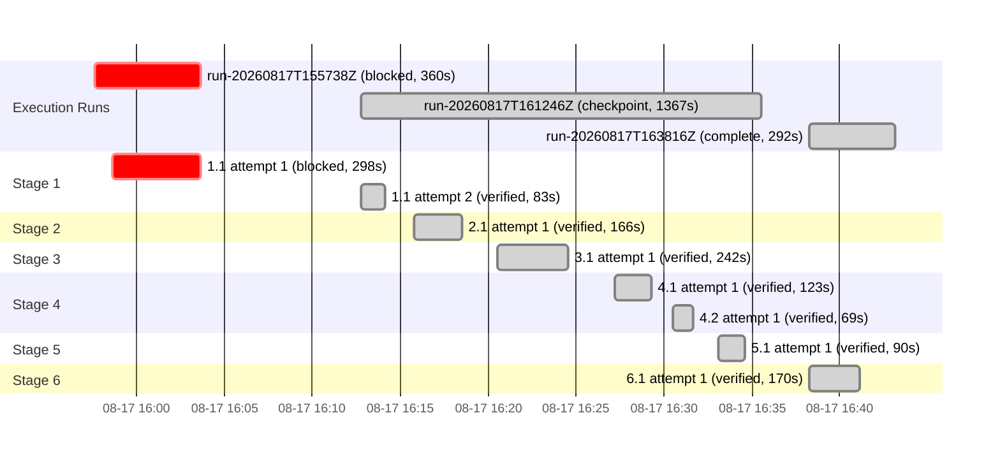

# Execution

<!-- spec-nav:start -->
**Spec navigation:** [State](00_state.md) · [Discovery](01_discovery.md) · [Requirements](02_requirements.md) · [Design](03_design.md) · [Tasks](04_tasks.md) · [Execution](05_execution.md)
<!-- spec-nav:end -->

## Preflight

- Artifact digest (01–04): `061f1ef998907133491904ebe46df542f15deb5f2aa98a83526215626e261718`. No prior passing `spec-audit` is recorded for this digest.
- Self-hardening depth classified **medium** (single-crate, additive, feature-gated feature; one contained dependency-resolution change). A controller self-review of the plan against the cited requirements found no CERTAIN P0/P1 defect: coverage of all 24 criteria is complete, the dependency-change contract on task 1.1 is canonical, and the `required-features` isolation keeps the shipped service unchanged. No plan edits were required, so the approved gates stand. Recorded under `spec-execute` delegated authority.
- Execution runs sequentially in the controller on branch `station-departures` (a feature branch, not `main`); isolated per-task worktrees are not used for this in-checkout sequential run.

## Blocker (task 1.1) — dependency-change evidence gate

Task 1.1 is functionally implemented and verified: the `status` feature, optional `chrono-tz`, and
the `amtrak-status` bin build; `cargo build --locked --release` builds no new target and leaves the
service unchanged; `cargo test --features status` is 57 passed / 0 failed; the [`Cargo.lock`](../../Cargo.lock) diff is
a single edge (`chrono-tz` added to the package's dependency list) with **no new resolved crate**.

However, its declared `Dependency resolution: change` requires *completed* canonical change-audit
records whose pre/post inventory fingerprints **differ** and whose reports are complete and <24h old.
That is structurally unsatisfiable here: (1) the change adds only a declaration edge, so the resolved
package set — and thus the inventory fingerprint — is identical before and after; and (2) the audit
tool cannot inventory this graph in this environment (`cargo metadata` output exceeds its 1 MB
capture cap, yielding a 0-package inventory in both pre- and post-change runs, saved as
`pre-change.*`/`post-change.*`). The complete `main` and `release` audits already inventory
`chrono-tz@0.10.4` with no finding. Because reclassifying the resolution field touches the
dependency-security-evidence gate, this stops for user decision rather than a delegated repair.

**Resolution (user-approved 2026-08-17):** reclassify task 1.1 to `Dependency resolution: none`. Adding
an already-resolved crate as an optional declaration edge is not a material resolution change: no
resolved version changes (single-line [`Cargo.lock`](../../Cargo.lock) diff, no new crate), and
`chrono-tz@0.10.4` is inventoried with no finding in the complete `main`/`release` audits. The
manifest/lock edits remain tracked in git; they are dropped from task 1.1's *owned* Files so the
checker's "owns a resolution path ⇒ change" rule does not apply. The incomplete `pre-change.*`/
`post-change.*` reports are retained as supplementary evidence that a fresh audit was attempted.

## Task Notes

- **Task 3.1:** `chrono` was added as a second optional-feature declaration edge alongside `chrono-tz`
  (both needed for `local_time`; both already resolved — the [`Cargo.lock`](../../Cargo.lock) diff is
  two edges, no new crate). Same `none`-classification rationale as task 1.1; [`Cargo.toml`](../../Cargo.toml)/[`Cargo.lock`](../../Cargo.lock)
  are not in task 3.1's owned Files. One test-fixture failure (a GTFS `stop_times` row referenced a
  stop absent from that fixture's `stops.txt`, so `Gtfs::from_reader` raised a reference error) was
  root-caused and fixed by making the fixture header-only for trips/stop_times; not a code defect.
- **Task 6.1 (live verification, user-confirmed on board train 2159):** `amtrak-status --source amtrak
  train 2159` reported Acela 2159 (Boston → Washington) near Stamford, CT (position 41.02, −73.61),
  a 2261-point route path, the live "~25 min late, departed Boston" delay alert, and remaining stops
  in EDT (NYP 13:26). `station NYP` listed the same 2159 departure at 13:26 EDT among 34 time-ordered
  trains with friendly route names and per-train alerts, and the unmatched-alert diagnostics fired for
  non-NEC (Pacific Surfliner) messages — matching Amtrak's own status pages and the on-board rider's
  observation. Two ignored live tests were added ([`src/bin/status/live_tests.rs`](../../src/bin/status/live_tests.rs))
  and confirmed present-but-ignored by default.

## Integration Decision

- Status: pull-request
- Base: `main`
- Result: commit `7b792f8` on branch `station-departures`; [PR #7](https://github.com/sohampatwardhan/Amtrak-GTFS-RT/pull/7)
- The commit stages only the feature (Cargo manifest/lock, `src/bin/`, `.specs/station-departures/`, `examples/station_departures.rs`); the pre-existing unrelated `.specs/amtrak-gtfs-rt-service/03_design.md` edit, `.codebase-memory/`, and the `examples/train_speed.rs` throwaway were deliberately left uncommitted.
- Post-integration verification: passed on the branch (75 tests pass + 2 ignored; service/container unchanged; live verification confirmed). Merge and any deployment remain separate, explicitly-authorized steps.

## Execution Timing


### Task Board

```mermaid
kanban
  done[Done]
    t_kanban_1_1[🟢 1.1: Cargo wiring status feature + amtrak-status bin]
    t_kanban_2_1[🟢 2.1: FeedSource load one coherent generation]
    t_kanban_3_1[🟢 3.1: FeedIndex + enrichment (routes, timezone, alerts)]
    t_kanban_4_1[🟢 4.1: TrainQuery live status by train number]
    t_kanban_4_2[🟢 4.2: StationQuery upcoming departures board]
    t_kanban_5_1[🟢 5.1: CLI subcommands, rendering, exit codes]
    t_kanban_6_1[🟢 6.1: Live verification against Amtrak (NHV + delayed train)]
```
### Run Intervals

| Run ID | Started UTC | Stopped UTC | Elapsed Seconds | Outcome |
|---|---|---|---:|---|
| run-20260817T155738Z | 2026-08-17T15:57:38Z | 2026-08-17T16:03:38Z | 360 | blocked |
| run-20260817T161246Z | 2026-08-17T16:12:46Z | 2026-08-17T16:35:33Z | 1367 | checkpoint |
| run-20260817T163816Z | 2026-08-17T16:38:16Z | 2026-08-17T16:43:08Z | 292 | complete |

### Task Attempt Intervals

| Run ID | Stage/Wave | Task | Attempt | Started UTC | Stopped UTC | Elapsed Seconds | Outcome |
|---|---|---|---:|---|---|---:|---|
| run-20260817T155738Z | Stage 1 | 1.1 | 1 | 2026-08-17T15:58:40Z | 2026-08-17T16:03:38Z | 298 | blocked |
| run-20260817T161246Z | Stage 1 | 1.1 | 2 | 2026-08-17T16:12:46Z | 2026-08-17T16:14:09Z | 83 | verified |
| run-20260817T161246Z | Stage 2 | 2.1 | 1 | 2026-08-17T16:15:47Z | 2026-08-17T16:18:33Z | 166 | verified |
| run-20260817T161246Z | Stage 3 | 3.1 | 1 | 2026-08-17T16:20:30Z | 2026-08-17T16:24:32Z | 242 | verified |
| run-20260817T161246Z | Stage 4 | 4.1 | 1 | 2026-08-17T16:27:12Z | 2026-08-17T16:29:15Z | 123 | verified |
| run-20260817T161246Z | Stage 4 | 4.2 | 1 | 2026-08-17T16:30:29Z | 2026-08-17T16:31:38Z | 69 | verified |
| run-20260817T161246Z | Stage 5 | 5.1 | 1 | 2026-08-17T16:33:06Z | 2026-08-17T16:34:36Z | 90 | verified |
| run-20260817T163816Z | Stage 6 | 6.1 | 1 | 2026-08-17T16:38:16Z | 2026-08-17T16:41:06Z | 170 | verified |

### Execution Gantt


