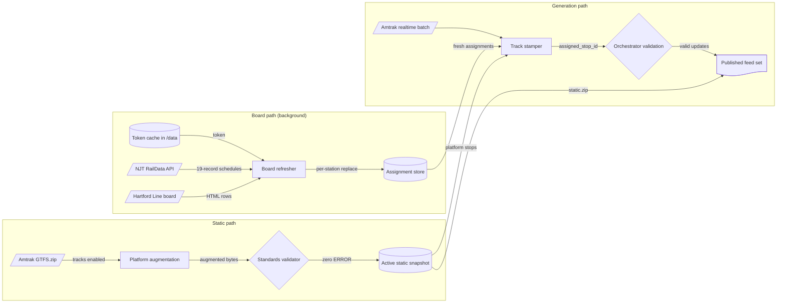

# Design: Real-Time Track Assignments

<!-- spec-nav:start -->
**Spec navigation:** [State](00_state.md) · [Discovery](01_discovery.md) · [Requirements](02_requirements.md) · [Design](03_design.md) · [Tasks](04_tasks.md) · [Execution](05_execution.md)
<!-- spec-nav:end -->

## Overview

The feature publishes live Amtrak platform assignments in the way the GTFS-Realtime reference
intends: `StopTimeProperties.assigned_stop_id` names a platform stop that exists in the published
static feed. Three independent paths carry it:

1. **Static path.** When tracks are enabled, each upstream Amtrak `GTFS.zip` is deterministically
   augmented with a parent station and one platform stop per configured track at each covered
   station, then validated and published in place of the upstream bytes.
2. **Board path.** A background task reads NJ Transit's registered RailData API and the Hartford
   Line board on its own schedule and keeps per-station assignment snapshots with the time each was
   observed.
3. **Generation path.** The trip-update decorator reads the freshest assignments without any
   network call and stamps platform stop ids onto matching stop times. The orchestrator's existing
   stop-time validation enforces the reference's rules.

This realizes the approved discovery direction: a fixed configured platform table and deterministic
augmentation, registered RailData access only, expiring assignments, and background refresh. The
rejected alternatives (learned platforms, generated 1–N ranges, the DepartureVision bootstrap, the
legacy SOAP service, in-generation refresh) are not reintroduced.

## Existing Repository Evidence

- [`src/static_gtfs.rs`](../../src/static_gtfs.rs) downloads the upstream ZIP, parses it, and
  validates the exact retained bytes with the MobilityData validator before it can become active;
  `stage_static` compares candidate bytes with the active snapshot to detect change, and the
  snapshot version comes from `feed_info.feed_version`. The validator gate rejects only `ERROR`
  notices.
- Amtrak's current `stops.txt` (feed version `20260927`) has the columns `stop_id, stop_code,
  stop_name, stop_url, stop_timezone, stop_lat, stop_lon` and no `location_type` or
  `parent_station`. `NYP`, `NWK`, `MET`, `TRE`, and `NHV` are ordinary stops referenced directly by
  `stop_times.txt`, so a covered station needs a new parent rather than becoming one.
- [`src/orchestrator.rs`](../../src/orchestrator.rs) `valid_stop_time_update` drops stop-time updates
  that fail reference checks, which makes it the enforcement point for assignment validity.
- PR #17's `src/sources/tracks.rs` supplies reusable parsing:
  `normalize_train_number`, `is_track_label`, the RailData item parser `assignments_for_station`,
  and `parse_hartford_board`. Its SPA bootstrap, embedded keys, SOAP fallback, and indefinite cache
  are removed.
- [`src/bin/status/station.rs`](../../src/bin/status/station.rs) matches stop times to a station
  by `stop_id`, so it must resolve stations from `stop_sequence` once `stop_id` is cleared.
- Trackside joins trip updates by `stopSequence`, so clearing `stop_id` does not affect it.
- [`scripts/validate-feeds.sh`](../../scripts/validate-feeds.sh) generates live feeds and ratchets
  validator `ERROR` codes against
  [`validation/baseline.json`](../../validation/baseline.json), which forbids any static error.

## Architecture



## Components and Interfaces

### Platform table ([`src/static_augment.rs`](../../src/static_augment.rs))

Parsed from `AMTRAK_TRACKS_PLATFORMS`, a semicolon-separated list of `STOP=labels`, where labels are
comma-separated track labels or numeric ranges (`1-5`). Every label must pass `is_track_label`.

```rust
pub struct PlatformTable { stations: BTreeMap<String, Vec<String>> } // stop_id -> ordered labels

impl PlatformTable {
    pub fn parse(raw: &str) -> Result<PlatformTable, ConfigError>;
    /// First 8 hex digits of SHA-256 over the canonical form `NHV=1,2;NWK=A,1`.
    pub fn digest(&self) -> String;
    pub fn contains(&self, stop_id: &str, label: &str) -> bool;
    pub fn station_ids(&self) -> impl Iterator<Item = &str>;
}
pub fn parent_station_id(stop_id: &str) -> String;             // "NWK:station"
pub fn platform_stop_id(stop_id: &str, label: &str) -> String; // "NWK:track:4"
```

Default table (evidence in [Current Technology Evidence](#current-technology-evidence)):

| Stop | Tracks |
|---|---|
| `NYP` | 1–21 |
| `NWK` | A, 1–5 |
| `NHV` | 1, 2, 3, 4, 8, 10, 12, 14 |

`MET` and `TRE` have no published track numbering in the sources consulted, so they are read from
RailData but not covered. An unlisted label is logged (R3.7), so the operator can add a verified
list through configuration.

### Static augmenter ([`src/static_augment.rs`](../../src/static_augment.rs))

```rust
pub fn augment_static(upstream: &[u8], table: &PlatformTable) -> Result<Vec<u8>, AugmentError>;
```

- Reads the upstream archive and rewrites only `stops.txt`; every other entry is copied with
  `ZipWriter::raw_copy_file`, in upstream order, so its bytes are unchanged (R1.6).
- Strips a leading UTF-8 byte-order mark from `stops.txt` before parsing, so the first header is read
  as `stop_id`.
- Appends the columns `location_type`, `parent_station`, and `platform_code` when absent, and keeps
  existing columns and rows in upstream order.
- For each table stop that exists in the upstream feed as a plain stop (empty or `0` location type,
  no parent): sets that row's `parent_station` to `{stop}:station` (R1.3); appends one parent
  station row (`location_type=1`, name, coordinates, timezone copied) (R1.2); appends one platform
  row per label (`location_type=0`, `parent_station={stop}:station`, `platform_code=label`, name
  `{name} Track {label}`, coordinates and timezone copied) (R1.1, R1.4, R1.5).
- A table stop that is absent, already has a parent, or is not a plain stop is skipped with a
  warning (R1.8).
- An id collision with an existing stop, a CSV error, or a ZIP error returns `AugmentError` (R1.9).
- `stops.txt` is written with Deflate and a fixed 1980-01-01 modification time, so the same input
  and table produce identical bytes (R2.3).

### Static pipeline changes ([`src/static_gtfs.rs`](../../src/static_gtfs.rs))

The functions that fetch static data gain `platforms: Option<&PlatformTable>` (or an owned
`Option<Arc<PlatformTable>>` for the refresh task): `fetch_static`, `stage_static`,
`bootstrap_static`, `refresh_snapshot_once`, and `run_snapshot_refresh`. For each downloaded
upstream ZIP:

1. If `platforms` is `None`, keep today's path: validate and publish the upstream bytes (R1.7).
2. Otherwise augment. On `AugmentError`, log and fall back to step 1 (R1.9).
3. Validate the augmented bytes, which are the bytes that will be published (R2.1). If the validator
   rejects them, log and fall back to step 1 (R2.2).
4. The snapshot version is `{feed_version}+tracks.{digest}` (R2.4, R2.5). Augmentation leaves
   `feed_info.txt` untouched, so `snapshot_from_bytes` gains an optional suffix argument and appends it
   after reading `feed_version`. The `+` suffix keeps the upstream version visible and changes whenever
   the table changes. The version identifies content: a dependency update that changes only the
   compressed bytes of an identical `stops.txt` keeps the same version, which is harmless because
   the content is the same.

Augmentation runs inside `fetch_static_at` before `snapshot_from_bytes`, so the parsed `Gtfs` used for
matching always comes from the same bytes that are validated and published. Each fallback re-parses
and re-validates the upstream bytes rather than reusing anything built from the rejected bytes.

Change detection is unchanged: `stage_static` compares candidate bytes (augmented or not) with the
active snapshot, so turning tracks on or off across a restart stages a new snapshot on the next
static refresh. Recovery of a committed generation keeps its retained bytes and version.

### Assignment store ([`src/sources/tracks/store.rs`](../../src/sources/tracks/store.rs))

```rust
pub struct Assignment { pub train_number: String, pub stop_id: String, pub track: String }

pub struct AssignmentStore { boards: std::sync::RwLock<HashMap<String, StationBoard>> }
struct StationBoard { observed_at: SystemTime, rows: Vec<Assignment> }

impl AssignmentStore {
    /// Replaces one source station's rows after a successful fetch (R5.3).
    pub fn replace_station(&self, source_key: &str, rows: Vec<Assignment>, observed_at: SystemTime);
    /// Lookup built from boards observed within `max_age` of `now` (R5.1, R5.2).
    pub fn fresh_board(&self, now: SystemTime, max_age: Duration) -> TrackBoard;
}
```

The source key is `njt:{code}` or `hartford:{stop}`. A failed fetch never touches its board, so its
rows age out after `AMTRAK_TRACKS_MAX_AGE_SECS` (default 300 s). The lock is never held across an
`await`.

### RailData client ([`src/sources/tracks/raildata.rs`](../../src/sources/tracks/raildata.rs))

```rust
pub struct RailDataClient { http: reqwest::Client, base: String, credentials: Credentials, cache: TokenCache }

impl RailDataClient {
    pub async fn schedule(&mut self, station: &str, now: SystemTime) -> Result<String, BoardError>;
}
```

- **Endpoints:** `POST {base}/getToken` (multipart `username`, `password`) and
  `POST {base}/getTrainSchedule19Rec` (multipart `token`, `station`, `line=`), with `base` defaulting
  to `https://raildata.njtransit.com/api/TrainData` (R4.1). Nothing from the DepartureVision web
  client remains (R4.2).
- **Token cache:** a JSON file `{output_dir}/tracks/raildata-token.json` holding `token`,
  `issued_at`, and the Unix times of token requests in the last 24 hours. It is written atomically
  (temporary file, then rename) with mode `0600`. A token younger than 23 hours is reused, including
  after restart (R4.3, R4.4). The serve layer exposes only its versioned routes, so this file is
  never published.
- **Budget:** before `getToken`, requests in the last 24 hours are counted and a tenth request
  is refused (R4.5); NJT's own counter resets at midnight, so the rolling window is stricter.
- **Rejected token:** an `errorMessage` containing `Invalid token` or a `null` body clears the
  token, requests one replacement within budget, and retries the schedule once (R4.6).
- **Rejected credentials:** `Authenticated: "False"` suspends NJT requests for one hour, so a wrong
  password cannot use up the day's budget.
- **Unconfigured:** without both `NJT_RAILDATA_USERNAME` and `NJT_RAILDATA_PASSWORD`, the refresher
  skips NJT stations and logs this once (R4.7).
- **Secrets:** credentials and tokens are never logged or included in errors; `TrackConfig`'s
  `Debug` shows only whether they are set (R4.8).

### Board refresher ([`src/sources/tracks/refresher.rs`](../../src/sources/tracks/refresher.rs))

```rust
pub async fn run_board_refresher(store: Arc<AssignmentStore>, config: TrackConfig, token_path: PathBuf);
```

Spawned from `main` when tracks are enabled. Every `AMTRAK_TRACKS_REFRESH_SECS` (default 60) it
fetches each configured RailData station and the Hartford board (R6.1, R7.1, R7.2), each request
bounded by `AMTRAK_TRACKS_REQUEST_TIMEOUT_SECS` (default 10) (R6.4). Successful parses call
`replace_station`. Rows with empty or non-platform track labels are discarded by the kept parsers
(R7.4). Stations come from `AMTRAK_TRACKS_NJT_STATIONS` and `AMTRAK_TRACKS_STATION_MAP`; covered
tracks come from `AMTRAK_TRACKS_PLATFORMS`, so a new station needs configuration only (R7.3).

### Track stamper ([`src/sources/tracks/mod.rs`](../../src/sources/tracks/mod.rs))

```rust
pub struct WithTracks<S> { inner: S, store: Arc<AssignmentStore>, table: Arc<PlatformTable>, max_age: Duration, unlisted: Mutex<HashSet<(String, String)>> }
pub fn apply_track_assignments(batch: &mut RtBatch, gtfs: &Gtfs, board: &TrackBoard, table: &PlatformTable, now: SystemTime, unlisted: &Mutex<HashSet<(String, String)>>);
```

Constructed as `WithTracks::new(inner, store: Arc<AssignmentStore>, table: Arc<PlatformTable>, max_age: Duration)`.
`main` builds the store and table once and shares them with the refresher, the static pipeline, and
the stamper; `realtime_source` takes `Option<TrackWiring>`, a struct holding those three values.

`fetch` calls the inner source, then `store.fresh_board(now, max_age)`, which is an in-memory read
(R6.2, R6.3). For each stop-time update of a trip whose `trip_short_name` normalizes to a train
number, a stop time is stamped only if every condition holds:

1. Its schedule relationship is not `SKIPPED` (R3.5).
2. It has an arrival or departure `time` between one hour before and twelve hours after `now`
   (R3.11). This excludes the other run of a train that runs across two days.
3. Its scheduled stop resolves from `stop_sequence`, or from `stop_id` when `stop_sequence` is absent,
   and that stop occurs exactly once in the static trip. The occurrence check runs even when the update
   already carries `stop_sequence`, because one board reading cannot say which visit it describes (R3.4).
4. The fresh board has a track for (train number, scheduled stop) (R3.1).
5. The label is in the table and the platform stop exists in the active static feed. Otherwise the
   (stop, label) pair is logged once per process (R3.6, R3.7). This check also disables stamping
   when augmentation fell back to upstream bytes.

A stamped stop time gets `assigned_stop_id = {stop}:track:{label}`, `stop_sequence` from the static
trip (R3.2), and no `stop_id` (R3.3). When tracks are disabled, `main` does not construct the
decorator (R3.10).

### Orchestrator validation ([`src/orchestrator.rs`](../../src/orchestrator.rs))

`stop_assignment_is_valid(assigned_id, update, trip, gtfs)` replaces PR #17's overlay rule. It
requires `stop_sequence`, requires `assigned_id` to be a stop in the active static feed (R3.8),
requires any present `stop_id` to equal `assigned_id`, and requires the assigned stop to equal the
scheduled stop or share its non-empty `parent_station` (R3.9).

### Status tool ([`src/bin/status`](../../src/bin/status))

Station matching resolves each stop time's station from `stop_id`, or from `stop_sequence` and the
static trip when `stop_id` is absent (R8.2). The track shown is the assigned stop's `platform_code`
from the static feed (R8.1).

### Feed validation ([`scripts/validate-feeds.sh`](../../scripts/validate-feeds.sh), [`.github/workflows/validate-feeds.yml`](../../.github/workflows/validate-feeds.yml))

The scheduled job runs its generate-and-validate pass twice: once as today and once with
`AMTRAK_TRACKS=on` (R8.3). The tracks pass runs without RailData credentials: a fresh runner has no
token cache, so sharing production credentials would spend the production account's 10 daily token
requests. The pass still validates the augmented static feed, Hartford assignments, and the stamping
path. Each pass writes its own reports and
is ratcheted against the same baseline, so a new `ERROR` code in either pass fails the job (R8.4).

### Configuration ([`src/config.rs`](../../src/config.rs))

| Variable | Default | Purpose |
|---|---|---|
| `AMTRAK_TRACKS` | off | Enables the feature |
| `AMTRAK_TRACKS_PLATFORMS` | `NYP=1-21;NWK=A,1-5;NHV=1-4,8,10,12,14` | Covered stations and tracks |
| `AMTRAK_TRACKS_REFRESH_SECS` | `60` | Board refresh interval |
| `AMTRAK_TRACKS_MAX_AGE_SECS` | `300` | Oldest assignment that may be stamped |
| `AMTRAK_TRACKS_REQUEST_TIMEOUT_SECS` | `10` | Per-request timeout |
| `AMTRAK_TRACKS_RAILDATA_BASE` | `https://raildata.njtransit.com/api/TrainData` | RailData base URL |
| `NJT_RAILDATA_USERNAME`, `NJT_RAILDATA_PASSWORD` | empty | Registered RailData credentials; both or neither |
| `AMTRAK_TRACKS_NJT_STATIONS` | `NY,NP,MP,TR` | RailData stations to read |
| `AMTRAK_TRACKS_STATION_MAP` | `NY=NYP,NP=NWK,MP=MET,TR=TRE` | RailData code to Amtrak stop |
| `AMTRAK_TRACKS_HARTFORD_URL` | `https://hartfordline.com/connecting-train-status/` | Hartford board; empty disables |
| `AMTRAK_TRACKS_HARTFORD_STOP` | `NHV` | Amtrak stop for that board |

PR #17's `AMTRAK_TRACKS_TTL_SECS`, `AMTRAK_TRACKS_NJT_API_BASE`, `AMTRAK_TRACKS_NJT_SPA_ORIGIN`, and
`NJT_RAILDATA_URL` are removed. They were never released, so no migration applies. Zero intervals,
ages, or timeouts are configuration errors.

## Data Models

- **`stops.txt` additions (tracks enabled):** for `NWK`, the row `NWK` gains
  `parent_station=NWK:station`; new rows `NWK:station` (`location_type=1`) and `NWK:track:A`,
  `NWK:track:1` … `NWK:track:5` (`location_type=0`, `parent_station=NWK:station`,
  `platform_code` = label).
- **Stamped stop time:** `stop_sequence=7`, no `stop_id`,
  `stop_time_properties.assigned_stop_id="NWK:track:4"`, arrival and departure unchanged.
- **Token cache file:** `{"token": "…", "issued_at": 1790500000, "requests": [1790500000]}`.

## Error Handling

| Condition | Behavior | Criteria |
|---|---|---|
| Tracks disabled | Upstream bytes published; decorator absent | R1.7, R3.10 |
| Covered stop missing or already parented | Station skipped with a warning | R1.8 |
| Augmentation error | Upstream bytes published for that snapshot | R1.9 |
| Augmented feed has a validator `ERROR` | Upstream bytes published for that snapshot | R2.2 |
| Label not in table or platform stop absent | Stop time unassigned; logged once | R3.6, R3.7 |
| Duplicate station in trip, skipped stop, event outside window | Stop time unassigned | R3.4, R3.5, R3.11 |
| Invalid assignment reaches the orchestrator | Stop-time update rejected | R3.8, R3.9 |
| Credentials missing | NJT skipped; logged once | R4.7 |
| Token rejected | One replacement, one retry | R4.6 |
| Token budget reached | No token request until the window allows | R4.5 |
| Credentials rejected | NJT suspended for one hour | R4.5 |
| Board fetch fails or times out | Board untouched; rows expire | R5.2, R6.3, R6.4 |

## Current Technology Evidence

Context7 was consulted for the `zip` crate (`/zip-rs/zip2`); the other rows are primary sources that Context7 does not index.

| Technology | Context7 identity/source | Exact selected version | Current-doc question | Decision |
|---|---|---|---|
| GTFS-Realtime `assigned_stop_id` | `google/transit` `gtfs-realtime/spec/en/reference.md` on `main`, read 2026-09-28 | Current reference (field marked experimental) | What may the field contain? | Must be a `stops.txt` stop id; requires `stop_sequence`; `stop_id` should be omitted and must match if present. Drives R3.1–R3.3 and R3.8. |
| NJ Transit RailData | *NJTRANSIT RailData API V2.1* PDF from developer.njtransit.com, read 2026-09-28 | API V2.1 | Access, limits, response shape | `getToken` returns `Authenticated`/`UserToken`; 10 token calls per day, reset at midnight; tokens last 24 hours; `getTrainSchedule19Rec` returns `ITEMS` with `TRAIN_ID`, `TRACK`, `SCHED_DEP_DATE`; an invalid token returns `errorMessage: "Invalid token."`; schedule data is limited to 40,000 calls per day. |
| Station track numbering | Wikipedia (*New York Penn Station*, *Newark Penn Station*, *Union Station (New Haven)*, *Trenton Transit Center*, *Metropark station*) and Amtrak's NYP track map, read 2026-09-28 | Current articles | Real platform tracks | NYP 1–21; NWK A, 1–5; NHV 1–4, 8, 10, 12, 14 (track 6 has no platform); Trenton has four unnumbered platform tracks and Metropark two side platforms, so neither gets a default. |
| `zip` crate | Context7 `/zip-rs/zip2` | 6.0.0 (locked) | Copy entries unchanged and fix timestamps | `ZipWriter::raw_copy_file` preserves compressed bytes; `SimpleFileOptions::last_modified_time` sets a fixed time. Exact 6.0.0 signatures are confirmed at build time. |
| Amtrak static feed | `https://content.amtrak.com/content/gtfs/GTFS.zip`, downloaded 2026-09-28 | Feed version 20260927 | `stops.txt` shape | No `location_type` or `parent_station` column; covered stops are plain stops. |

## Dependency Security Evidence

This feature uses dependency-security-audit `change` mode because it edits
[`Cargo.toml`](../../Cargo.toml) and [`Cargo.lock`](../../Cargo.lock).

- **Resolution change:** remove the direct dependencies `aes`, `aes-gcm`, `base64`, `cipher`, and
  `pbkdf2`, used only by the removed DepartureVision bootstrap, and promote `csv` to a direct
  dependency at its exact resolved version `csv@1.4.0` (already locked through `gtfs-structures`).
  `zip@6.0.0` and `flate2@1.1.9` are existing resolved versions used for writing.
- **Audits:** the [pre-change JSON](../../.security/dependency-audit/track-assignments-pre/latest.json)
  and [pre-change Markdown](../../.security/dependency-audit/track-assignments-pre/latest.md), and the
  post-change pair recorded in task 1.1, report effective status `warnings`, exit 0, zero blockers,
  and the same twelve pre-existing transitive advisories. These are explicitly reviewed warnings:
  the warnings are not clean. The inventories are complete because the audit tool's `cargo metadata`
  output cap was raised for the run; with the default cap the inventory is incomplete.
- **Targeted check:** OSV queries on 2026-09-28 return no advisories for `csv@1.4.0`, `zip@6.0.0`,
  or `flate2@1.1.9`.
- **Decision:** proceed. The change removes eleven crates and adds no new resolved package, and the
  pre-existing advisories are unchanged. The release gate's full image scan remains the final check.
- [`THIRD_PARTY_LICENSES.html`](../../THIRD_PARTY_LICENSES.html) is regenerated to drop the removed
  crates.

## Security and Cross-Cutting Risk Gates

| Gate | Failure mode | Verification | Decision |
|---|---|---|---|
| Authorization | Unsanctioned NJT access | Code search finds no bootstrap or copied key; only `getToken`/`getTrainSchedule19Rec` are called | Registered RailData only |
| Secrets | Credentials or token leak to logs or served files | Tests assert `Debug` redaction and error text; token file mode `0600` outside served routes | Environment-only credentials |
| Privacy | None: boards contain train and track data, not personal data | — | Not applicable |
| Accessibility | None: no user interface changes beyond CLI text | — | Not applicable |
| Performance | Board latency delays generations | Timing test with hanging boards | Background refresh; in-memory read |
| Observability | Silent misses | Logs for unlisted labels, skipped stations, fallbacks, budget exhaustion | Log once per condition where repetitive |
| Migration | Consumers see new stops and fewer `stop_id` values | Documented in README and CHANGELOG | Opt-in with `AMTRAK_TRACKS` |
| Rollout | Wrong track list publishes wrong platforms | Defaults limited to sourced stations | Operator extends by configuration |
| Rollback | Turning tracks off leaves consumers with cached platform stops | The next static refresh publishes upstream bytes with a new version | Unset `AMTRAK_TRACKS` |

## Testing Strategy

- **Augmenter:** fixture ZIP round trip; byte-order-mark input; non-`stops.txt` entries byte-identical; determinism; skipped
  stations; collisions; column appending; version suffix changes with the table.
- **Static pipeline:** a stub validator that rejects augmented bytes causes upstream publication; a
  disabled table publishes upstream bytes.
- **Stamper:** every stamping condition, including a station visited twice when `stop_sequence` is already set, with fixtures derived from PR #17's board fixtures.
- **Orchestrator:** valid platform assignment, unknown stop, different parent, `stop_id` mismatch.
- **Store and refresher:** per-station replacement, expiry after a failed refresh, timing with a
  hanging local HTTP server.
- **RailData client:** a local HTTP server drives token reuse, persistence across instances, budget
  refusal, invalid-token retry, rejected credentials, and redaction.
- **Status tool:** station resolution by `stop_sequence` and `platform_code` display.
- **Feed validation:** the scheduled job's tracks-enabled pass.

## Correctness Properties

### Property 1: The augmented feed adds only platform structure

Enabling tracks changes `stops.txt` only by adding parent stations, platform stops, and parent
links for covered stations present upstream; every other entry is byte-identical, and disabling
tracks or any augmentation failure publishes upstream bytes.

**Validates: Requirements 1.1, 1.2, 1.3, 1.4, 1.5, 1.6, 1.7, 1.8, 1.9**

### Property 2: Published static bytes are validated bytes with a stable version

The validator sees exactly the bytes that are published, a rejected augmentation publishes upstream
bytes, augmentation is a pure function of upstream bytes and table, and the version changes exactly
when either changes.

**Validates: Requirements 2.1, 2.2, 2.3, 2.4, 2.5**

### Property 3: Every published assignment is a valid platform of the scheduled station

A stop time carries `assigned_stop_id` only when it names a configured platform stop in the active
feed that shares the scheduled stop's parent, with `stop_sequence` set and `stop_id` absent; any
other assignment is rejected by the orchestrator.

**Validates: Requirements 3.1, 3.2, 3.3, 3.6, 3.7, 3.8, 3.9**

### Property 4: Ambiguous or inapplicable stop times are never assigned

Skipped stops, stations visited twice, stop times outside the event window, and every stop time
when tracks are disabled remain unassigned.

**Validates: Requirements 3.4, 3.5, 3.10, 3.11**

### Property 5: NJ Transit access uses only registered, budgeted tokens

Every RailData schedule request uses a token issued to the configured credentials, the service
contains no DepartureVision bootstrap, cached tokens are reused across restarts, token requests
stay within 10 per 24 hours, a rejected token causes one replacement, and missing credentials skip
NJ Transit.

**Validates: Requirements 4.1, 4.2, 4.3, 4.4, 4.5, 4.6, 4.7**

### Property 6: Credentials never leave process memory and configuration

No log line, error, response, or published file contains the RailData username, password, or token.

**Validates: Requirements 4.8**

### Property 7: Only fresh assignments are stamped

An assignment is used only while its station board is within the maximum age; failures never extend
it; a successful refresh replaces the station's rows.

**Validates: Requirements 5.1, 5.2, 5.3**

### Property 8: Generation latency is independent of boards

Board requests run only in the background with bounded timeouts, and a generation reads assignments
from memory, so hanging boards add at most one second to generation time.

**Validates: Requirements 6.1, 6.2, 6.3, 6.4**

### Property 9: Board coverage is configuration-driven

The default configuration reads the four RailData stations and New Haven, an added mapping and track
list takes effect without code changes, and non-platform labels are discarded.

**Validates: Requirements 7.1, 7.2, 7.3, 7.4**

### Property 10: Tools and validation understand platform assignments

The status tool resolves stations by `stop_sequence` and displays `platform_code`, and the scheduled
feed validation fails on any new `ERROR` code in a tracks-enabled generation.

**Validates: Requirements 8.1, 8.2, 8.3, 8.4**

## Rejected Design Alternatives

- **Rewriting `feed_info.feed_version`** to carry the suffix: rejected because it changes a
  non-stop file; the suffix lives in the snapshot version instead.
- **Keeping `stop_id` on stamped stop times** set to the platform id: rejected because consumers
  that join on the station id would lose the stop; omitting it is the reference's preferred form.
- **Matching by `SCHED_DEP_DATE`** against static times: rejected in favor of the event-time
  window, which needs no timezone handling and covers both boards.

## Approval

Status: **Approved on 2026-09-28** (standing approval of all gates).
