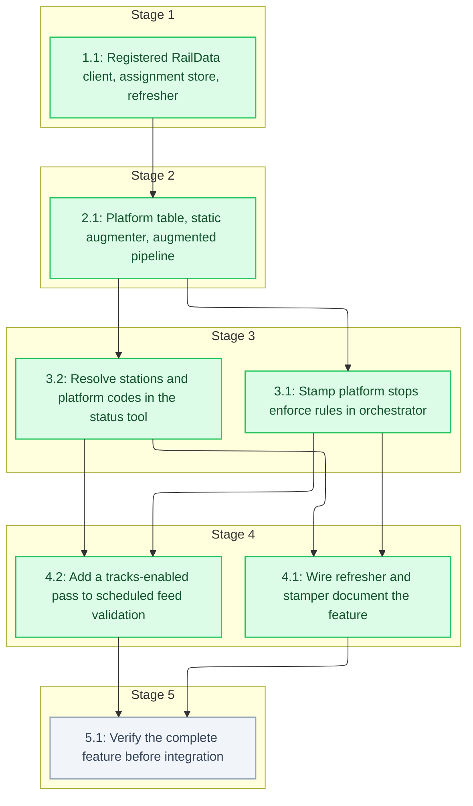

# Tasks: Real-Time Track Assignments

<!-- spec-nav:start -->
**Spec navigation:** [State](00_state.md) · [Discovery](01_discovery.md) · [Requirements](02_requirements.md) · [Design](03_design.md) · [Tasks](04_tasks.md) · [Execution](05_execution.md)
<!-- spec-nav:end -->

## Stage and Dependency Overview

## Delivery Schedule

| Stage | Task | Estimate | Depends on | Critical path |
|---|---|---|---|---|
| 1 | 1.1 Registered RailData client, assignment store, refresher | 3-4 hours | none | yes |
| 2 | 2.1 Platform table, static augmenter, augmented pipeline | 2.5-3.5 hours | 1.1 | yes |
| 3 | 3.1 Stamp platform stops; enforce rules in orchestrator | 2-3 hours | 2.1 | yes |
| 3 | 3.2 Resolve stations and platform codes in the status tool | 1-1.5 hours | 2.1 | no |
| 4 | 4.1 Wire refresher and stamper; document the feature | 1.5-2 hours | 3.1, 3.2 | yes |
| 4 | 4.2 Add a tracks-enabled pass to scheduled feed validation | 1-1.5 hours | 3.1, 3.2 | no |
| 5 | 5.1 Verify the complete feature before integration | 1-1.5 hours | 4.1, 4.2 | yes |

> [!WARNING]
> Execute dependency stages in order. Every task here is `controller` work; none is marked
> `parallel-safe`.

- [x] 1. Authorized board sources
  - [x] 1.1 Registered RailData client, assignment store, refresher
    - Split `src/sources/tracks.rs` into [`src/sources/tracks/mod.rs`](../../src/sources/tracks/mod.rs), [`src/sources/tracks/raildata.rs`](../../src/sources/tracks/raildata.rs), [`src/sources/tracks/hartford.rs`](../../src/sources/tracks/hartford.rs), [`src/sources/tracks/store.rs`](../../src/sources/tracks/store.rs), and [`src/sources/tracks/refresher.rs`](../../src/sources/tracks/refresher.rs), keeping `normalize_train_number`, `is_track_label`, `assignments_for_station`, and `parse_hartford_board` with their fixture tests.
    - Delete the DepartureVision bootstrap (`SPA_AES_KEY`, `SPA_PBKDF2_PASSWORD`, `bootstrap_token`, blob decryption, AES/PBKDF2 helpers), the `NJTTrainData.asmx` fallback, and the in-generation cache (`CachedBoards`, `current_board`, `refresh`).
    - Implement `RailDataClient::schedule(&mut self, station: &str, now: SystemTime) -> Result<String, BoardError>` against `POST {base}/getToken` and `POST {base}/getTrainSchedule19Rec` with multipart bodies, the persisted `raildata-token.json` cache (atomic write, mode `0600`, 23-hour reuse), the 10-per-24-hours request budget, one replacement on `Invalid token`/`null`, and a one-hour suspension on `Authenticated: "False"`.
    - Implement `AssignmentStore::replace_station` and `AssignmentStore::fresh_board(now, max_age) -> TrackBoard`, and `run_board_refresher(store, config, token_path)` with per-request timeouts.
    - Update `TrackConfig` in [`src/config.rs`](../../src/config.rs) to the design's variable table: add `AMTRAK_TRACKS_REFRESH_SECS`, `AMTRAK_TRACKS_MAX_AGE_SECS`, `AMTRAK_TRACKS_REQUEST_TIMEOUT_SECS`, and `AMTRAK_TRACKS_RAILDATA_BASE`; keep the station map, stations, Hartford, and credential variables; remove the TTL, API base, SPA origin, and `NJT_RAILDATA_URL` variables; reject zero durations; keep `Debug` redaction.
    - Remove `aes`, `aes-gcm`, `base64`, `cipher`, and `pbkdf2` from [`Cargo.toml`](../../Cargo.toml), add `csv = "1.4"`, update [`Cargo.lock`](../../Cargo.lock) without changing other resolved versions, and regenerate [`THIRD_PARTY_LICENSES.html`](../../THIRD_PARTY_LICENSES.html).
    - Test token reuse, persistence across two client instances, budget refusal, invalid-token retry, rejected credentials, missing credentials, redaction, per-station replacement, expiry after failure, and request timeouts with a local HTTP server.
    - **Files:** `src/sources/tracks.rs` (removed), [`src/sources/tracks/mod.rs`](../../src/sources/tracks/mod.rs), [`src/sources/tracks/raildata.rs`](../../src/sources/tracks/raildata.rs), [`src/sources/tracks/hartford.rs`](../../src/sources/tracks/hartford.rs), [`src/sources/tracks/store.rs`](../../src/sources/tracks/store.rs), [`src/sources/tracks/refresher.rs`](../../src/sources/tracks/refresher.rs), [`src/main.rs`](../../src/main.rs), [`src/config.rs`](../../src/config.rs), [`Cargo.toml`](../../Cargo.toml), [`Cargo.lock`](../../Cargo.lock), [`THIRD_PARTY_LICENSES.html`](../../THIRD_PARTY_LICENSES.html)
    - **Dependency resolution:** change
    - **Dependency delivery:** none
    - **Context7 evidence:** state=completed | identity=/zip-rs/zip2 | version=6.0.0 | decision=csv 1.4 reads and writes stops.txt; zip raw_copy_file keeps other entries byte-identical
    - **Pre-change dependency audit:** state=completed | command=dependency-security-audit change | mode=change | timestamp=2026-09-28T05:35:29.034832Z | project_revision=5ce2feb2f89f3b2a6306da2521f16903acb58894 | inventory_fingerprint=3c30eba3b810588a8e77e5047a79b0ed7d96630b684959da5f68cf8cb69a0bb1 | json=[`.security/dependency-audit/track-assignments-pre.json`](../../.security/dependency-audit/track-assignments-pre.json) | markdown=[`.security/dependency-audit/track-assignments-pre.md`](../../.security/dependency-audit/track-assignments-pre.md) | review=completed | result=warnings | exit=0 | decision=proceed; twelve pre-existing transitive advisories, none blocking | warnings_reviewed=true | clean=false
    - **Resolution edit:** state=completed | files=[`Cargo.toml`](../../Cargo.toml), [`Cargo.lock`](../../Cargo.lock)
    - **Project tests:** state=completed | evidence=[`.specs/track-assignments/05_execution.md`](../../.specs/track-assignments/05_execution.md)
    - **Post-change dependency audit:** state=completed | command=dependency-security-audit change | mode=change | timestamp=2026-09-28T05:35:44.986583Z | project_revision=5ce2feb2f89f3b2a6306da2521f16903acb58894 | inventory_fingerprint=b76b6e2f9f75a31b261dfc2041d63eba200c2cd1d48ec23edfe2625202743de7 | json=[`.security/dependency-audit/track-assignments-post.json`](../../.security/dependency-audit/track-assignments-post.json) | markdown=[`.security/dependency-audit/track-assignments-post.md`](../../.security/dependency-audit/track-assignments-post.md) | review=completed | result=warnings | exit=0 | decision=proceed; the same twelve pre-existing advisories and no new ones, with eleven crypto crates removed | warnings_reviewed=true | clean=false
    - **Depends on:** none
    - **Stage:** 1
    - **Interfaces:** Consumes: design's RailData contract, `TrackConfig` variable table, and PR #17 parsers; Produces: `RailDataClient::schedule`, `AssignmentStore::{replace_station, fresh_board}`, `TrackBoard`, `run_board_refresher(store, config, token_path)`, and the revised `TrackConfig`
    - **Documentation:** module docs for `tracks`, `raildata`, `store`, and `refresher` explaining the registered-access rule, token budget rationale, and expiry contract; doc comments on every public function and struct
    - **Verification:** `cargo test --features status`; `cargo clippy --bins --tests --features status -- -D warnings`; `git grep -nE 'SPA_|block1|getBaseInfo|pbkdf2|Aes192' src` returns nothing; review the new doc comments
    - **Estimated effort:** 3-4 hours
    - **Risk:** high; a budget or retry bug can exhaust the daily token allowance or leak a secret, and rollback is reverting the branch commit
    - **Task category:** heavy_reasoning
    - **Delegation:** controller
    - _Requirements: 4.1, 4.2, 4.3, 4.4, 4.5, 4.6, 4.7, 4.8, 5.2, 5.3, 6.1, 6.4, 7.1, 7.2, 7.3, 7.4_

- [x] 2. Platform stops in the static feed
  - [x] 2.1 Platform table, static augmenter, augmented pipeline
    - Create [`src/static_augment.rs`](../../src/static_augment.rs) with `PlatformTable::{parse, digest, contains, station_ids}`, `parent_station_id`, `platform_stop_id`, and `augment_static(upstream: &[u8], table: &PlatformTable) -> Result<Vec<u8>, AugmentError>` as specified in the design, and register the module in [`src/main.rs`](../../src/main.rs).
    - Add `AMTRAK_TRACKS_PLATFORMS` (default `NYP=1-21;NWK=A,1-5;NHV=1-4,8,10,12,14`) to `TrackConfig` in [`src/config.rs`](../../src/config.rs) as a parsed `PlatformTable`.
    - Thread `platforms: Option<&PlatformTable>` through `fetch_static`, `stage_static`, `bootstrap_static`, and `refresh_snapshot_once`, and `Option<Arc<PlatformTable>>` through `run_snapshot_refresh`, in [`src/static_gtfs.rs`](../../src/static_gtfs.rs), augmenting inside `fetch_static_at` before `snapshot_from_bytes`, re-parsing and re-validating the upstream bytes on augmentation or validation failure, and adding an optional version-suffix argument to `snapshot_from_bytes` for `+tracks.{digest}`.
    - Update existing callers and tests to pass `None` where tracks are not under test.
    - Promote `zip` from a dev-dependency to a normal dependency in [`Cargo.toml`](../../Cargo.toml) (already locked at 6.0.0).
    - Strip a leading UTF-8 byte-order mark from `stops.txt` before parsing.
    - Test the fixture round trip, a byte-order-mark input, byte-identical non-stop entries, determinism, skipped stations, id collisions, column appending, version changes, and both fallback paths with a stub validator.
    - **Files:** [`src/static_augment.rs`](../../src/static_augment.rs), [`src/static_gtfs.rs`](../../src/static_gtfs.rs), [`src/config.rs`](../../src/config.rs), [`src/main.rs`](../../src/main.rs), [`Cargo.toml`](../../Cargo.toml), [`Cargo.lock`](../../Cargo.lock)
    - **Dependency resolution:** change
    - **Dependency delivery:** none
    - **Context7 evidence:** state=completed | identity=/zip-rs/zip2 | version=6.0.0 | decision=ZipWriter::raw_copy_file copies untouched entries; SimpleFileOptions::last_modified_time fixes the stops.txt timestamp
    - **Pre-change dependency audit:** state=completed | command=dependency-security-audit change | mode=change | timestamp=2026-09-28T05:40:20.832196Z | project_revision=80abb567c5731ee5639aef1e16ca3272f8f8cb2f | inventory_fingerprint=b76b6e2f9f75a31b261dfc2041d63eba200c2cd1d48ec23edfe2625202743de7 | json=[`.security/dependency-audit/track-assignments-zip-pre.json`](../../.security/dependency-audit/track-assignments-zip-pre.json) | markdown=[`.security/dependency-audit/track-assignments-zip-pre.md`](../../.security/dependency-audit/track-assignments-zip-pre.md) | review=completed | result=warnings | exit=0 | decision=proceed; twelve pre-existing transitive advisories, none blocking | warnings_reviewed=true | clean=false
    - **Resolution edit:** state=completed | files=[`Cargo.toml`](../../Cargo.toml), [`Cargo.lock`](../../Cargo.lock)
    - **Project tests:** state=completed | evidence=[`.specs/track-assignments/05_execution.md`](../../.specs/track-assignments/05_execution.md)
    - **Post-change dependency audit:** state=completed | command=dependency-security-audit change | mode=change | timestamp=2026-09-28T05:52:16.805147Z | project_revision=80abb567c5731ee5639aef1e16ca3272f8f8cb2f | inventory_fingerprint=57329c694a70decfc6ff8c6d302fd76ec126289da0cc84c57fc8335c5e1f3a36 | json=[`.security/dependency-audit/track-assignments-zip-post.json`](../../.security/dependency-audit/track-assignments-zip-post.json) | markdown=[`.security/dependency-audit/track-assignments-zip-post.md`](../../.security/dependency-audit/track-assignments-zip-post.md) | review=completed | result=warnings | exit=0 | decision=proceed; zip moves from dev to normal dependency at the locked 6.0.0 with no new findings | warnings_reviewed=true | clean=false
    - **Depends on:** 1.1
    - **Stage:** 2
    - **Interfaces:** Consumes: `csv` from 1.1 and the promoted `zip` dependency, the revised `TrackConfig`, and upstream GTFS ZIP bytes; Produces: `PlatformTable`, `augment_static`, `platform_stop_id`, `parent_station_id`, and static snapshots whose bytes and version reflect augmentation
    - **Documentation:** module docs for `static_augment` explaining why covered stops are re-parented rather than converted, the determinism contract, and the fallback rule; doc comments on the changed `static_gtfs` functions
    - **Verification:** `cargo test --features status`; `cargo clippy --bins --tests --features status -- -D warnings`; augment the downloaded Amtrak `GTFS.zip` and run the MobilityData 8.0.1 validator on the result with zero `ERROR` notices; review doc comments
    - **Estimated effort:** 2.5-3.5 hours
    - **Risk:** high; a malformed augmented feed would be rejected and fall back safely, but a subtly wrong one could mislead consumers; rollback is unsetting `AMTRAK_TRACKS`
    - **Task category:** heavy_reasoning
    - **Delegation:** controller
    - _Requirements: 1.1, 1.2, 1.3, 1.4, 1.5, 1.6, 1.7, 1.8, 1.9, 2.1, 2.2, 2.3, 2.4, 2.5_

- [x] 3. Assignments in trip updates and tools
  - [x] 3.1 Stamp platform stops; enforce rules in orchestrator
    - Rewrite `WithTracks` and `apply_track_assignments` in [`src/sources/tracks/mod.rs`](../../src/sources/tracks/mod.rs) to read `AssignmentStore::fresh_board` and stamp `assigned_stop_id = platform_stop_id(stop, label)`, set `stop_sequence`, and clear `stop_id`, under the design's five conditions (the duplicate-station check runs even when `stop_sequence` is present), logging each unlisted (stop, label) once. Change the constructor to `WithTracks::new(inner, store, table, max_age)`.
    - Replace `stop_assignment_is_valid` so it lives in [`src/orchestrator.rs`](../../src/orchestrator.rs) and requires `stop_sequence`, an existing assigned stop, a matching `stop_id` when present, and the same parent station as the scheduled stop.
    - Rewrite the orchestrator overlay tests for the new rule, and test every stamping condition and the one-hour/twelve-hour window.
    - **Files:** [`src/sources/tracks/mod.rs`](../../src/sources/tracks/mod.rs), [`src/orchestrator.rs`](../../src/orchestrator.rs), [`src/static_augment.rs`](../../src/static_augment.rs), [`src/main.rs`](../../src/main.rs)
    - **Dependency resolution:** none
    - **Dependency delivery:** none
    - **Depends on:** 2.1
    - **Stage:** 3
    - **Interfaces:** Consumes: `AssignmentStore::fresh_board`, `TrackBoard`, `PlatformTable`, `platform_stop_id`, and the active parsed `Gtfs`; Produces: stamped `StopTimeUpdate`s and `stop_assignment_is_valid(assigned_id, update, trip, gtfs) -> bool`
    - **Documentation:** doc comments on `WithTracks`, `apply_track_assignments`, and `stop_assignment_is_valid` citing the GTFS-Realtime rules they enforce and why `stop_id` is cleared
    - **Verification:** `cargo test --features status`; `cargo clippy --bins --tests --features status -- -D warnings`; review doc comments
    - **Estimated effort:** 2-3 hours
    - **Risk:** medium; an overly strict check drops valid predictions, caught by orchestrator tests; rollback is unsetting `AMTRAK_TRACKS`
    - **Task category:** heavy_reasoning
    - **Delegation:** controller
    - _Requirements: 3.1, 3.2, 3.3, 3.4, 3.5, 3.6, 3.7, 3.8, 3.9, 3.11, 5.1, 6.2_
  - [x] 3.2 Resolve stations and platform codes in the status tool
    - In [`src/bin/status/station.rs`](../../src/bin/status/station.rs) and [`src/bin/status/train.rs`](../../src/bin/status/train.rs), resolve each stop time's station from `stop_id` or from `stop_sequence` and the static trip, and read the track from the assigned stop's `platform_code`.
    - Replace the `{stop}:track:{label}` string-parsing tests with platform-stop fixtures.
    - **Files:** [`src/bin/status/station.rs`](../../src/bin/status/station.rs), [`src/bin/status/train.rs`](../../src/bin/status/train.rs)
    - **Dependency resolution:** none
    - **Dependency delivery:** none
    - **Depends on:** 2.1
    - **Stage:** 3
    - **Interfaces:** Consumes: static `Stop::platform_code`, `Stop::parent_station`, and stamped stop times shaped by the design; Produces: status rows whose station and track come from the static feed
    - **Documentation:** doc comments on the station-resolution and track helpers explaining why `stop_sequence` is authoritative when `stop_id` is absent
    - **Verification:** `cargo test --features status`; `cargo clippy --bins --tests --features status -- -D warnings`; review doc comments
    - **Estimated effort:** 1-1.5 hours
    - **Risk:** low; affects only the operator CLI; rollback is reverting the change
    - **Task category:** code_analysis
    - **Delegation:** controller
    - _Requirements: 8.1, 8.2_
    - **Integration note:** 3.1 clears `stop_id`, which the status tool matches on today, so 3.1 and 3.2 are committed together.

- [x] 4. Wiring, validation, and documentation
  - [x] 4.1 Wire refresher and stamper; document the feature
    - In [`src/main.rs`](../../src/main.rs), add `TrackWiring { store, table, max_age }`, change `realtime_source` to take `Option<TrackWiring>`, build the `AssignmentStore`, spawn `run_board_refresher` with `{output_dir}/tracks/raildata-token.json` when tracks are enabled, pass the platform table to the static bootstrap and refresh task, and construct `WithTracks` only when enabled.
    - Add a timing test showing a generation with hanging boards completes within one second of a tracks-disabled generation.
    - Update [`README.md`](../../README.md) (platform stops, configuration table, RailData registration, consumer impact), the Unreleased section of [`CHANGELOG.md`](../../CHANGELOG.md), and the comment in [`docker-compose.yml`](../../docker-compose.yml).
    - **Files:** [`src/main.rs`](../../src/main.rs), [`README.md`](../../README.md), [`CHANGELOG.md`](../../CHANGELOG.md), [`docker-compose.yml`](../../docker-compose.yml)
    - **Dependency resolution:** none
    - **Dependency delivery:** none
    - **Depends on:** 3.1, 3.2
    - **Stage:** 4
    - **Interfaces:** Consumes: `run_board_refresher`, `AssignmentStore`, `WithTracks`, `PlatformTable`, and the changed static pipeline signatures; Produces: a service where `AMTRAK_TRACKS=on` enables all three paths and off preserves current behavior
    - **Documentation:** README and CHANGELOG describe behavior, configuration, credentials handling, and consumer impact; `main` wiring comments explain the fail-open ordering
    - **Verification:** `cargo test --features status`; `cargo clippy --bins --tests --features status -- -D warnings`; `docker compose config`; review README and CHANGELOG against the design's configuration table
    - **Estimated effort:** 1.5-2 hours
    - **Risk:** medium; mis-wiring could enable board fetches when disabled, covered by a disabled-path test; rollback is reverting the change
    - **Task category:** code_analysis
    - **Delegation:** controller
    - _Requirements: 3.10, 6.1, 6.2, 6.3_
  - [x] 4.2 Add a tracks-enabled pass to scheduled feed validation
    - Extend [`scripts/validate-feeds.sh`](../../scripts/validate-feeds.sh) to run its generate-and-validate pass a second time with `AMTRAK_TRACKS=on`, writing reports to a separate directory and ratcheting both against [`validation/baseline.json`](../../validation/baseline.json).
    - Run the tracks pass without RailData credentials so CI never spends the production token budget, and note this in [`.github/workflows/validate-feeds.yml`](../../.github/workflows/validate-feeds.yml).
    - **Files:** [`scripts/validate-feeds.sh`](../../scripts/validate-feeds.sh), [`.github/workflows/validate-feeds.yml`](../../.github/workflows/validate-feeds.yml)
    - **Dependency resolution:** none
    - **Dependency delivery:** none
    - **Depends on:** 3.1, 3.2
    - **Stage:** 4
    - **Interfaces:** Consumes: the service binary with `AMTRAK_TRACKS` and the existing ratchet; Produces: per-pass validation reports and a job that fails on a new `ERROR` code in either pass
    - **Documentation:** script comments explaining why the tracks pass exists and how it behaves without credentials
    - **Verification:** `bash -n scripts/validate-feeds.sh`; `scripts/validate-feeds.sh --offline-fixtures`; run the script locally in live mode and confirm both passes report and ratchet
    - **Estimated effort:** 1-1.5 hours
    - **Risk:** low; the job is scheduled rather than a PR gate, and rollback is reverting the script
    - **Task category:** code_analysis
    - **Delegation:** controller
    - _Requirements: 8.3, 8.4_

- [ ] 5. Checkpoint — feature complete
  - [ ] 5.1 Verify the complete feature before integration
    - Run the full Rust suite, Clippy, the advisory-fetcher and release-control tests, and a live local run with tracks enabled that fetches the Hartford board and publishes an augmented `static.zip` that passes the standards validator.
    - Confirm every criterion's evidence in [05_execution.md](05_execution.md).
    - **Files:** [`.specs/track-assignments/05_execution.md`](05_execution.md)
    - **Dependency resolution:** none
    - **Dependency delivery:** none
    - **Depends on:** 4.1, 4.2
    - **Stage:** 5
    - **Interfaces:** Consumes: all prior task outputs; Produces: recorded verification evidence and an integration decision
    - **Documentation:** no public surface
    - **Verification:** `cargo test --features status`; `cargo clippy --bins --tests --features status -- -D warnings`; [`scripts/test-release-controls.sh`](../../scripts/test-release-controls.sh); live run evidence recorded
    - **Estimated effort:** 1-1.5 hours
    - **Risk:** medium; live sources can be unavailable, in which case the fixture evidence stands and the gap is recorded
    - **Task category:** review
    - **Delegation:** controller
    - _Requirements: 1.1, 2.1, 3.1, 6.3, 8.3_
