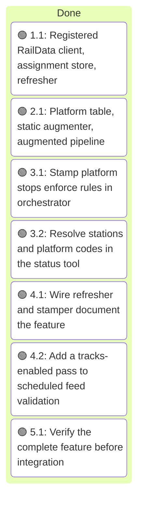
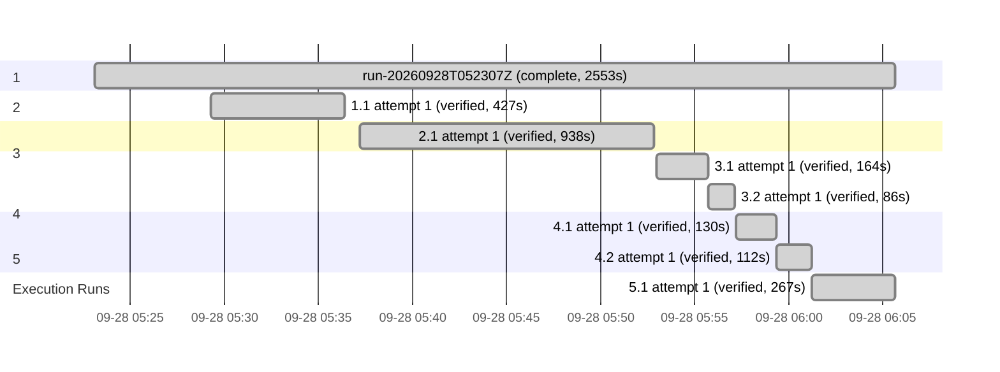

# Execution

<!-- spec-nav:start -->
**Spec navigation:** [State](00_state.md) · [Discovery](01_discovery.md) · [Requirements](02_requirements.md) · [Design](03_design.md) · [Tasks](04_tasks.md) · [Execution](05_execution.md)
<!-- spec-nav:end -->

## Execution Context

- **Worktree:** `.claude/worktrees/track-assignments` on branch `track-assignments`, created from `origin/cursor/amtrak-track-enrichment-917f` at `5ce2feb2f89f3b2a6306da2521f16903acb58894` (PR #17 head). Clean except for the new spec folder.
- **Baseline:** `cargo test --features status` passes (77 service tests, 20 status-tool tests). `cargo clippy --bins --tests --features status -- -D warnings` is clean. `cargo clippy --all-targets` already fails on [`examples/station_departures.rs`](../../examples/station_departures.rs) line 110 (`print_literal`, a new-toolchain lint unrelated to this feature), so task verification uses `--bins --tests`.

## Preflight Hardening

- **Depth:** thorough (credentials, a public static-feed contract, and a dependency change), resolved to 2 reviewers at the balanced tier with high reasoning and 2 self-repair rounds. Artifact digest before hardening: `1e2612b55b53c2618dba86306fe79d2877383a82ee885288167515930e2123a0`.
- **Applied (self-hardened under delegated authority, within approved requirements):**
  - The duplicate-station check runs even when an update already carries `stop_sequence` (R3.4); PR #17 skipped it in that case.
  - `augment_static` strips a leading UTF-8 byte-order mark before parsing `stops.txt`.
  - `snapshot_from_bytes` gains an explicit version-suffix argument, and augmentation runs before parsing with a full upstream re-parse on fallback.
  - The scheduled tracks-enabled validation runs without RailData credentials, so CI cannot spend the production account's daily token budget.
  - `WithTracks::new(inner, store, table, max_age)` and `TrackWiring` are specified; tasks 3.1 and 3.2 are committed together.
  - Clippy verification uses `--bins --tests` because of the baseline example failure.
- **Recorded decision:** the static version identifies content, so a compression-only byte change keeps its version.
- **Not adopted:** a same-day duplicate train number test; Amtrak does not reuse a train number on one service day, and the event window already limits matches.

## Execution Timing

### Task Board

### Run Intervals
| Run ID | Started UTC | Stopped UTC | Elapsed Seconds | Outcome |
|---|---|---|---:|---|
| run-20260928T052307Z | 2026-09-28T05:23:07Z | 2026-09-28T06:05:40Z | 2553 | complete |

### Task Attempt Intervals
| Run ID | Stage/Wave | Task | Attempt | Started UTC | Stopped UTC | Elapsed Seconds | Outcome |
|---|---|---|---:|---|---|---:|---|
| run-20260928T052307Z | 1 | 1.1 | 1 | 2026-09-28T05:29:17Z | 2026-09-28T05:36:24Z | 427 | verified |
| run-20260928T052307Z | 2 | 2.1 | 1 | 2026-09-28T05:37:14Z | 2026-09-28T05:52:52Z | 938 | verified |
| run-20260928T052307Z | 3 | 3.1 | 1 | 2026-09-28T05:53:00Z | 2026-09-28T05:55:44Z | 164 | verified |
| run-20260928T052307Z | 3 | 3.2 | 1 | 2026-09-28T05:55:44Z | 2026-09-28T05:57:10Z | 86 | verified |
| run-20260928T052307Z | 4 | 4.1 | 1 | 2026-09-28T05:57:11Z | 2026-09-28T05:59:21Z | 130 | verified |
| run-20260928T052307Z | 4 | 4.2 | 1 | 2026-09-28T05:59:21Z | 2026-09-28T06:01:13Z | 112 | verified |
| run-20260928T052307Z | 5 | 5.1 | 1 | 2026-09-28T06:01:13Z | 2026-09-28T06:05:40Z | 267 | verified |

## Task Evidence

### Task 1.1 — Registered RailData client, assignment store, refresher

- **Result:** verified. `src/sources/tracks.rs` became the [`src/sources/tracks`](../../src/sources/tracks) module: [`raildata.rs`](../../src/sources/tracks/raildata.rs) (registered `getToken`/`getTrainSchedule19Rec` client, persisted `0600` token cache, 10-per-24-hour budget, one replacement on a rejected token, one-hour suspension on rejected credentials), [`store.rs`](../../src/sources/tracks/store.rs) (per-station replacement, age-based expiry), [`refresher.rs`](../../src/sources/tracks/refresher.rs) (background loop with per-request timeouts), and [`hartford.rs`](../../src/sources/tracks/hartford.rs). The DepartureVision bootstrap, its embedded keys, the test file's hard-coded public web credentials, the SOAP fallback, and the in-generation cache are gone; `git grep` for `SPA_`, `block1`, `getBaseInfo`, `pbkdf2`, `Aes192`, and the credential strings finds nothing.
- **Contract repair:** [`src/main.rs`](../../src/main.rs) was added to the task's files because the new `WithTracks::new(inner, store, max_age)` constructor must be wired for the crate to build; the refresher is spawned there when tracks are enabled.
- **Configuration:** `TrackConfig` now has `refresh_interval`, `max_age`, `request_timeout`, and `raildata_base`; zero durations are rejected; `Debug` still reports only whether credentials are set.
- **Dependencies:** `aes`, `aes-gcm`, `base64`, `cipher`, and `pbkdf2` removed (eleven crates leave [`Cargo.lock`](../../Cargo.lock)); `csv = "1.4"` promoted to direct at 1.4.0; [`THIRD_PARTY_LICENSES.html`](../../THIRD_PARTY_LICENSES.html) regenerated. The audit tool's 1 MB `cargo metadata` cap was raised in memory for these runs (no skill file edited), giving complete inventories: both reports are `warnings`, exit 0, with the same twelve pre-existing transitive advisories and no new findings.
- **Verification:** `cargo test --features status` passes (84 service tests, 20 status-tool tests), including local-server tests for token reuse across restart, file mode `0600`, secret-free cache and errors, invalid-token replacement, budget refusal across restart and recovery after 24 hours, credential suspension, unconfigured skip, Hartford refresh and expiry, and a hanging board bounded by the request timeout. `cargo clippy --bins --tests --features status -- -D warnings` is clean; `cargo fmt` applied.
- **Criteria:** R4.1–R4.8, R5.2, R5.3, R6.1, R6.4, R7.1–R7.4 met.

### Task 2.1 — Platform table, static augmenter, augmented pipeline

- **Result:** verified. [`src/static_augment.rs`](../../src/static_augment.rs) adds `PlatformTable` (ranges, letters, canonical digest), `parent_station_id`, `platform_stop_id`, and `augment_static`, which rewrites only `stops.txt` (byte-order mark stripped, columns appended, covered stops re-parented, parent station and platform rows added) and copies every other entry raw with a fixed `stops.txt` timestamp. [`src/static_gtfs.rs`](../../src/static_gtfs.rs) augments inside `fetch_static_at` before parsing, validates the augmented bytes, falls back to a fresh parse and validation of the upstream bytes on any failure, and versions augmented snapshots `{feed_version}+tracks.{digest}` through a new `snapshot_from_bytes` suffix argument. `AMTRAK_TRACKS_PLATFORMS` (default `NYP=1-21;NWK=A,1-5;NHV=1-4,8,10,12,14`) is part of `TrackConfig`, and [`src/main.rs`](../../src/main.rs) passes the table to the bootstrap and refresh task when tracks are enabled.
- **Contract repairs:** `zip` was only a dev-dependency, so the task became a dependency-resolution change that promotes it (no [`Cargo.lock`](../../Cargo.lock) change; complete pre/post audits both `warnings` with the same twelve pre-existing advisories). `PlatformTable::parse` returns a message string that `TrackConfig` wraps in `ConfigError`, because `ConfigError::new` is private to the config module.
- **Debugging note:** the first full test run hung. Root cause: a new test held a `std::sync::Mutex` guard on the recording validator while calling `fetch_static` again, so the validator blocked on the same lock. Scoping the guard fixed it; no production code was involved.
- **Live validation:** augmenting Amtrak's `GTFS.zip` (feed version 20260927) with the default table and running MobilityData validator 8.0.1 gives zero `ERROR` notices, the same notices as the upstream feed, plus `stop_without_stop_time` (WARNING) for exactly the 35 added platform stops, which no scheduled trip references by design.
- **Verification:** `cargo test --features status` passes (92 service tests, 20 status-tool tests), including round trip, byte-identical untouched entries, determinism, byte-order mark, skipped stations, collisions, version change with the table and stability without it, and both fallback paths. `cargo clippy --bins --tests --features status -- -D warnings` is clean.
- **Criteria:** R1.1–R1.9 and R2.1–R2.5 met.

### Task 3.1 — Stamp platform stops; enforce rules in orchestrator

- **Result:** verified. `WithTracks::new(inner, store, table, max_age)` in [`src/sources/tracks/mod.rs`](../../src/sources/tracks/mod.rs) stamps `assigned_stop_id = {stop}:track:{label}`, fills `stop_sequence`, and clears `stop_id` only when the stop time is not skipped, has a predicted time from one hour before to twelve hours after generation, visits its station exactly once in the trip (checked even when `stop_sequence` is already set), has a fresh board track, and that track is configured with a platform stop present in the active feed; an unconfigured (stop, track) pair is logged once. PR #17's synthetic overlay, `split_track_assignment`, and the tracks-module validator are removed. The orchestrator's new `stop_assignment_is_valid` in [`src/orchestrator.rs`](../../src/orchestrator.rs) requires `stop_sequence`, an existing assigned stop, a matching `stop_id` when present, and the scheduled stop itself or a sibling under the same non-empty parent.
- **Contract repair:** the constructor change required the `TrackWiring { store, table, max_age }` struct and `realtime_source(…, Option<TrackWiring>)` in [`src/main.rs`](../../src/main.rs) now rather than in task 4.1, and the temporary `dead_code` allowance on `PlatformTable::contains` in [`src/static_augment.rs`](../../src/static_augment.rs) was removed.
- **Test correction:** an added orchestrator case with `stop_id` equal to the platform and the scheduled stop's sequence failed. It was an invalid test: the orchestrator's existing check that `stop_id` agrees with `stop_sequence` rejects that pair before the assignment rule, and the stamper never produces it because it clears `stop_id`. The case was removed; the existing check is unchanged.
- **Verification:** `cargo test --features status` passes (99 service tests, 20 status-tool tests), covering stamping by `stop_id` and by sequence, a station visited twice, skipped stops, both window edges and a missing time, an unconfigured track, a configured track whose platform is absent, a mismatched `stop_id`/sequence, stale and fresh store rows through the decorator, and orchestrator acceptance of sibling platforms and rejection of other stations, unknown stops, and synthetic overlays. Clippy is clean.
- **Criteria:** R3.1–R3.9, R3.11, R5.1, and R6.2 met.

### Task 3.2 — Resolve stations and platform codes in the status tool

- **Result:** verified. [`src/bin/status/station.rs`](../../src/bin/status/station.rs) adds `scheduled_stop_id`, which uses `stop_id` or, when a platform assignment cleared it, the static trip's stop at `stop_sequence`; the station board and [`src/bin/status/train.rs`](../../src/bin/status/train.rs) both use it. `track_from_update` now returns the assigned platform stop's `platform_code` from the static feed instead of parsing the id string. [`src/bin/amtrak_status.rs`](../../src/bin/amtrak_status.rs) only renders the `track` field and needed no change, so it was dropped from the task's files.
- **Repair note:** a text replacement initially removed the neighbouring `trip_meta` helper; the build failed immediately and the helper was restored verbatim from the previous commit.
- **Verification:** `cargo test --features status` passes (99 service tests, 20 status-tool tests), including a board where a stamped stop time with only `stop_sequence` stays on its station and shows track `4`, and an assignment to an unknown stop showing no track. Clippy is clean.
- **Integration:** committed together with task 3.1 because 3.1 clears the `stop_id` this tool previously matched on.
- **Criteria:** R8.1 and R8.2 met.

### Task 4.1 — Wire refresher and stamper; document the feature

- **Result:** verified. [`src/main.rs`](../../src/main.rs) builds one `Arc<PlatformTable>` when tracks are enabled and shares it between the static bootstrap, the static refresh task, and `TrackWiring`; it spawns `run_board_refresher` with `{output_dir}/tracks/raildata-token.json` and constructs `WithTracks` only when enabled. [`README.md`](../../README.md) documents the platform stops, the static version suffix, the added `stop_without_stop_time` warnings, the default coverage and why Metropark and Trenton are not covered, stamping conditions, consumer impact, RailData registration and token handling, and the new configuration table; the removed PR #17 variables are gone. [`CHANGELOG.md`](../../CHANGELOG.md) and the [`docker-compose.yml`](../../docker-compose.yml) comment match.
- **Verification:** `cargo test --features status` passes (101 service tests, 20 status-tool tests), including `hanging_boards_do_not_delay_generation` (a board that accepts connections and never answers, with a 30-second request timeout, leaves a tracks-enabled fetch within one second of a disabled one) and `disabled_tracks_leave_the_source_undecorated`. Clippy is clean; `docker compose config` passes.
- **Criteria:** R3.10, R6.1, R6.2, and R6.3 met.

### Task 4.2 — Add a tracks-enabled pass to scheduled feed validation

- **Result:** verified. [`scripts/validate-feeds.sh`](../../scripts/validate-feeds.sh) gains `--tracks`, which reruns the same generate-and-validate pass with `AMTRAK_TRACKS=on` and empty RailData credentials, writing to `$REPORT_DIR/tracks` and `$FEED_DIR-tracks` and ratcheting against the same [`validation/baseline.json`](../../validation/baseline.json). [`.github/workflows/validate-feeds.yml`](../../.github/workflows/validate-feeds.yml) runs it as a second step (`if: always()`), with a comment explaining why no credentials are passed; the existing upload step already includes the `tracks/` reports.
- **Verification:** `bash -n` passes; `--offline-fixtures` passes all six ratchet fixtures. A live local `--tracks` run passed with no new `ERROR` codes: the published generation's static version was `20260927+tracks.612ca043`, its `stops.txt` held the 35 platform stops, static notices matched the augmented-feed run in task 2.1, and its trip updates contained a real stamped assignment, `NHV:track:1` from the Hartford Line board, which the GTFS-Realtime validator accepted. The only realtime `ERROR` codes were the baselined upstream E022 and E025.
- **Criteria:** R8.3 and R8.4 met.

### Task 5.1 — Verify the complete feature before integration

- **Full suite:** `cargo test --features status` passes (102 service tests, 20 status-tool tests); the default-feature `cargo build` used by the container passes; `cargo clippy --bins --tests --features status -- -D warnings` is clean; `cargo fmt --check` passes; [`scripts/test-release-controls.sh`](../../scripts/test-release-controls.sh) passes.
- **Live evidence:** task 2.1's augmentation of Amtrak's feed passed MobilityData 8.0.1 with zero `ERROR` notices, and task 4.2's live tracks-enabled run published `20260927+tracks.612ca043` with the 35 platform stops and a real stamped `NHV:track:1` assignment that the GTFS-Realtime validator accepted. NJ Transit stations were not exercised live because no RailData account is configured; their path is covered by the local-server tests in task 1.1.
- **Independent review (2 reviewers, balanced tier, high reasoning):** requirements compliance passed for all 48 criteria and task quality passed. The correctness and security review found one real defect: the `stops.txt` reader was not `flexible`, so a legal row omitting trailing fields would have failed augmentation and silently fallen back to upstream bytes. Fixed with `csv::ReaderBuilder::flexible(true)` (rows were already padded to the header width) and a regression test; the suite was rerun green. Reviewed and not changed: multipart fields are unescaped, but every value is operator configuration, not external input; any `getToken` `errorMessage` is classified as budget exhaustion, which fails closed either way.
- **Housekeeping:** the tracks pass’s feed directory (`$FEED_DIR-tracks`) was briefly committed and is now untracked and ignored in [`.gitignore`](../../.gitignore).
- **Integration decision:** handed to `spec-finish`.

## Outcome

All seven tasks and all 48 criteria are verified. The branch `track-assignments` holds the reworked PR #17 on top of `5ce2feb`, in four work-in-progress commits plus the final fix; nothing has been pushed.

### Execution Gantt

