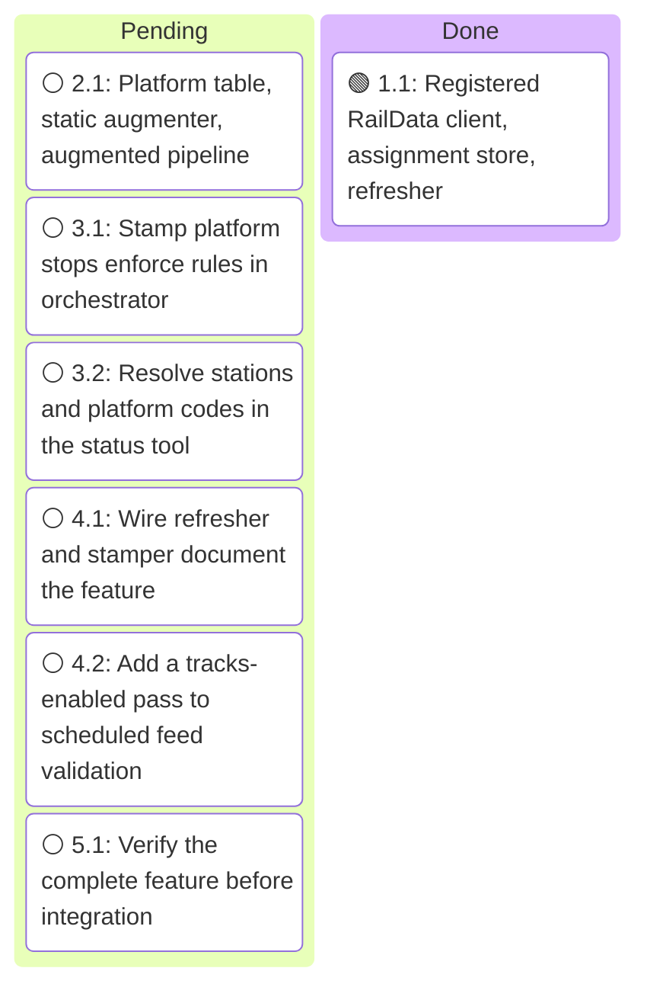
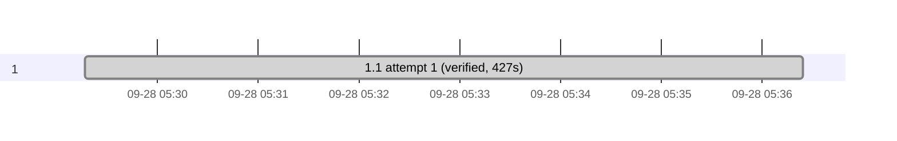

# Execution

<!-- spec-nav:start -->
**Spec navigation:** [State](00_state.md) · [Discovery](01_discovery.md) · [Requirements](02_requirements.md) · [Design](03_design.md) · [Tasks](04_tasks.md) · [Execution](05_execution.md)
<!-- spec-nav:end -->

## Execution Context

- **Worktree:** `.claude/worktrees/track-assignments` on branch `track-assignments`, created from `origin/cursor/amtrak-track-enrichment-917f` at `5ce2feb2f89f3b2a6306da2521f16903acb58894` (PR #17 head). Clean except for the new spec folder.
- **Baseline:** `cargo test --features status` passes (77 service tests, 20 status-tool tests). `cargo clippy --bins --tests --features status -- -D warnings` is clean. `cargo clippy --all-targets` already fails on [`examples/station_departures.rs`](../../examples/station_departures.rs) line 110 (`print_literal`, a new-toolchain lint unrelated to this feature), so task verification uses `--bins --tests`.

## Preflight Hardening

- **Depth:** thorough (credentials, a public static-feed contract, and a dependency change), resolved to 2 reviewers at the balanced tier with high reasoning and 2 self-repair rounds. Artifact digest before hardening: `1e2612b55b53c2618dba86306fe79d2877383a82ee885288167515930e2123a0`.
- **Applied (self-hardened under delegated authority, within approved requirements):**
  - The duplicate-station check runs even when an update already carries `stop_sequence` (R3.4); PR #17 skipped it in that case.
  - `augment_static` strips a leading UTF-8 byte-order mark before parsing `stops.txt`.
  - `snapshot_from_bytes` gains an explicit version-suffix argument, and augmentation runs before parsing with a full upstream re-parse on fallback.
  - The scheduled tracks-enabled validation runs without RailData credentials, so CI cannot spend the production account's daily token budget.
  - `WithTracks::new(inner, store, table, max_age)` and `TrackWiring` are specified; tasks 3.1 and 3.2 are committed together.
  - Clippy verification uses `--bins --tests` because of the baseline example failure.
- **Recorded decision:** the static version identifies content, so a compression-only byte change keeps its version.
- **Not adopted:** a same-day duplicate train number test; Amtrak does not reuse a train number on one service day, and the event window already limits matches.

## Execution Timing

### Task Board

### Run Intervals
| Run ID | Started UTC | Stopped UTC | Elapsed Seconds | Outcome |
|---|---|---|---:|---|
| run-20260928T052307Z | 2026-09-28T05:23:07Z | pending | pending | active |

### Task Attempt Intervals
| Run ID | Stage/Wave | Task | Attempt | Started UTC | Stopped UTC | Elapsed Seconds | Outcome |
|---|---|---|---:|---|---|---:|---|
| run-20260928T052307Z | 1 | 1.1 | 1 | 2026-09-28T05:29:17Z | 2026-09-28T05:36:24Z | 427 | verified |

## Task Evidence

### Task 1.1 — Registered RailData client, assignment store, refresher

- **Result:** verified. `src/sources/tracks.rs` became the [`src/sources/tracks`](../../src/sources/tracks) module: [`raildata.rs`](../../src/sources/tracks/raildata.rs) (registered `getToken`/`getTrainSchedule19Rec` client, persisted `0600` token cache, 10-per-24-hour budget, one replacement on a rejected token, one-hour suspension on rejected credentials), [`store.rs`](../../src/sources/tracks/store.rs) (per-station replacement, age-based expiry), [`refresher.rs`](../../src/sources/tracks/refresher.rs) (background loop with per-request timeouts), and [`hartford.rs`](../../src/sources/tracks/hartford.rs). The DepartureVision bootstrap, its embedded keys, the test file's hard-coded public web credentials, the SOAP fallback, and the in-generation cache are gone; `git grep` for `SPA_`, `block1`, `getBaseInfo`, `pbkdf2`, `Aes192`, and the credential strings finds nothing.
- **Contract repair:** [`src/main.rs`](../../src/main.rs) was added to the task's files because the new `WithTracks::new(inner, store, max_age)` constructor must be wired for the crate to build; the refresher is spawned there when tracks are enabled.
- **Configuration:** `TrackConfig` now has `refresh_interval`, `max_age`, `request_timeout`, and `raildata_base`; zero durations are rejected; `Debug` still reports only whether credentials are set.
- **Dependencies:** `aes`, `aes-gcm`, `base64`, `cipher`, and `pbkdf2` removed (eleven crates leave [`Cargo.lock`](../../Cargo.lock)); `csv = "1.4"` promoted to direct at 1.4.0; [`THIRD_PARTY_LICENSES.html`](../../THIRD_PARTY_LICENSES.html) regenerated. The audit tool's 1 MB `cargo metadata` cap was raised in memory for these runs (no skill file edited), giving complete inventories: both reports are `warnings`, exit 0, with the same twelve pre-existing transitive advisories and no new findings.
- **Verification:** `cargo test --features status` passes (84 service tests, 20 status-tool tests), including local-server tests for token reuse across restart, file mode `0600`, secret-free cache and errors, invalid-token replacement, budget refusal across restart and recovery after 24 hours, credential suspension, unconfigured skip, Hartford refresh and expiry, and a hanging board bounded by the request timeout. `cargo clippy --bins --tests --features status -- -D warnings` is clean; `cargo fmt` applied.
- **Criteria:** R4.1–R4.8, R5.2, R5.3, R6.1, R6.4, R7.1–R7.4 met.

### Execution Gantt

